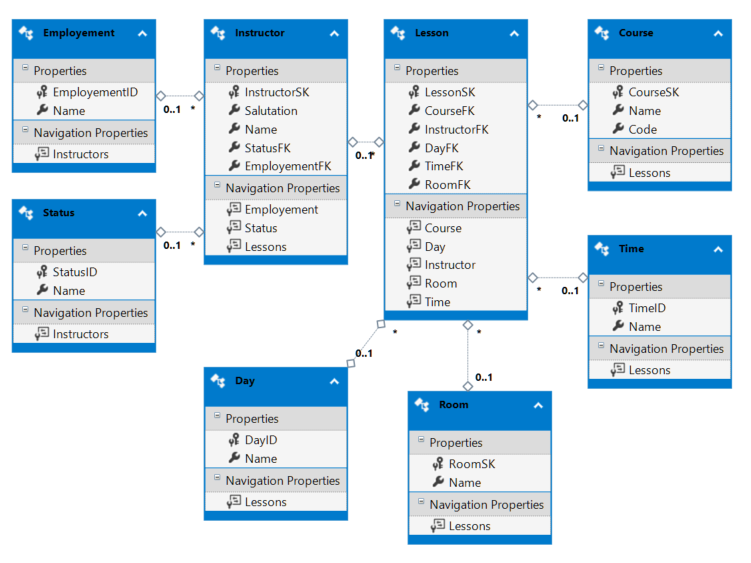
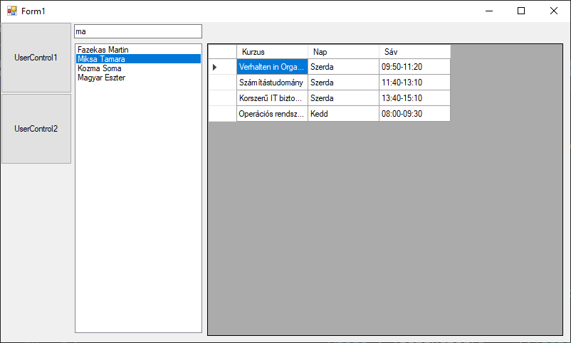
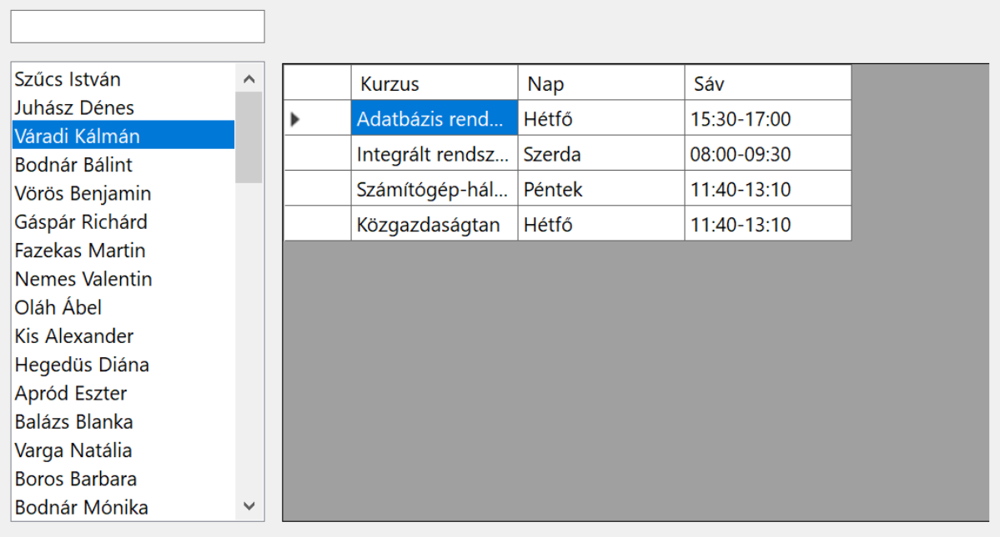

# 11. gyakorlati feladatsor: LINQ lekérdezések a  Studies adatbázis táblaira 

## A feladat háttere

A gyakorlat célja olyan kliens építése, mely LINQ-lekérdezések segítségével szűri és jeleníti meg egy adott tábla tartalmát. A mintafeladat egy tanszék óráit tartalmazó adatbázis köré épül.



Az `Instructor` tábla az oktatókat tartalmazza, az oktató státusza (Pl: *Adjunktus*, *Docens*, *Egyetemi tanár*, stb.) idegen kulcsként van tárolva, akárcsak az `Emplolyment` (Pl: *Főállású*, *félállású*, *óraadó*). A `Lesson` tábla a saját kulcsa mellett csak idegen kulcsokat tartalmaz. Itt kerül tárolásra, hogy  milyen tantárgyból melyik oktatónak a hét melyik napján, melyik sávban és melyik teremben van órája. `Cousre` például a *szoftvertechnológia*, amiből van 7 `Lesson` egy héten. 

A cél kliens felület építése, mely kétféle nézetben teszi lehetővé az adatbázisban tárolt adatok megjelenítését. A nézetek között gombokkal lehet választani. 
- Az egyik nézet egy listában megjeleníti az oktatókat, és a kiválasztott oktatónak listázza az óráit, de úgy, hogy az idegen kulcsok helyén a csatolt táblában szereplő érték jelenjen meg. Az oktatók név szerint szűrhetők az oktatók listája felett lévő szövegdobozban.
- A másik gombhoz tartozó nézetben kurzusonként lehet megtekinteni az órákat.



## Gyakorlati feladatsor

### 1. Projekt létrehozása és elnevezése

(+/-) Hozz létre egy Widows Forms App típusú **projekt**et

### 2. Adatbázis felépítése és ORM

Az adatbázis csak az egyetemi IP-tartományból vagy egyetemi VPN-el érhető el!

|              | |
|-             |-|
|Szerver       |bit.uni-corvinus.hu
|Felhasználónév|hallgato
|Jelszó        |Password123
|Adatbázis     |Studies

(+/-) telepítsd az adatbázis eléréséhez szükséges NuGet csomagokat, majd készítsd el az ORM osztályokat!

Hogy ne húzzuk az időt, alant a parancs:

```powershell
Scaffold-DbContext "Data Source=bit.uni-corvinus.hu;Initial Catalog=Studies;Persist Security Info=True;User ID=hallgato;Password=Password123;TrustServerCertificate=true" Microsoft.EntityFrameworkCore.SqlServer -OutputDir Models
```


### 3. Felhasználói felület

Hozd létre a fenti ábrán látható felületet az alábbi lépésekben! 

(+/-) A `Form1`-en hozz létre két gombot és egy `Panel`-t! A `Panel`-t tervező nézetben a *Toolbox*-ból behúzhatod. A gombok fogják a UC-ket cserélgetni a paneleken, így tud majd a felhasználó váltogatni a nézetek között. 

(+/-) Állítsd be a panel horgonyait (`Anchor` a *Properties* panelen) úgy, hogy a panel kövesse az ablak méretét. 

(+/-) Adj a projekthez két `UserControl`-t is `UserControl1` és `UserControl2` néven. Az `UserControl`-ok háttérszínét tervezőből állítsd különbözőre, hogy könnyen ellenőrizhető legyen a funkciók működése. 

(+/-) A két `UserControl` a panelba kerüljön bele. Hozzál létre eseménykiszolgálót a gombok kattintás eseményéhez. 

(+/-) Az esemény-kiszolgálókban hozd létre a gombhoz tartozó `UserControl`-t, majd add hozzá a panelhez úgy, hogy töltse ki a rendelkezésére álló területet (a `UserControl` `Dock` tulajdonságának `DockStyles.Fill` értékre történő beállításával). Az esemény-kiszolgálóban még a `UserControl` létrehozása előtt töröljük a panel korábbi tartalmát, végül adjuk a `Panel` `Controls` gyűjteményéhez a `UserControl`-t.

> `Dock`: Az objektum szülőobjektumához való illeszkedését határozza meg. Így oldható meg legegyszerűbben, hogy a panel átméretezésével a benne lévő UC mindig vegye fel a panel méretét. 

◯ Példaként az első gombhoz tartozó eseménykiszolgáló:
``` csharp
private void button1_Click(object sender, EventArgs e)  
{  
	// Kitöröljük az összes vezérlőt a panelről  
	panel1.Controls.Clear();  
  
	// Létrehozzuk az 1. UserControlt  
	UserControl userControl1 = new UserControl1();  
  
	// Hozzáadjuk a panelhez.  
	panel1.Controls.Add(userControl1);  
  
	// Dock: Az objektum szülőobjektumához való illeszkedését határozza meg  
	// DockStíle.Fill: A vezérlő mind a négy oldala illeszkedjen (és méreteződjön) a szülőobjektumhoz.  
	userControl1.Dock = DockStyle.Fill;  
}
```
(+/-) Az ábrán látható `TextBox`, `ListBox` és `DataGridView` vezérlőket az egyik `UserControl`-on helyezd el (a *Toolbox*ról behúzva)! A továbbiakban az első `UserControl`-ra dolgozz!

### 4. UserContorl1: Oktatók lekérdezése




#### 4.1 Lista feltöltése az oktatók neveivel

Fel kell tölteni adattal a `listBox1`-et az alábbiak szerint:

(+/-) Példányosítsd a `context`-et az osztály szintjén!

> **LINQ**: a .NET keretrendszerbe épített lekérdező nyelv (szabálygyűjtemény), amely rendelkezik a hagyományos lekérdező nyelvek (pl.: MSSQL) funkcionalitásának egy részével, egyszersmind integrálva van a programozási nyelvekbe (C#, VB).

(+/-) Az alábbi egyszerű lekérdezéssel, melyet a konstruktorban vagy a `Load` eseményhez tartozó eseménykiszolgálóban is elhelyezhetünk, megkapjuk az `Instructor` tábla tartalmát. A LINQ eredményét adjuk meg a `listBox1` adatforrásaként:

```csharp
var ilist = from i in context.Instructors
            select i;
listBox1.DataSource = ilist.ToList();
```
(+/-) Ahhoz, hogy a `listBox1`-ben csak az oktatók neve jelenjen meg, be kell állítani a lista `DisplayMember` tulajdonságát. Ezt a kódban az alábbi utasítás végzi el:

```csharp
listBox1.DisplayMember = "Name";
```

> [!WARNING] 
>
> A `DisplayMember` értékét pontosan kell megadni, különben nem fog működni! Be kell gépelni. Ha rosszul van megadva, vagy nincs megadva a `DisplayMember`, a tábla sorait leképező osztály neve jelenik meg annyiszor, ahány eleme van az adatforrásul szolgáló gyüjteménynek. Kerülőút, ha a "fülén" keresztül állítjuk be az adatforrást, és `BindingSource`-on keresztül kötünk. Ekkor a _Properties_ panelen a `DisplayMember` tulajdonság legördíthető, és tervezőből is kiválasztható a listában megjelenítendő tulajdonság.

#### 4.2 Oktatók szűrése névre
A cél az, hogy ahogy a felhasználó gépel, úgy szűküljön az oktatók listája.

A LINQ lekérdezésekben az SQL nyelvekhez hasonló módon lehet `WHERE` záradékokat írni. Az oktatók lekérdezéséhez használt lekérdezést az alábbi módon átalakítva a `textBox1`-be beírt szöveg alapján szűrve kerülnek az oktatók nevei az adatforrásba. Az alábbi kódrészletet a `textBox1` `TextChanged` eseményéhez létrehozott eseménykiszolgálóban célszerű elhelyezni:

```csharp
listBox1.DataSource = (from i in context.Instructors
                       where i.Name.Contains(textBox1.Text)
                       select i).ToList();
```

A `Contains()` helyett használható még a `StartsWith()` metódus is, ha csak név eleji egyezésekre akarunk összpontosítani.

```csharp
listBox1.DataSource = (from i in context.Instructors
                       where i.Name.StartsWith(textBox1.Text)
                       select i).ToList();
```
Ahhoz, hogy a lekérdezés szűrő jellege ténylegesen működjön, nem elég a konstruktorból meghívni. Szervezd ki a lekérdezést és az adatforrás feltöltését egy külön metódusba, amit aztán hívj meg a konstruktorból és a `textBox1` `TextChanged` eseményéhez rendelt eseménykezelőből is!

Megoldás:

```csharp
public UserControl1()
{
    InitializeComponent();

    FillDataSource();
    listBox1.DisplayMember = "Name";
}

private void FillDataSource()
{
    listBox1.DataSource = (from i in context.Instructors
                           where i.Name.Contains(textBox1.Text)
                           select i).ToList();
}

private void TextBox1_TextChanged(object sender, EventArgs e)
{
    FillDataSource();
}
```

#### 4.3 A kiválasztott oktató óráinak lekérdezése

(+/-) Rendelj eseménykezelőt a `listBox1` `SelectedIndexChanged` eseményéhez! Az eseménykezelőben kérdezd le egy változóba kiválasztott oktató rekordját:

```csharp
Instructor instructor = (Instructor)listBox1.SelectedItem;
```

vagy 

```c#
 Instructor selectedInstructor = listBox1.SelectedItem as Instructor;
```

Mivel a `ListBox1` adatforrása `Instructor` típusú elemekből álló gyűjtemény, bisztosak lehetünk benne, hogy a kiválasztott elem is `Instructor` típusú, vagy `null`, ha épp nincs semmi kiválasztva. 

Éppen ezért előtte illik ellenőrizni, hogy van-e egyáltalán kiválasztott oktató, vagy esetleg túl jól sikerült a szűrés :)

```cs
if(listBox1.SelectedItem == null) return;
Instructor selectedInstructor = listBox1.SelectedItem as Instructor;
```

(+/-) Ezt a rekordot felhasználva megírható egy lekérdezés, ami visszaadja az adott oktató tanóráit. A `Lessons` tábla azonban kizárólag idegen kulcsokat tartalmaz. Így a pontos értékek megjelenítéséhez a táblák összekapcsolására (INNER JOIN) lenne szükség. A LINQ ennél egyszerűbb lehetőséget is ad a táblakapcsolatokon keresztüli lekérdezésekre:

```csharp
var lessons = from l in context.Lessons
              where l.InstructorFk == selectedInstructor.InstructorSk
              select new
              {
                  Kurzus = l.CourseFkNavigation.Name,
                  Nap = l.DayFkNavigation.Name,
                  Sáv = l.TimeFkNavigation.Name
              };
```

A `select` után a `new` kulcsszó a három lekérdezett mezőt egy úgynevezett „névtelen típusú” objektumba gyűjti össze a fenti utasítás. A megfelelő kapcsolt táblákon keresztül hivatkozva pedig az idegen kulcsok helyett az egyes értékekhez tartozó neveket is meg tudjuk jeleníteni.

Ugyanerre használhatsz lambda kifejezést is ha akarsz, kinek mi áll kézre:

```c#
var lessons2 = context.Lessons.Where(l => l.InstructorFk == selectedInstructor.InstructorSk)
    .Select(l => new
    {
        Kurzus = l.CourseFkNavigation.Name,
        Nap = l.DayFkNavigation.Name,
        Sáv = l.TimeFkNavigation.Name
    });
```

(+/-) Töltsd be a LINQ-lekérdezés eredményét a dataGridView1-be! (Állítsd be a dataGridView1 adatforrását!)

```csharp
dataGridView1.DataSource = lessons.ToList();
```

### 5. UserControl2: kurzusok óráinak lekérdezése

(+/-) A második `UserControl` felületén valósítsd meg a fent leírt szerkezetet, de most a kurzusok jelenjenek meg a `ListBox`-ban, és az adott kurzus órái legyenek a `DataGridView`-ban! **Próbáld az alábbi megoldás használata nélkül megvalósítani a funkciót!**

Megoldás
```csharp
public partial class UserControl2 : UserControl
{
    StudiesContext context = new StudiesContext();
    public UserControl2()
    {
        InitializeComponent();

        FillDataSource();
        listBox1.DisplayMember = "Name";
    }

    private void textBox1_TextChanged(object sender, EventArgs e)
    {
        FillDataSource();
    }

    private void listBox1_SelectedIndexChanged(object sender, EventArgs e)
    {
        if (listBox1.SelectedItem == null) return;
        Course course = listBox1.SelectedItem as Course;

        dataGridView1.DataSource = (from l in context.Lessons
                                    where l.CourseFk == course.CourseSk
                                    select new
                                    {
                                        Nap = l.DayFkNavigation.Name,
                                        Sáv = l.TimeFkNavigation.Name,
                                        Oktató = l.InstructorFkNavigation.Name
                                    }).ToList();
    }

    private void FillDataSource()
    {
        listBox1.DataSource = (from c in context.Courses
                               where c.Name.Contains(textBox1.Text)
                               select c).ToList();
    }
}
```


## 6. Oktatók adatainak megjelenítése és mentése

(+/-) Készíts `UserControl`-t, ami az oktatók adatait jeleníti meg, de az idegen kulcsok helyén a csatolt táblákban szereplő vontkozó szövegek jelenjenek meg!

(+/-) Készíts gombot, amely CSV állományba menti az oktatókat!

## 7. Új kurzus rögzítése

(+/-) Készíts `UserControl`-t, ami a kurzusok adatait jeleníti meg! Új kurzust _Ok_ és _Mégse_ gombot tartalmazó felugró ablakból lehessen rögzíteni!

## 8. Egyéb feladatok

(+/-)  Egészítsd ki az előző feladatokat úgy, hogy a rácsok és a listák alatt jelenjen meg egy cimkében, hogy éppen hány rekordot taralmaznak!
