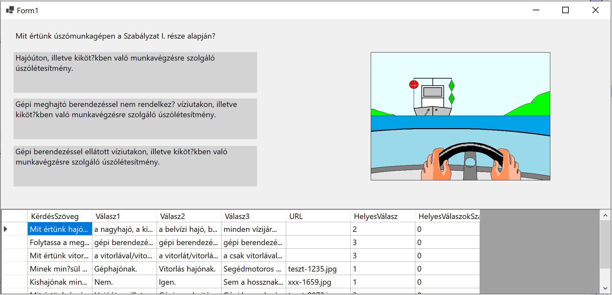

# Hajós kvíz

A gyakorlaton a hatósági kisgéphajó vezetői vizsgához elérhető kérdésbankhoz készítünk felületet, amely a felhasználóval begyakoroltatja a kérdésekre a válaszokat.

A kérdéseket tartalmazó állomány CSV fájlból fogjuk beolvasni egy memóriában tárolt listába.

Ha az 1400 kérdésből mindig véletlenszerűen választanánk, nem lenne hatékony a tanulás. A program az összes kérdést tartalmazó lista mellett használ egy másik listát is, melyben az éppen gyakoroltatott 7 kérdés van. A program indításakor az első 7 kérdés kerül majd ide. 

Az éppen gyakoroltatott kérdések közül kerül mindig a soron következő a képernyőre. Ha a tanuló egymás után háromszor helyesen válaszol egy kérdésre, a kérdés kikerül a gyakoroltatott kérdések listájáról, és helyébe a teljes listáról bekerül a következő kérdés.

Valahogy így fog kinézni:



## Kinnduló állományok

A feladat megoldásához szükséges fájt itt találjátok:

[hajozasi_szabalyzat_kerdessor_BOM.txt](hajozasi_szabalyzat_kerdessor_BOM.txt)

Érdemes megnézni a fájlt mielőtt elkezdhetek dolgozni! 

- A mezőket a tabulátor (`\t`) tagolja.
- Az első oszlop a kérdés sorszámát tartalmazza,
- ezt a kérdés szövege követi,

- egy kérdéshez a kérdésen felül minden esetben három lehetséges válasz tartozik, 

- néhány kérdéshez tartozik kép is, a következő adat a kép fájlneve,

- az utolsó szám a helyes válaszlehetőségét sorszámát tartalmazza. 

 A képeket webről töltjük majd be.

## A megoldás menete

(+/-) Töltsd Git-ről a Solution-t, amibe eddig is dolgoztál, ebbe hozd létre az új projektet `HajósTeszt` néven! A munka végeztével `commit` és `push` 😊

(+/-) Hozz létre egy osztályt `Kérdés` néven. Ez az osztály ír le egy kérdést -- tehát a fájl minden sorához létrehozunk majd egy példányt ebből az osztályból --, a példányokat pedig majd egy listában helyezzük el.

`Kérdés` osztály tulajdonságai képezzék le a fájlban lévő oszlopokat:

``` csharp
internal class Kérdés
{
    public string KérdésSzöveg { get; set; }
    public string Válasz1 { get; set; }
    public string Válasz2 { get; set; }
    public string Válasz3 { get; set; }
    public string URL { get; set; }
    public int HelyesVálasz { get; set; }
    public int HelyesVálaszokSzáma { get; set; }
}
```

## CSV feldolgozása

(+/-) A `Form2`-et bővítsük két listával:

- az egyik, kérdésből álló listába az összes kérdést olvassuk majd be a fájlból,

- a másik listába viszont az éppen gyakoroltatott 7 kérdés kerül majd átmásolása a teljes listából.

- Ezen felül szükségünk lesz egy változóra, ami éppen feltett kérdés sorszámát tartalmazza a szűkített, 7 elemű listából. Tehát ennek a változónak az értéke 0 és 6 között lehet majd.

 Valahogy így:

```csharp
List<Kérdés> ÖsszesKérdés;
List<Kérdés> AktívKérdések;
int AktívKérdés=5;
```

Teszteléshez most alapértelmezetten 5 állítotsuk be aktív kérdésnek, mert ehhez van kép is. 

(+/-) Ezután hozzunk létre egy metódust mely beolvassa a fájlból a kérdéseket. Érdemes megfigyelni hogy a `KérdésBeolvasás()` metódus visszatérési értéke egy kérdés típusú elemekből álló lista. Ez így szép 😊

> [!TIP]
>
> Az alábbi kódrészletet éremes "kézzel" felépíteni, és nem bemásolni, mert ilyen biztosan lesz a következő ZH-ban.

```csharp
List<Kérdés> KérdésBeolvasás()
{
  List<Kérdés> kérdések = new List<Kérdés>();
  StreamReader sr = new StreamReader("hajozasi_szabalyzat_kerdessor_BOM.txt", true);

  while (!sr.EndOfStream)
  {

     string sor = sr.ReadLine() ?? string.Empty; 
     //A ?? azt jelenti, hogy ha az sr.ReadLine() null értékkel jön vissza, akkor legyen üres string a sor változó értéke
      
     string[] tömb = sor.Split("\t");
     if (tömb.Length != 7) continue; 
     //Ha nem 6 részre hasítja a sort a TAB, akkor ez egy rossz sor, megyünk a következőre

     Kérdés k = new Kérdés();
     k.KérdésSzöveg = tömb[1];
     k.Válasz1 = tömb[2];
     k.Válasz2 = tömb[3];
     k.Válasz3 = tömb[4];
     k.URL = tömb[5];

     int.TryParse(tömb[6], out int jóválasz); //Ez a best practice

     k.HelyesVálasz = jóválasz;

     kérdések.Add(k);
  }
  sr.Colse();
  return kérdések;
}
```


A kódrészlet elemeit előadáson részletesen tagoltuk. Csak ismétlésképpen:

- Szövegfájlt beolvasni a `StreamReader` osztály segítségével lehet. A  `StreamReader`  konstruktorának első argumentuma a fájlnév, a második `bool` típusú argumentummal lehet megadni, hogy a fájl kezelésénél figyelembe vegye a karakterkódolást leíró BOM-ot, azaz az első négy bájtot a szövegfájlban. 

- Szövegfájl beolvasásánál nem tudhatjuk előre, hogy hány sort fogunk beolvasni, éppen ezért nem előírt lépésszáú ciklussal dolgozunk. A ` while (!sr.EndOfStream)` addig pörög, amíg az olvasásban a fájl végére nem értünk. Természetesen, ha nem olvasunk, sosem érünk a végére -- hacsak nem üres szövegfájlról van szó.

- A C#-ban érdekesen működnek az elemi változók. Úgy viselkednek, mint hogyha objektumok lennének: vannak metódusaik. A `string` osztálynak például van egy `Split()` metódusa, mely az argumentumként átadott szöveg vagy karakter mentén feldarabolja a stringet. Az eredmény egy tömb lesz, mely annyi elemből áll, ahány darabra szelte az elválasztó karakter - vagy string - (más néven delimiter) a szöveget. 

- A szövegfájlok feldolgozása csupa veszély! Egyáltalán nem biztos, hogy ahol számot várunk ott szám is lesz. A _best practice_ szöveg számmá alakítására a `TryParse`. Ha az átalakítás sikerül, jó, ha nem, akkor sem kapunk hibaüzenetet. Az `out`-ról lesz még bővebben szó, a lényeg hogy az eredmény az argumentumban átadott változóba kerül vissza.

- Miután létrehoztuk az új kérdést, nem felejtjük el betenni a listába.

- Az olvasási ciklus után a metódus visszaadja a feltöltött listát.

> [!IMPORTANT]
>
> Fájkezelésnél sohasem lehetünk biztosak a sikerben. Mindig használj `try-catch` blokkot!

## Az alkalmazás indulása

 

(+/-) Rendeljünk eseménykiszolgálót a `Form1` `Load` eseményéhez!

(+/-) Az eseménykiszolgálóban hívjuk meg az előbb elkészített ` KérdésBeolvasás();` metódust!

(+/-) Ezután inicializáljuk az `AktívKérdések` listát! Ha megfigyelitek az előbb ezt még nem tettük meg:

``` csharp
List<Kérdés> ÖsszesKérdés;
List<Kérdés> AktívKérdések;
```

> [!NOTE] 
>
> A `List<Kérdés> AktívKérdések;` csak egy `Kérdés` típusú elemekből álló ún. **referenciát** hoz létre. Viszont egyenlőre még nem hoztuk létre a tényleges listát a memóriában. Ebben a pillanatban az `ÖsszesKérdés` értéke még `null`. A tényleges objektum létrehozása majd az `AktívKérdések = new List<Kérdés>();` kifejezéssel történik.
>
> ```csharp
> List<Kérdés> AktívKérdések;
> AktívKérdések = new List<Kérdés>();
> ```
>
> A fenti két sor összevonható:
>
> ```
> List<Kérdés> AktívKérdések = new List<Kérdés>();
> ```

(+/-) Az `ÖsszesKérdés` listát tölsük fel a `KérdésBeolvasás()` metódus hívásával:

```csharp
private void Form1_Load(object sender, EventArgs e)
{
    AktívKérdések = new List<Kérdés>();
    ÖsszesKérdés = KérdésBeolvasás(); 
}

```

(+/-) Most már készen állunk arra, hogy az első 7 kérdést áthelyezzük az `ÖsszesKérdés` listából az `AktívKérdések` listába:

```csharp
private void Form1_Load(object sender, EventArgs e)
{
    AktívKérdések = new List<Kérdés>();
    ÖsszesKérdés = KérdésBeolvasás(); 
    for (int i = 0; i < 7; i++)
    {
        AktívKérdések.Add(ÖsszesKérdés[0]);
        ÖsszesKérdés.RemoveAt(0);
    }
}
```

A ` ÖsszesKérdés.RemoveAt(0)` törli a lista első elemét, és az eddigi második elem kerül az első helyre. Egy éles alkalmazásban itt mindenféle ellenőrzéseket kéne végezni, hogy a beolvasott szövegfájl egyáltalán tartalmaz-e legalább 7 kérdést.

Tesztelési céllal érdemes kirakni egy `DataGridView`-t az űrlapra, és bekötni az adat forrását. Ha mindent jól csináltunk megjelenik az első hét kérdés rácsban.

```csharp
dataGridView1.DataSource = AktívKérdések;
```


## `VálaszGomb` létrehozása

 A válaszlehetőségek megjelenítéséhez érdemes egy új osztályt létrehozni. Ehhez most nem a gombot vagy a címkét fogjuk használni ősosztályként, mert ezek a vezérlők nem kezelik rendesen a többsoros szövegeket. Illetve kezelik, csak nekünk kell beállítani, hogy hol legyen a sortörés. 

Ha valaki szeretne egy olyan szövegdobozt, amiben a szöveget nem lehet szerkeszteni, nincs neki kerete, és többsoros szöveget is tud tárolni, forduljon bizalommal a ChatGPT-hez :)

Az eredmény valami ilyesmi lesz, ha még keretet is szeretnénk, ha a felhasználó fölé megy az egérrel, és kéz alakú a kurzort, ami segít rájönni a felhasználónak, hogy mit kell csinálni:

``` csharp
internal class VálaszGomb : TextBox
{
    public VálaszGomb()
    {
        BackColor = Color.LightGray;
        Multiline = true;
        ReadOnly = true;

        MouseEnter += VálaszGomb_MouseEnter;
        MouseLeave += VálaszGomb_MouseLeave;

        BorderStyle = BorderStyle.None;
        Cursor = Cursors.Hand;
    }

    private void VálaszGomb_MouseLeave(object? sender, EventArgs e)
    {
        BorderStyle = BorderStyle.None;
    }

    private void VálaszGomb_MouseEnter(object? sender, EventArgs e)
    {
        BorderStyle = BorderStyle.FixedSingle;
    }
}
```


Ha ezzel megvagyunk, érdemes fölépíteni az UI-t. Fordítás után a Toolboxban meg kell jelenjen az új választógomb. Ha ezt nem teszi, érdemes újraindítani a VS-t!

 

## Kérdés megjelenítése a képernyőn

A kérdésmegjelenítést végző kódrészletet megint érdemes kiszervezni külön metódusba!

A képek a https://storage.altinum.hu/hajo/ URL alá kerültek fel.

Ha nincs kép és úgy próbáljuk meg betölteni, a program hibára fut.

Legkifinomultabban a `string.IsNullOrEmpty` metódussal tudjuk eldönteni, hogy üres vagy `null`-e egy string.

 ```csharp
 void KérdésMegjelenítés(Kérdés kérdés)
 {
     labelKérdés.Text = kérdés.KérdésSzöveg;
     textBox1.Text = kérdés.Válasz1;
     textBox2.Text = kérdés.Válasz2;
     textBox3.Text = kérdés.Válasz3;
     if (!string.IsNullOrEmpty(kérdés.URL))
     {
         pictureBox1.Load("https://storage.altinum.hu/hajo/" + kérdés.URL);
         pictureBox1.Visible = true;
     }
     else
     {
         pictureBox1.Visible = false;
     }            
 }
 ```


# Egyéni feladatok

(+/-) Helyezz el az űrlapon egy „Következő” gombot, megjeleníti a következő kérdést természetesen hogyha az aktív kérdés száma eléri a 7-et, elölről kell kezdeni.

(+/-) Rendelj eseménykiszolgálót a válasz gombok kattintás eseményéhez, és ez eseménykiszolgálóban színezd pirosra, illetve zöldre a gombokat annak függvényében, hogy eltalálta-e a felhasználó a helyes választ.

(+/-) Ha a feltaláló eltalálta a helyes választ, az éppen megjelenített kérdésnél a ` HelyesVálaszokSzáma` tulajdonság értékét növeld egyel!

(+/-) Ha a `HelyesVálaszokSzáma` elérte a hármat, cseréld ki a kérdést az összes kérdést tartalmazó lista első (nulladik) elemére. Az összes kérdést tartalmazó listából pedig vedd ki a nulladik elemet!


Happy Coding!

 

 

 

 

 

 

 

 

 

 

 