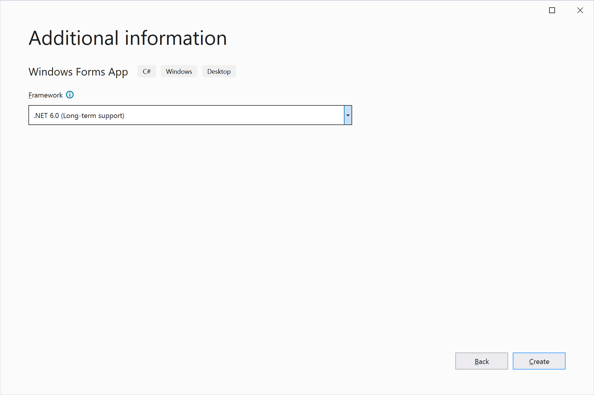
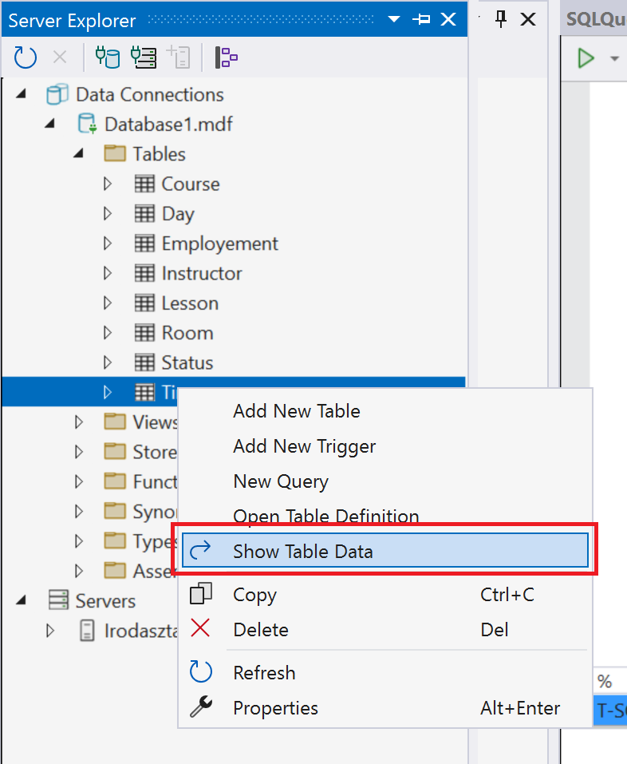

# Lokális adatbázis használata
## A feladat célja

A fejlesztés korai fázisában, vagy egy kísérleti projektnél körülményes lehet adatbázis-szerveren kialakítani a tesztadatbázist. EFCore alatt lehetőség van lokális fájlrendszerben tárolt `.mdf` kiterjesztésű adatbázis fájlt használni, mely később elhelyezhető adatbázis szerveren. A lokális adatbázis egyértelmű hátránya, hogy nem tudja egyszerre több felhasználó elérni az adatokat, de erre fejlesztés közben valószínűleg nincs is szükség. Viszont nincs szükség internet elérésre és/vagy szerver üzemeltetésére. Lokális adatbázis használata *production*, azaz éles környezetben nem javasolt, fejlesztéshez és prototípus készítéshez viszont kiváló eszköz.

Ebben a feladatsorban:

1. Létrehozunk egy új, Windows Froms App-ot .NET 6 alá

2. A projektben létrehozunk egy adatbázis állományt

3. Az adatbázisban  SQL script futtatásával kialakítjuk  az adatbázis sémát, melyet feltöltünk adatokkal

4. Telepítjük az EntityFrameworkCore használatához szükséges csomagokat NuGet segítségével  

5. Az osztályokat legeneráljuk `Scaffold-DbContext` parancs segítségével.

6. Elkészítjük a felhasználói felületet, amelyet feltöltünk adatokkal.

 A feladatsor nagyon hasonlít az előző,  [A távoli adatbázis elérése](../2a_gyak_tavoli_adatbazis_visual_studioban/)  című feladatsorhoz, így egyben gyakorló feladatként is szolgál.


## 1. Windows Forms App létrehozása .NET 6 alatt
(+/-) Hozz létre egy `Windows Forms App` típusú alkalmazást Visual Studio-ban. A Solution és a Project neve tetszőleges, a példában a `LocalDbTest` nevet használjuk. 


---

**Vigyázz:** `Windows Forms App (.NET Framework)` template a régi .NET Framework 4.7 vagy 4.8 keretrendszert használja, nem a .NET 6.0-át! Ne keverd össze! Ha jól csináltad ez látszik:





## 2. Lokális adatbázis létrehozásának lépései egy Visual Studio projektben

### 2.1 Adatbázis állomány létrehozása

(+/-) Adj egy `Service based database` objektumot a projekthez, az objektum neve lesz az adatbázis neve! (A képen látható ablak a *Solution Explorer*-ben jobb egérgombra megjelenő menüben az *Add new item* menüpontra kattintva jelenik meg.)


Ez két új fájlt fog létrehozni a Solution Explorerben:

* A .mdf kiterjesztésű maga az adatbázis
* Az .ldf kiterjesztésű az adatbázishoz kapcsolódó log fájl. (Ez  utóbbit büntetlenül lehet törölni is, legfeljebb újra létrejön.)


### 2.2 Csatlakozás Server Explorer-ben az új adatbázishoz

**Figyelem:** A  _Server Explorer_-nek semmi köze nincs az épp megnyitott projekthez. A Visual Studio egy integrált fejlesztőkörnyezet,  és mint ilyen rendelkezik beépített funkcióval alapvető adatbázis műveletek elvégzésére.  A fejlesztőnek így nem kell elhagyni a VS-t, és más  alkalmazást telepíteni, ha egyszerű adatbázis műveleteket szeretne végrehajtani.  A Server Explorer ablakban  akkor is csatlakozhatunk adatbázishoz, ha a Visual Studio-ban éppen nincsen  projekt megnyitva.

- A _Server Explorer_-be legegyszerűbben úgy tudod felvenni az új kapcsolatot, ha kettőt kattintasz az `.mdf` állományra a Solution Explorer-ben. 

- Ha ez valami miatt nem működik, a _Server Explorer_ `Connect To Databese` ikonjával is fel lehet venni az új adatbáziskapcsoaltot.

Tipp: Ha nincs kedved kitallózni a fájlrendszerben az adatbázis elérési útját, a _Solution Explorer_-ben kattints az `.mdf` állományra, és a _Properties_ ablakból másold vágólapra az elérési utat. 

<!---->

Az _OK_ gomb után ilyesminek kéne megjelennie a _Server Explorer_-ben:


### 2.3 Adatbázis  séma létrehozása,  adatok feltöltése

 A következő lépésben _Server Explorer_ segítségével felépítünk egy többtáblás adatbázist  az előbb létrehozott `.mdf` adatbázis állományban.  Kattintgatás helyett most egyenlőre legenerált SQL scriptet fogunk használni,  mely létrehozza a táblákat,  majd INSERT INTO-k  segítségével  feltölti őket adatokkal.

(+/- ) Töltsd le a [Studies_CREATE_FILL.sql](Studies_CREATE_FILL.sql)  állományt, és nyisd meg  Notepad-ben, vagy Notepad++-ban.  

(+/- ) Mielőtt vágólapra másolt a fájl teljes tartalmát,  érdemes megnézni hogy épül fel.

(+/- ) A _Server Explorer_-ben kattints jobb gombbal az adatbázisra, majd a _New query_  menüpont kiválasztása után megjelenő ablakba másold be az SQL scriptet.

(+/- ) Futtasd az SQL szkriptet  az SQL szerkesztő toolbar-ján  lévő kis üres zöld háromszög lenyomásával.  (Ezt könnyű összekeverni a projekt futtatására szolgáló teli zöld háromszöggel...)

(+/- ) Ha minden sikerült,  és kinyitod a _Tables_  csoportot,  megjelennek az adatbázis táblák,  és a kiválasztott táblára jobb egérrel kattintva a _Show Table Data_  menüponttal megtekintheted a tábla adatait. 



### 2.4 Connection String kinyerése

Mint ahogy arról már korábban esett szó, a _Server Explorer_-nek semmi köze nincs az éppen megnyitott projekthez.  Eddig arra használtuk,  hogy a projektben lévő `.mdf` adatbázis állományban felépítjük az adatbázist. Ahhoz hogy olyan C# programot tudjunk írni,  szükségünk lesz az úgynevezett _connection string_-re.

A _connection string_-ben mező--érték párokat találunk, ez az információ szükséges egy adatbázisba bejelentkezéshez, és egy meghatározott adatbázis eléréséhez. A következő lépésben erre a _connection string_-re  lesz szükségünk ahhoz,  hogy legeneráljuk az adatbázis eléréséhez szükséges C# osztályokat.

Ha a _Server Explorer_-ben  az adatbázisra kattintasz, a _Properties_  ablakban megjelenik a _connection string_.  Attól függően hogy a fájlrendszerben hol hoztad létre a Solution-t, valami ilyesmi:

```
Data Source=(LocalDB)\MSSQLLocalDB;AttachDbFilename=C:\TFS\SotwareEngineering\LocalDbTest\LocalDbTest\Database1.mdf;Integrated Security=True;Connect Timeout=30
```

(+/-)  Jegyezd meg, hogy hol találod a _connection string_-et később kelleni fog!


## 3. Reverse engineering 

 A Microsoft-os terminológiában _Revrese Engineering_-nek  hívjuk azt a folyamatot,  ami egy meglévő adatbázis séma alapján legenerálja azokat az osztályokat,  amelyek leképezik az adatbázist táblákat, a köztük lévő kapcsolatokat, illetve lehetőséget biztosítanak  adatok mozgatására  a kliens és a szerver között.

### 3.1 NuGet csomagok hozzáadása a projekthez

(+/-) Nyisdmeg a NuGet csomagkezelőt,  és add az alábbi csomagokat  a projekthez:


A `Microsoft.EntityFrameworkCore.Tools` és a `Microsoft.EntityFrameworkCore.SqlServer` a NuGet konzolán keresztül ezzel a két paranccsal is hozzáadható a projekthez:
``` powershell
Install-Package Microsoft.EntityFrameworkCore.SqlServer
Install-Package Microsoft.EntityFrameworkCore.Tools
```
 

### Osztályok generálása

Sajnos .NET Core alatt nem áll rendelkezésre grafikus eszköz és varázsló az adatbázis sémája alapját leképező C# osztályok előállítására. Ezt is a *Package Manager Console*-ból kell megoldani parancssorból, de nem olyan veszélyes, mint első hallásra tűnik. (`Tools`/`NuGet Package Manager`)

A `Scaffold-DbContext` parancs használata egyszerű, meg kell neki adni a _Connection String_-et, és a projekten belül azt a mappát, ahova dolgozhat. A mappa neve tipikusan a `Models`, ha csak egy adatbázisunk van. 

``` powershell
Scaffold-DbContext "[Connection String]" Microsoft.EntityFrameworkCore.SqlServer -OutputDir [Mappa]
```

Az adatbázis elérési útja  valószínűleg eltér az alábbi példától:
``` powershell
Scaffold-DbContext "Data Source=(LocalDB)\MSSQLLocalDB;AttachDbFilename=C:\TFS\SotwareEngineering\LocalDbTest\LocalDbTest\Database1.mdf;Integrated Security=True;Connect Timeout=30" Microsoft.EntityFrameworkCore.SqlServer -OutputDir Models
```

> Fontos: ha a projektet nem lehet lefordítani, amikor kiadjuk a `Scaffold-DbContext` parancsot, csak egy mérsékelten beszédes "Bulid Failed." 
>  üzenetet kapunk. Ha nem ez a baj, használható a parancs végére a `-Verbose` kapcsoló.

(+/-) Állítsd össze a `Scaffold-DbContext`  parancsot saját _connection string_-ed alapján,  majd futtasd  a *Package Manager Console*-ban.   

Ezután meglelenik a SolutionExplorer-ben egy `Models` mappa benne a fájlokkal:


Érdemes megfigyelni az egyik osztály neve céltalanul borzasztó -- a feladatsor összeállításakor `CTFSSOTWAREENGINEERINGLOCALDBTESTLOCALDBTESTDATABASE1MDFContext.cs`  lett.  Az osztály nevet az a bázis elérési útjából képezte `Scaffold-DbContext`. 

- A `-Context`  kapcsoló  segítségével megadhatjuk  az adatbázis eléréséhez szükséges osztály nevét.  Microsoft  által javasolt elnevezési konvenció szerint  az osztály neve  az adatbázis nevéből és a `Context` szóból áll össze.   Esetünkben például `-Context Database1Context`.

- Ha az `-OutputDir`  kapcsoló után megadott mappában  már ott vannak a fájlok, a `-f`  kapcsolóval lehet rávenni `Scaffold-DbContext`-et  a  már meglévő fájlok felülírására.

 A fentiek alapján a parancs a következőképp alakul:

``` powershell
Scaffold-DbContext "Data Source=(LocalDB)\MSSQLLocalDB;AttachDbFilename=C:\TFS\SotwareEngineering\LocalDbTest\LocalDbTest\Database1.mdf;Integrated Security=True;Connect Timeout=30" Microsoft.EntityFrameworkCore.SqlServer -OutputDir Models -Context Database1Context -f
```

- Amíg nem hivatkozunk rá a `CTFSSOTWAREENGINEERINGLOCALDBTESTLOCALDBTESTDATABASE1MDFContext.cs`   büntetlenül törölhető a projektből.

Érdemes megnézni egy osztályt, például az `Instructor.cs`-t -- az SQL szerveren lévő `Question` tábla leképezését tartalmazza:

``` csharp
using System;
using System.Collections.Generic;

namespace LocalDbTest.Models
{
    public partial class Instructor
    {
        public Instructor()
        {
            Lessons = new HashSet<Lesson>();
        }

        public int InstructorSk { get; set; }
        public string? Salutation { get; set; }
        public string Name { get; set; } = null!;
        public byte? StatusFk { get; set; }
        public string? EmployementFk { get; set; }

        public virtual Employement? EmployementFkNavigation { get; set; }
        public virtual Status? StatusFkNavigation { get; set; }
        public virtual ICollection<Lesson> Lessons { get; set; }
    }
}
```


## 4. Forms alapú felhasználói felület készítése 

A továbbiakban csak az elvégzendő feladat fog szerepelni ellenőrző listaként az előző feladatsorban elvégzett lépésekről. Ha elakadsz, ott találsz majd segítséget.

### 4.1 Elvégzendő feladatok

(+/-)  Hozz létre egy `DataGridView`-t, az ablak átméretezésével a `DataGridView` is nőjön/csökkenjen

(+/-)  Hozz létre egy adatbáziskontextust (`Database1Context`) és kösd hozzá a `DataGridView`-hoz

(+/-)  Hozz létre egy mentés gombot, a kattintás eseménykezelőjében mentsed el a `Database1Context` változásait (ügyelj a hibakezelésre)

(+/-)  Hozz létre egy `BindingSource`-t és állítsd be a `DataGridView` adatforrásának

## + Bónusz az érdeklődőknek

Eddig csak az egyik tábla adatait tudtuk megjeleníteni a `DataGridView`-ban, de egy `ListBox` és néhány sor kód segítségével át tudjuk állítani a `DataGridView` adatforrását.

(+/-)  Hozz létre egy `string` listát és pakold bele a táblák neveit
``` csharp
List<string> tableNames = new List<string> {"Courses","Days","Employements","Instructors","Lessons","Rooms","Statuses","Times"};
```

(+/-)  Hozz létre egy `ListBox`-ot és tedd a mentés gomb alá

(+/-)  A `Form1` konstruktorában rendeld hozzá a táblanevek listát `ListBox` adatforrásához
``` csharp
listBox1.DataSource = tableNames;
```

(+/-)  Ha van `BindingSource` beállítva a `DataGridView` adatforrásának, akkor töröld ki a `BindingSource`-t a `Form1.cs [Design]`-ból és írd vissza az eredeti sorodat
``` csharp
        Models.Database1Context context = new(); //Érdekesség: ha üres konstruktorral hozol létre egy objektumot lehet rövidebben írni úgy, hogy egyszerűen csak annyit mondunk, hogy =new();
        List<string> tableNames = new List<string> {"Courses","Days","Employements","Instructors","Lessons","Rooms","Statuses","Times"};
        public Form1()
        {
            InitializeComponent();
            dataGridView1.DataSource = context.Courses.ToList();
            listBox1.DataSource = tableNames;
        }
```

(+/-)  Hozz létre egy eseménykezelőt a `ListBox`-hoz

(+/-)  Nyerd ki a `sender`-ből a kiválasztott elemet
``` csharp
         private void listBox1_SelectedIndexChanged(object sender, EventArgs e)
        {
            string selectedTable = (sender as ListBox).SelectedItem.ToString();
            //Castoljuk a sender objektumot ListBox-á, hogy legyen SelectedItem tulajdonsága
        }
```

Egy `switch` statement-tel végig lehet menni minden egyes lehetőségen és attól függően be lehet állítani az új adatforrást
``` csharp
     private void listBox1_SelectedIndexChanged(object sender, EventArgs e)
        {
            string selectedTable = (sender as ListBox).SelectedItem.ToString();
            switch (selectedTable)
            {
                case "Courses":
                    dataGridView1.DataSource = context.Courses.ToList();
                    break;
                case "Days":
                    dataGridView1.DataSource = context.Days.ToList();
                    break;
                case "Employements":
                    dataGridView1.DataSource = context.Employements.ToList();
                    break;
                case "Instructors":
                    dataGridView1.DataSource = context.Instructors.ToList();
                    break;
                    //...
                    //...
                    //...
                default:
                    break;
            }
        }
    }
```
De ennél van egy sokkal elegánsabb megoldás:
A C#-ban lehet módosítani és elérni objektumok tulajdonságát úgy, hogy a tulajdonság nevét egy változóban tároljuk.
Ezt a reflekciónak köszönhetjük, ami lehetővé teszi az osztály struktúrájának kifejezését kóddal.

``` csharp
using system.Reflection;
//...
     private void listBox1_SelectedIndexChanged(object sender, EventArgs e)
        {
            string selectedTable = (sender as ListBox).SelectedItem.ToString(); //listBox1 kiválasztott eleme

            Type type = context.GetType(); //a type változóban eltároljuk azt, hogy a context (Models.Database1Context) milyen típusú - itt Models.Database1Context lesz a típus
            PropertyInfo propertyInfo = type.GetProperty(selectedTable); //a propertyInfo-ban eltároljuk a tulajdonságot úgy, mint ahogy az előbb az eltároltuk osztály típusát a type-ban
            object value = propertyInfo.GetValue(context); //az eltárolt tulajdonság kivonatán meghívjuk a GetValue-t, ami egy létező példányt kér egy olyan objektumból, aminek van a tulajdonsága a propertyInfo által reprezentált tulajdonság és ez visszaadja a context.Courses-t, a context.Instuctors-t attól függően, hogy mi van a selectedTable-ben

            dataGridView1.DataSource = (value as IEnumerable<object>).ToList(); //végül pedig beállítjuk az új adatforrást, de ahhoz, hogy listává tudjuk alakítani először biztosítanunk kell róla a C#-ot, hogy ez az objektum (ami most a value) az listává alakítható. Mivel tudjuk, hogy a context.Courses ... mind átalakítható, így itt nem lesz gond. Ha rámegyünk az egérrel a .ToList()-re, akkor azt látjuk, hogy egy IEnumerable<bármi> kell neki, így mi adunk neki egy IEnumerable<object>-et, mert a value egy object.
        }
```

Ez az "elegáns" megoldás egy sorban:
``` csharp
    private void listBox1_SelectedIndexChanged(object sender, EventArgs e)
        {
            dataGridView1.DataSource = (context.GetType().GetProperty((sender as ListBox).SelectedItem.ToString()).GetValue(context) as IEnumerable<object>).ToList();
        }
```

(+/-)  Valósítsd meg az egyik módszert és próbáld ki, hogy működik-e
