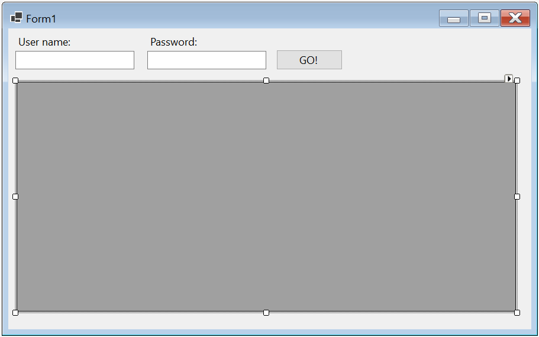
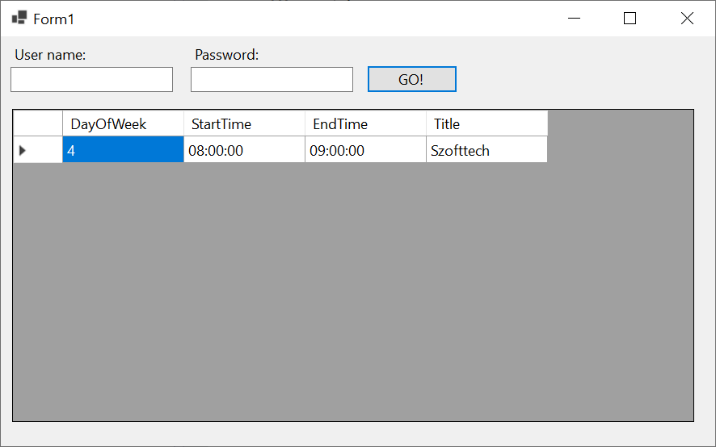
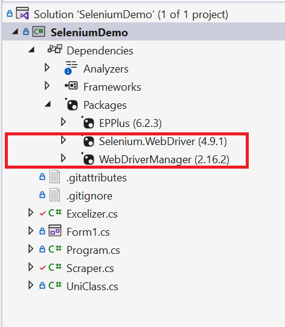

# Third Party Package-ek használata

A mai gyakorlat rendhagyó lesz több szempontból is. Egy saját projektet kell létrehozni legalább az egyik mintaprojektben is használt csomag felhasználásával.

A programnyelvek igazi erejét, az ökoszisztéma gerincét, az elérhető csomagok/könyvtárak alkotják. A programozás tulajdonképpen probléma megoldás több szinten, minél absztraktabb módon. Nem kell gépi kódot írnunk, mert vannak magas szintű programnyelvek, nem kell minden dolgot feltalálni a programnyelvekben sem, mert vannak alaposztályok és funkciók, és erre épülnek rá a harmadik féltől származó könyvtárak/csomagok. Miért vesződjünk azzal, hogy egy objektumot `JSON`-ná konvertáljunk, ha ezt már valaki nagy fáradozással megtette helyettünk? A .NET keretrendszerhez nagyon sokféle csomag érhető el -- akárcsak Python-hoz.

A modern fejlesztői környezet részévé vált a `ChatGPT`, ezért most a használata nemcsak hogy engedélyezett, de feladat is. Sokkal gyorsabban el lehet érni vele a kívánt eredményt, mint a hivatalos dokumentáció böngészésével. Azonban itt fontos megjegyezni, hogy "A nagy erő, nagy felelősséggel jár." (Pókember). Nem lehet teljesen rábízni magunkat az AI-ra, mert könnyen el tud vinni minket vakvágányra és előfordul, hogy túlbonyolít és halucinál dolgokat.


## Röviden a mintaprojektről

A mintaprojekt két könyvtárat használ, a `Selenium`-mal böngészőt tudunk vezérelni és az `EPPlus`-sal pedig Excel mukafüzeteket lehet kódból generálni. Az alkalmazás 

- felmegy a neptunra, 
- bejelentkezik, 
- letölti az órarendet,
- és az órarend alapján csinál egy excel fájlt, az órarendünkről.


## Tippek a ChatGPT használatához
1. Kontextus: Adjuk át minél jobban, hogy mik az elvárásaink és milyen környezetben vagyunk, hagyjunk minél kevesebb dolgot a képzelőerőnek
2. Tegyünk fel jól strukturált kérdéseket és ha feladatot adunk, legyünk precízek
3. Kérdezzünk bátran és kérdezzünk vissza, ha valamit nem értünk, kiemelve a kérdéses részeket
4. Ha változtatunk a kódon miután átvettük akkor a következő kérdésnél adjuk oda a modellnek, hogy jó kóddal dolgozzon
5. Ha valami nem jó, pontosítsunk
6. Használjunk minél fejlettebb modellt
        
## A mintaprojekt felépítése

> [!WARNING]
>
> A mintaprojektet nem kell leadni, okulásul és kiindulásul szolgál a lap legalján található leadandó feladathoz!

### A felhasznált csomagok

#### Selenium

(!Hint) Kérdezd meg a ChatGPT-t, hogy mi az a Selenium! [!A Selenium egy olyan eszköz vagy keretrendszer, amely lehetővé teszi a webes alkalmazások automatizált tesztelését és a böngészőalapú műveletek programozását. A Selenium lehetővé teszi a felhasználók számára, hogy felvegyenek teszteket, amelyek az egyes felhasználói eseteket szimulálják, és ellenőrzik, hogy az alkalmazás működik-e a tervezett módon. A Selenium támogatja a legnépszerűbb böngészőket, mint például a Google Chrome, a Mozilla Firefox és az Internet Explorer, és lehetővé teszi a felhasználók számára, hogy automatizáltan töltsenek ki űrlapokat, kattintsanak gombokra, navigáljanak az oldalak között, és még sok más dolgot tegyenek. A Selenium nagyon hasznos lehet a webfejlesztők és tesztelők számára, akik hatékonyabb és megbízhatóbb teszteket szeretnének végrehajtani, valamint a webes alkalmazások fejlesztői számára, akik könnyedén hozzáadhatják a Selenium támogatását az alkalmazásaikhoz. **Egy éles projektben nincs lehetőség arra, hogy minden kódváltozatás után manuálisan végigteszteltessünk mindent, hogy nem tört-e el valamit az eszközölt változtatás.**]
        

#### EPPlus

(!Hint) Kérdezd meg mire jó az EPPlus! [!Az EPPlus egy .NET-ben írt nyílt forráskódú könyvtár, amely lehetővé teszi a Microsoft Excel fájlok olvasását és írását. Az EPPlus alkalmas Excel-fájlok létrehozására, módosítására, olvasására és mentésére is, és támogatja a legtöbb Excel-fájl formátumot. Az EPPlus-nal a fejlesztők programozói módon kezelhetik az Excel-fájlokat, így lehetőségük van arra, hogy a programozás révén generálják az Excel-táblázatokat vagy azok tartalmát. Az EPPlus további előnye, hogy nagyon hatékonyan kezeli a nagy adathalmazokat, és támogatja a diagramok, táblázatok, képek és más elemek beillesztését az Excel-fájlokba. Az EPPlus így kiválóan alkalmas olyan alkalmazások fejlesztésére, amelyek az Excel adathalmazok kezelésére épülnek, és lehetőséget kívánnak adni az adatok vizualizálására és elemzésére.]

## A projekt felépítése

(+/-) Első lépésként hozz létre egy Widows Forms App típusú projektet, és az űrlapon helyezz el egy-egy mezőt a Neptun kódodnak és a felhasználónevednek, és egy OK gomot!

> [!IMPORTANT] 
>
> Nem szeretnénk, ha a felhasználónév illetve bármilyen jelszó el lenne mentve a forráskódban! Ne írd be lustaságból a `TextBox`-okba tervezőben, mert bent maradhat, feltölthated bárhova, és egy ilyen feledékenység vállalati környezetben az állásodba kerülhet!

(+/-)  Kérdezd meg a ChatGPT-t, hogyan oldható meg az, hogy a jelszó karakterei helyett pöttyök jelenjenek meg egy `TextBox`-ban!

(+/-) Helyezz el egy DataGridView vezérlőt is az űrlapon, itt tudjuk majd megjeleníteni az adatokat, amiket letöltöttünk! Erről bővebben később!



Három osztályt használunk, a `Scraper.cs`-be száműztük azt a kódot, ami a böngésző irányításért felel, az `Excelizer.cs`-be raktuk azt, ami az Excel generálást végzi és van egy `UniClass` nevű osztályunk, ami az óránknak a modellje.

> [!Note]
> Azért lett UniClass, mert a class az egy foglalt kifejezés a C#-ban és példányosításnál nem lehetne neki egyszerűen a class nevet adni és félrevezető lehet, de ha bármilyen foglalt kifejezés elé írunk egy @-t, akkor használhatjuk változó névként.

## Az `UniClass` osztály

(+/-) Hozd létre a projektben az `UniClass` osztályt! Ez egy egyszerű osztály, ami egy óráról tárol infromációt. Ez órarend `List<UniClass>`. A `DayOfWeek` tulajdonságban 0-6 ig megmondhatjuk milyen nap van az óránk, a `StartTime` és az `EndTime` megadja, mikor kezdődik, illetve mikor van vége. A `Title` a tárgy  címe:

``` csharp
public class UniClass
{
    // Teljesen egyszerű osztály, 0-6 ig megmondhatjuk milyen nap van az óránk, mikor kezdődik, mikor van vége és mi a szöveg
    // A szövegben van benne a tantárgy neve, hogy ki tartja és melyik teremben van
    public int DayOfWeek { get; set; }
    public TimeSpan StartTime { get; set; }
    public TimeSpan EndTime { get; set; }
    public string Title { get; set; }
}
```

## A `Scraper` osztály 

(+/-) Hozd létre az alábbi osztályt a projektben!

```cs
public class Scraper
{    
    private static string _url = @"https://neptun3r.web.uni-corvinus.hu/Hallgatoi/login.aspx";

    public static List<UniClass> ScrapeClasses(string username, string password)
    {
        List<UniClass> classes = new List<UniClass>();
        //Ide jön a kód


        return classes;
    }
}
```

Az  `_url` a neptununk url-je ez nem fog változni, nyugodtan iderakhatjuk

A `ScrapeClasses` függvény fogja megszerezni nekünk az óráinkat, de ehhez szüksége van a felhasználónevünkre és jelszavunkra, amit a Form1-ből szerzünk.  

A kódját egészítsd ki az alábbiak szerint, hogy legyen legalább egy tesztadatunk, amit meg tudunk jeleníteni:


``` csharp
List<UniClass> classes = new List<UniClass>();

UniClass mintaÓra = new UniClass();
mintaÓra.DayOfWeek = 4;
mintaÓra.Title = "Szofttech";
mintaÓra.StartTime = TimeSpan.FromHours(8);
mintaÓra.EndTime = TimeSpan.FromHours(9);

classes.Add(mintaÓra);

return classes;
```

## A `ScrapeClasses` hívása a `Form1`-ből:

(+/-) Rendelj eseménykiszolgálót a gomb kattintás eseményéhez, melyben hívd meg a `Sraper` osztály statikus `ScrapeClasses` és jelenítsd meg az órákat a rácsban. A `DataGridView` `DataSouce` tulajdonságán keresztül beállítható a lista, amelynek tartalmát szeretnénk megjeleníteni!

``` csharp
List<UniClass> classes = Scraper.ScrapeClasses(textBoxUser.Text, textBoxPassword.Text);
dataGridView1.DataSource= classes;
```

lustáknak:
``` csharp
var classes = Scraper.ScrapeClasses(textBoxUser.Text, textBoxPassword.Text);
dataGridView1.DataSource= classes;
```

Ha minden jól megy, valami ilyesmit kéne látni:



​                           

# Böngésző vezérlése Seleniummal                                                                      

### NuGet csomag telepítése

A NuGet a Visual Studio csomagkezelője. Számtalan ingyenes és fizetős modul érhető el rajta keresztül, és telepíthető pillanatok alatt. 

(+/-) Kérdezzétek meg a ChatGPT-t, hogyan kell a Selnium NuGet csomagot telepíteni C# projektbe!

```
how can i install selenium into a c# project?
```

(+/-) Telepítsétek a `WebDriverManager` csomagot is. A Solution Expolrerban is tudjátok ellenőrizni a telepített csomagokat, mostanra a pirossal keretezetteknek kell telepítve lennie:




Minden böngészőhöz külön csomag tartozik, a `WebDriverManager` pedig segít a böngészőkhöz tartozó bináris állományok automatikus letöltésében. 

### Böngésző és weblap megnyitása Seleniummal

Az előző kérdésre kapott igen bőbeszédű válasz alapján már ki is egészíthetjük a `ScrapeClasses` metódust azzal, hogy nyissa meg a Chrome-ot a megfelelő URL-el:

```csharp
// Minden böngészőre máshogy kell konfigurálni a Selenium motort, it a Chrome-ot használjuk
new WebDriverManager.DriverManager().SetUpDriver(new ChromeConfig());
IWebDriver driver = new ChromeDriver();

// Megnyitjuk a neptunt
driver.Navigate().GoToUrl(_url);
```


### Órarend letöltése Seleniummal

Értelmezd az alábbi kódot! A böngészőben F12-vel megnyíló Developer Tools segítségével vizsgálhatod meg, hogy mely elemekre vagy kíváncsi az adott oldalon. 

> [!IMPORTANT] 
>
> A Neptun és a Moodle minden tevékenységet loggol. Az alább bemutatott technika etikátlan használója tettenérhető minden olyan oldalon, ahol a felhasználó egyértelműen azonosítható. Az alábbi kódrészéletet egy az egyben használd, NE a Neptunon gyakorloj!

> [!NOTE]
> Az alábbi kód összetetten vezérli a böngészőt, a teljes megértésére nincs idő a gyakorlat keretein belül. Az elv megértése a lényeg, szükség esetén a kódminta alapként szolgálhat más feladatok megoldására.

```csharp
public static List<UniClass> ScrapeClasses(string username, string password)
{
    // Minden böngészőre máshogy kell konfigurálni a Selenium motort, it a Chrome-ot használjuk
    new WebDriverManager.DriverManager().SetUpDriver(new ChromeConfig());
    IWebDriver driver = new ChromeDriver();

    // Megnyitjuk a neptunt
    driver.Navigate().GoToUrl(_url);

    // Ez a két elem az, ahova beírnánk a neptun kódot és jelszót. A driver-rel meg tudjuk találni a weboldalon az elemeket a szellemes By segítségével.
    // Itt a felhasználó nevet fogadó inputot a neve alapján választjuk ki, a jelszavasat pedig az id-ja alapján.
    var usernameField = driver.FindElement(By.Name("user"));
    var passwordField = driver.FindElement(By.Id("pwd"));

    // Beíratjuk a motorral a felhasználónevet és jelszót
    usernameField.SendKeys(username);
    passwordField.SendKeys(password);

    // Példányosítunk egy osztályt, aminek az a feladata, hogy megváratja a motort, maximum addig, amennyi a konstruktor második argumentuma
    WebDriverWait wait = new WebDriverWait(driver, TimeSpan.FromSeconds(10));

    // Itt például addig váratjuk, amíg nem talál egy btnSubmit id-val rendelkező elemet.
    // A nyilas dolog benne egy lambda kifejezés, ami tulajdonképpen egy rövidített függvény
    // Lesz róla szó bővebben a következő félévben.
    var loginButton = wait.Until(driver => driver.FindElement(By.Id("btnSubmit")));

    // Rákattintunk a gombra
    loginButton.Click();

    // Itt a Tanulmányok linket szeretnénk berakni a studiesLink változóba, aminek nem mondjuk meg előre, hogy micsoda
    // mert a jobb oldalából következik ez például lehet bármilyen olyan osztály példánya, ami teljesíti az
    // IWebElement interfész kritériumait és lehet null, mert van mögötte kérdőjel
    // A wait addig váratja a motort, amíg olyan eredményt kap, ami nem null
    var studiesLink = wait.Until(driver =>
    {
        try
        {
            // Itt XPath alapján választjuk ki az elemet, ebben egyerre benne van a típusa és most a szövege is.
            return driver.FindElement(By.XPath("//li[contains(text(), 'Tanulmányok')]"));
        }
        catch (NoSuchElementException)
        {
            return null;
        }
    });
    // Létrehozunk egy olyan osztályt, amivel felhasználói mozdulatokat tudunk emulálni.
    Actions actions = new Actions(driver);
    // Rákattintunk vele a Tanulmányok linkre
    actions.MoveToElement(studiesLink).Perform();

    var scheduleLink = driver.FindElement(By.Id("mb1_Tanulmanyok_Órarend"));
    actions.MoveToElement(scheduleLink).Perform();
    // Rákattintunk az Órarend linkre
    scheduleLink.Click();

    // Megvárjuk míg betölt (az, hogy maga a tábla létezik még nem jelenti azt, hogy a tartalma is fel van töltve)
    wait.Until(driver => driver.FindElement(By.Id("c_common_timetable_tabOrarend_body")));
    // Altatjuk a függvényt 3 másodpercig, hogy biztosan betöltsön az is, ami benne van
    Thread.Sleep(3000);

    // Megfogjuk az oszlop elemet, amiben vannak az órák
    var days = driver.FindElements(By.ClassName("tg-col"));

    List<UniClass> classes = new List<UniClass>();
    int d = 0;

    // Végigmegyünk minden oszlopon
    foreach (var day in days)
    {
        // A kék óra buborékok mind chip osztállyal rendelkeznek, azzal választjuk őket ki
        var classesInDay = day.FindElements(By.ClassName("chip"));

        foreach (IWebElement classElement in classesInDay)
        {
            // Kiválasztjuk az aktuális óra elemének a title attribútumát
            string title = classElement.GetAttribute("title");

            // Felvágjuk a sortörések mentén
            string[] titleParts = title.Split('\n');

            // Az időt ' - ' mentén választjuk le
            string[] timeRange = titleParts[0].Split(" - ");
            string startingTime = timeRange[0].Substring(timeRange[0].LastIndexOf(" ") + 1);
            string finishingTime = timeRange[1].Split("\r")[0].Trim();

            // Az lesz a szöveg, ami az [Óra] rész után van
            string classTitle = titleParts[1].Split("[Óra] ")[1];

            // Konstruktor nélkül létrehozunk egy új UniClass-t a szerzett paraméterekkel
            classes.Add(new UniClass
            {
                // A TimeSpan osztály hasonló, mint a DateTime, de ez időintervallumot jelöl.
                // Itt odaadjuk a ParseExact függvényének a feldolgozott stringünket és súgunk neki, hogy milyen formában van
                StartTime = TimeSpan.ParseExact(startingTime, "h\\:mm", null),
                EndTime = TimeSpan.ParseExact(finishingTime, "h\\:mm", null),
                Title = classTitle,
                DayOfWeek = d
            });

        }

        // Növeljük a d (nap) számlálónkat, később innen fogjuk tudni, hogy melyik nap van az óra
        d++;
    }

    // Becsukjuk a Seleniumot, hogy ne maradjon nyitva a fekete ablak.
    driver.Close();
    driver.Quit();
    return classes;
}
```

## Órarend exportálása Excelbe

(+/-) Telpítsltek az `epplus` NuGet csomagot is!

(+/-) Hozzátok létre az alábbi osztályt, majd építsétek be a `Form1`-be, miután megszereztétek a listát az órákkal. 

```csharp
public class Excelizer
{
    // Adunk egy tulajdonságot az osztálynak, ez lesz az elérési út
    public string Path { get; set; }
    // Konstruktorba ezt bekérjük és be is állítjuk
    public Excelizer(string path)
    {
        this.Path = path;
    }
    // Ez a metódus fogja legenerálni az excel táblát, az alapján az órákat tartalmazó lista alapján, amit kap
    public void CreateTimeTable(List<UniClass> classes)
    {
        // Az EPPLus szeretne pénzt kérni, ha üzleti fejlesztésben van használva a munkájuk, ezért a
        // licenszt beállíthatjuk, nem üzletire
        ExcelPackage.LicenseContext = LicenseContext.NonCommercial;
        // Ami a using blokkba van, az a using blokkból kilépve tisztességesen be lesz csukva
        using (var package = new ExcelPackage())
        {
            // A csomaggal létrehozunk egy munkafüzetet, ebben fogunk dolgozni
            var worksheet = package.Workbook.Worksheets.Add("Órarend");

            int startHour = 8; // Innen indítjuk a napot
            int endHour = 21; // Itt fejezzük be

            // Felcímkézzük a sorokat, hogy hány órát jelentenek
            for (int hour = startHour; hour <= endHour; hour++)
            {
                for (int minute = 0; minute < 60; minute += 10)
                {
                    int rowIndex = 2 + ((hour - startHour) * 6) + (minute / 10);
                    worksheet.Cells[rowIndex, 1].Value = $"{hour:D2}:{minute:D2}";
                }
            }
            // Felcímkézzük az oszlopokat is, minden másodikat, hogy szebb legyen és ki tudjunk hagyni egy picit
            // a napok között
            worksheet.Cells[1, 2].Value = "Hétfő";
            worksheet.Cells[1, 4].Value = "Kedd";
            worksheet.Cells[1, 6].Value = "Szerda";
            worksheet.Cells[1, 8].Value = "Csütörtök";
            worksheet.Cells[1, 10].Value = "Péntek";

            //Az első oszlop magasságát 15 pontról 30-ra állítjuk
            worksheet.Row(1).Height = 30;
            //Kiválasztjuk az első sort és félkövérre állítjuk
            var font = worksheet.Cells["1:1"].Style.Font;
            font.Bold = true;
            // Feltöltjük a munkafüzetet az órákkal
            for (int i = 0; i < classes.Count; i++)
            {
                UniClass uniClass = classes[i];

                // Kiszámoljuk a kezdő és záró sor indexet az idő alapján
                int startRowIndex = 2 + (((uniClass.StartTime.Hours - startHour) * 6) + (uniClass.StartTime.Minutes / 10));
                int endRowIndex = 2 + (((uniClass.EndTime.Hours - startHour) * 6) + (uniClass.EndTime.Minutes / 10));

                // Beírjuk a szöveget a cellába
                worksheet.Cells[startRowIndex, 2 + uniClass.DayOfWeek*2].Value = uniClass.Title;

                // Beállítjuk a sortörést
                worksheet.Cells[startRowIndex, 2 + uniClass.DayOfWeek*2].Style.WrapText = true;

                // Átméretezzük az oszlopokat (itt más mértékegységet használunk).
                // Az oszlop amiben az óra van az 12 széles és 2 szünet lesz mellette
                worksheet.Column(2 + uniClass.DayOfWeek*2).Width = 12;
                worksheet.Column(2 + uniClass.DayOfWeek * 2+1).Width = 2;

                // Beállítjuk, hogy a szöveg a tetejére húzzon
                worksheet.Cells[startRowIndex, 2 + uniClass.DayOfWeek*2].Style.VerticalAlignment = ExcelVerticalAlignment.Top;


                // Kitöltjük tankönyves nyomtatós stílussal a cellát, természetesen Fuchsiára
                var fill = worksheet.Cells[startRowIndex, 2 + uniClass.DayOfWeek*2].Style.Fill;
                fill.PatternType = ExcelFillStyle.LightTrellis;
                fill.BackgroundColor.SetColor(Color.Fuchsia);

                // Összeolvasztjuk az alatta lévő cellákkal, amíg tart az óra
                worksheet.Cells[startRowIndex, 2 + uniClass.DayOfWeek*2, endRowIndex, 2 + uniClass.DayOfWeek*2].Merge = true;

            }

            // Elmentjük a munkafüzetet Orarend.xlsx néven
            // Itt a System.IO előtagra szükség van, mert az osztályszintű elérési út is Path!
            package.SaveAs(new FileInfo(System.IO.Path.Combine(this.Path, "Orarend.xlsx")));

        }
    }
}
```

## Leadandó feladat

## 

> [!WARNING]
>
> Csak ezt kell leadni gyakrolat végén!

(+/-) Építs olyan alkalmazást, mely tetszőleges weblapról legyűjti az USD/HUF pillanatnyi árfolyamát!
