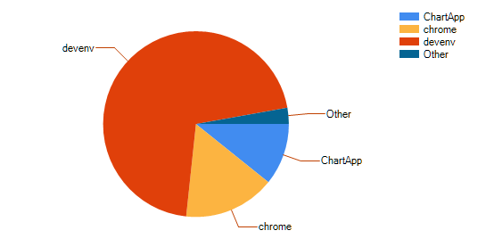

# BigBrother

A példa célja olyan kliens építése, mely naplózza a gépen történő szoftverhasználatot, és egy közös adatbázisba menti a hallgatóktól gyűjtött eredményeket. A gyakorlat során létre kell hozni egy második, külön projektet is, melynek segítségével lekérdezhetők és elemezhetők az eredmények. Tehát a gyakorlat végére lesz egy adatgyűjtő és egy adatmegjelenítő projekt. 

Ebben a példában két különböző programot is meg kell írni, és melyeknek egy közös adatbázishoz csatlakoznak. Mindkét feladatrészben valósítsd meg a megfelelő ORM osztályokat ugyanahhoz az adatbázishoz! A látványosabb eredmények elérése érdekében érdemes a közös központi adatbázissal dolgozni, amibe a teljes évfolyamról gyűjtött adatok belekerülnek.

> FIGYELEM!
A feladatot eredetileg egyetemi géptermi gyakorlatra terveztük, ami adatvédelmi szempontból teljesen más, mint a saját gépünkről adatot gyűjteni és megosztani. Mielőtt futtatod az adatrögzítőt, nézd meg, mi van nyitva, vagy ha aggályod merül fel, ugord át az adatgyűjtéssel kapcsolatos lépéseket! 

## A SoftwareUsage adatbázis

Az adatbázis **csak az egyetemi IP-tartományból vagy VPN-en** keresztül érhető el!

<table>
<tr><td>Szerver</td><td>bit.uni-corvinus.hu</td></tr>
<tr><td>Felhasználónév</td><td>hallgato</td></tr>
<tr><td>Jelszó</td><td>Password123</td></tr>
<tr><td>Adatbázis</td><td>SoftwareUsage</td></tr>
</table>

## I. rész: _BigBrother_ adatrögzítő projekt felépítése

#### BigBrother ablak beépítése
(+/-) Hozz létre egy új *Windows Forms Application* projektet, de a neve NE legyen `BigBrother`, mert ez lesz a következő lépésekben betöltött `Form` neve is.
(+/-) Töltsd le a [BigBrother.zip](BigBrother.zip) állományt, és a benne levő két fájlt add hozzá a projekt könyvtáradhoz. (Legegyszerűbb behúzni egérrel.)
(+/-)  Mindkét fájl elején cseréld le a névteret (Szoft2.Week10.BigBrother) a projekted nevére.

#### BigBrother adatok mentése

(+/-) A Form1 konstruktorában példányosítsd a `BigBrother` osztályt és rendelj eseménykezelőt az `AblakVáltás` eseményéhez.

(+/-) Az `AblakVáltás` eseménykezelőben hozz létre egy új `SoftwareUsage` rekordot, és értelemszerűen töltsd fel a tulajdonságait az esemény argumentumában szereplő értékekkel. (Az ID automata számlálós kulcs mező, nem szabad feltölteni!)

(+/-) Add hozzá az új rekordot az adatbázis tábládhoz.

Megoldás:
```csharp
public Form1()
{
    InitializeComponent();

    BigBrother bb = new BigBrother();
    bb.AblakVáltás += Bb_AblakVáltás;
}

private void Bb_AblakVáltás(object sender, AlkalmazásHasználatEventArgs e)
{
    // A program indulásakor még nincsenek feltöltve az argumentumok, és nem akarunk üres sorokat írni az adatbázisba!
    if (e.Ablakcím == null ||
        e.AlkalmazásNév == null ||
        e.LoginNév == null)
        return;

    SoftwareUsage s = new SoftwareUsage();
    s.WindowTitle = e.Ablakcím;
    s.ApplicationName = e.AlkalmazásNév;
    s.Login = e.LoginNév;
    s.Time = (int)e.Idő;
    context.SoftwareUsages.Add(s);
    context.SaveChanges();
}
```

Ha elkészültél, akkor futtasd a programot! A Form1 és a BigBrother ablakok is meg fognak nyílni. Óra végéig hagyd futni ezt a programot, és ne zárd be ezt a két ablakot (oldalra kihúzhatók, hogy ne legyenek útban). A program mostantól folyamatosan adatbázisba naplózza a gépeden történő ablakváltásokat. 

A továbbiakban nyiss egy új Visual Studio-t, és egy teljesen új projektbe dolgozz!

## II. rész: Adatelemző projekt felépítése
### Felhasználói felület

Hozzd létre az ábrán látható elrendezést! A jobb alsó sarokban látható objektum egy `Chart`. (Behúzás után még oszlopdiagrammot mutat, később beállítjuk.)

![kep2]

### Login lista
A bal oldali `ListBox`-ba kérdezd le a felhasználók Login neveit, és valósítsd meg hozzájuk a szűrést.

A `SoftwareUsage` a táblában az egyes Login nevek többször is szerepelnek, de mi csak egyszer szeretnénk megjeleníteni őket a listában. Ehhez a lekérdezés után az aggregáló függvényekhez hasonlóan meg kell hívni a `Distinct()` metódust. Ez minden egyforma adatsort csak egyszer fog megjeleníteni, azonban a mi adatsorainknak van egy `ID` nevű kulcsmezője is, tehát minden sor különbözik. A `select` részben viszont le tudunk szűkíteni a lekérdezett adatokat kizárólag a Login-ra, és így már megfelelően működik majd a függvény. (Ezzel a megközelítéssel elhagyható a `DisplayMember` beállítása, hiszen csak egy mezőnk van, így a `ListBox` automatikusan tudja, hogy azt kell megjelenítenie.)

Megoldás:
``` csharp
// Fontos, hogy csak a Login mező legyen lekérdezve, különben nem működik majd a Distinct parancs
var logins = from x in context.SoftwareUsages
             where x.Login.Contains(txtLoginFilter.Text)
             select x.Login;
// A listává alakítás előtt a Distinct paranccsal biztosítjuk, hogy minden login név csak egyszer szerepeljen a listában
listLogin.DataSource = logins
    .Distinct()
    .ToList();
```

### Kiválasztott felhasználó szoftverhasználatának lekérdezése

(+/-) A projekt adatforrásai közé vedd fel a `SoftwareUsage` osztályt!

(+/-) A felső rács adatforrásaként állítsd be a `SoftwareUsage` osztályt!

(+/-) Rendelj eseménykiszolgálót a `ListBox` `SelectedIndexChanged` eseményéhez. Az eseménykiszolgálóban a felső rácsban jelenítsd meg a kiválasztott felhasználó összes ablakváltásáról rendelkezésre álló adatot! A lekérdezés eredményét kötheted a `softwareUsageBindingSource.DataSource`-án keresztül.

```csharp
	var selectedLogin = (string)listBox1.SelectedItem; 
	var applicationData = from x in context.SoftwareUsages where x.Login == selectedLogin select x; 
	// A lekérdezést eredményét betöltjük a már korábban létrehozott BindingSource-ba, amit a design nézetben 	bekötöttünk a DataGridView adatforrásának 
	softwareUsageBindingSource.DataSource = applicationData.ToList(); 
```

### Szoftverhasználat idejének összesítése alkalmazás szerint

(+/-) Adj a projekthez egy `AppTime` osztályt 
```csharp
public class AppTime 
{
    public string ApplicationName { get; set; } 
    public int Time { get; set; } 
}
```
(+/-) Az új osztályt vedd fel a projekt adatforrásai közé: Build-eld a projektet és `DataSources` ablakban hozz létre egy adatkötött objektumot az új osztály alapján.
    
> Korábban csak adatbázis táblák esetén alkalmaztuk ezt a módszert, de bármilyen osztályból létre lehet hozni az adatkötött objektumokat. Az adattáblák esetén sem maguk a táblák, hanem az ORM során, a táblákból létrehozott osztályokat kötöttük be.

(+/-) A jobb-alsó rács adatforrása legyan az `AppTime` osztály. Mikor beállítod tervezőből, létre fog jönni egy `appTimeBindingSource` is.

(+/-) A `ListBox` `SelectedIndexChanged` eseménykiszolgálójában az előző LINQ lekérdezés eredményének felhasználásával összesítsd az időket alkalmazásonként!

(+/-) `appTimeBindingSource.DataSource`-át a fenit lekérdezés eredményére.

Megoldás:
```csharp
// Csoportosítjuk a korábban lekérdezett adatokat az Applikáció neve szerint
// A csoportokból egy-egy AppTime példányt hozunk létre
// A csoportosításhoz használt mező(k) a Key tulajdonságból kérdezhetők le
// Minden egyéb mezőt újabb LINQ segítségével lehet aggregálni (pl.: Sum)
var appTimes = from x in applicationData
               group x by new { x.ApplicationName } into g
               select new AppTime()
               {
                   ApplicationName = g.Key.ApplicationName,
                   Time = (from x in g select x.Time).Sum()
               };
// A lekérdezést eredményét betöltjük a már korábban létrehozott BindingSource-ba, amit a design nézetben bekötöttünk a Chart adatforrásának
appTimeBindingSource.DataSource = appTimes.ToList();
// Chart esetén ezzel a sorral lehet frissíteni a megjelenést, ha változtak a forrás adatok
chart1.DataBind();
```

#### Chart adatkötés
A `Chart`-ban egy kőrdiagrammon szeretnénk megjeleníteni azt, hogy a jobb-alsó `DataGridView`-ban szereplő adatokat.

(+/-) Az `appTimeBindingSource` legyen a `Chart` adatforrása!

(+/-) A `Chart` objektumnak van egy `Series` tulajdonsága, ezen keresztül állíthatók be a megjelenítendő adatok. Akár több adatsort is meg lehet jeleníteni egy `Chart`-on, de mi most csak a meglévővel foglalkozunk. Minden hátralévő beállítás elvégezhető tervező nézetből.

(+/-) Állítsd be `Chart`-ot kördiagram típusra, és határozd meg, melyik mezők jelenjenek meg az adatforrásból.  

![kep3]

(+/-) Azokat az applikációkat, amik kevesebb, mint az idő 10%-ban voltak használatban, vond össze egy *Other* nevű csoportba.
        
![kep4]



(+/-) Kísérletezz a többi megjelenítési funkcióval! Változtasd meg a színeket, helyezd át másik oldalra a jelmagyarázatot, vagy jelenítsd meg a pontos értékeket is.

[kep2]: letoltes.png
[kep3]: ChartSettings1.png
[kep4]: ChartSettings2.png
