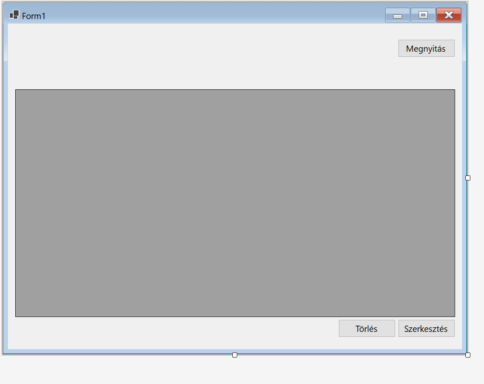
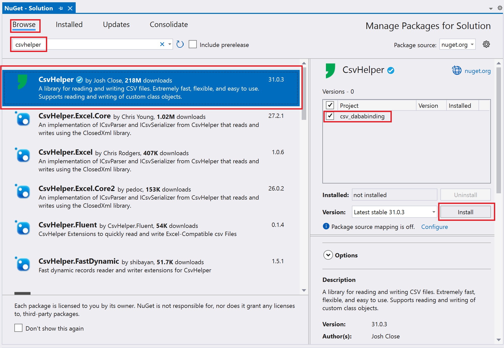
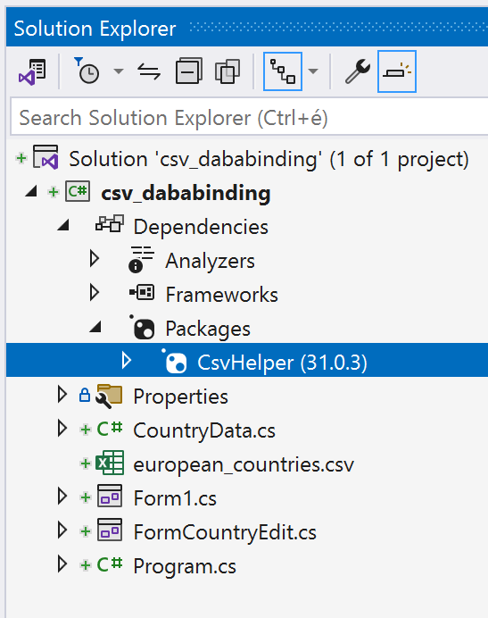
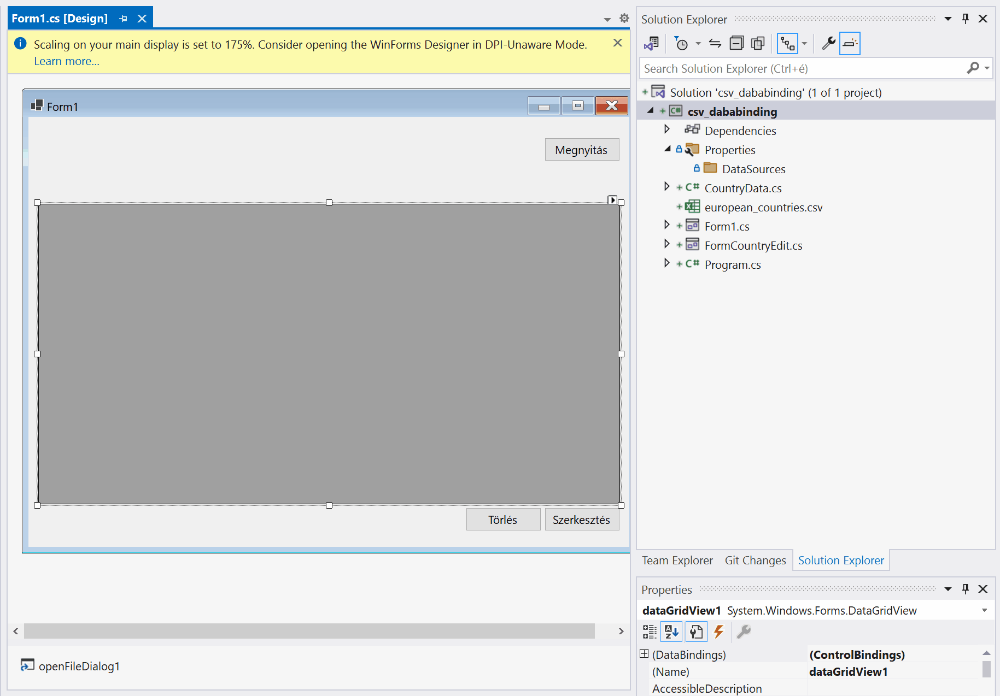
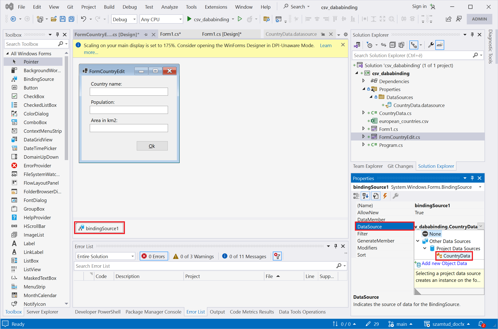
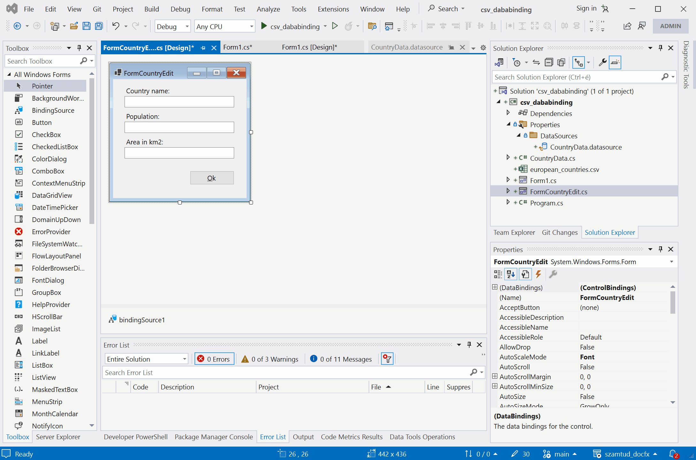
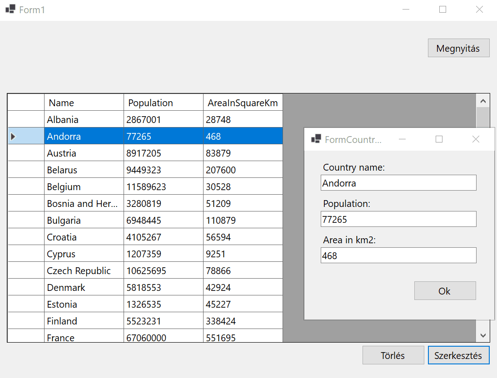

# CSV állományok és adatkötés

## Bevezetés

A heti feladatsor egyben minta ZH-ként is szolgál. 

Az előadás és gyakorlat fő célja az adatkötés bemutatása. Adatkötések (_data binding_) segítségével elérhető, hogy két tulajdonság értéke mindig szinkronban legyen egymással. Összeköthető például egy szövegdoboz `Text` tulajdonsága egy objektum valamely `string` típusú tulajdonságával. Ha a szöveg megváltozik a szövegdobozban, a változás automatikusan átkerül az objelktum kötött tulajdonságába. Az adatkötések nagyon leegyszerűsítik a fejlesztést, hosszas és unalmas kódolás helyett pillanatok alatt látványos eredmények érhetőek el a tervezőben. 

A gyakorlati példa az európai országok területét és lakosságát tartalmazó CSV állományt használ. 

## Előkészületek

Hozz létre egy projektet a `Forms Application` projektsablon alapján, majd projektben egy szövegfájlt `european_countries.csv` néven az alábbi tartalommal.  Legegyszerűbb, ha a projekten melül hozol létre egy szövegfájlt, aminek aztán `.csv` kitrejesztést adsz!

```
Name,Population,AreaInSquareKm
Albania,2862427,28748
Andorra,77265,468
Austria,8917205,83879
Belarus,9449323,207600
Belgium,11589623,30528
Bosnia and Herzegovina,3280819,51209
Bulgaria,6948445,110879
Croatia,4105267,56594
Cyprus,1207359,9251
Czech Republic,10625695,78866
Denmark,5818553,42924
Estonia,1326535,45227
Finland,5523231,338424
France,67060000,551695
Germany,83020000,357578
Greece,10423054,131957
Hungary,9773000,93030
Iceland,343353,102775
Ireland,4921500,70273
Italy,60390560,301340
Kosovo,1845300,10887
Latvia,1909000,64562
Liechtenstein,38813,160
Lithuania,2795335,65300
Luxembourg,625978,2586
Malta,514564,316
Moldova,2681735,33846
Monaco,38300,2
Montenegro,622359,13812
Netherlands,17181084,41543
North Macedonia,2077132,25713
Norway,5391369,385207
Poland,37976687,312696
Portugal,10276617,92212
Romania,19237691,238397
Russia,146171015,17098242
San Marino,33864,61
Serbia,6982084,88361
Slovakia,5467093,49035
Slovenia,2078654,20273
Spain,46733038,505990
Sweden,10367395,450295
Switzerland,8654622,41285
Ukraine,44385155,603500
United Kingdom,67886011,242495
Vatican City,800,0
```

> [!NOTE]
>
> Ne felejtsd el beállítani a `Copy to output directory`-t!

Ezután hozz létre egy egyszerű űrlapot:



## A megoldás menete

### 1. `CsvHelper` NuGet csomag telepítése

A CSV állományokat fel lehet úgy is olvasni ahogy a múltkor csináltunk: `StreamReader` osztály segítségével soronként, majd a sorokat a `Split()` metódus metódus segítségével valamilyen elválasztó karakter mentén tömbbe tördelve. Létezik egy könnyebb út is! C# nyelvhez több csomag is létezik, amely kész osztályt tartalmaz CSV állományok kezeléséhez. A gyakorlaton a `CsvHelper` csomagot használjuk, amit a Visual Studio beépített beépített csomagkezelőjén a NuGet-en keresztül telepítünk. Ha valakinek nem szimpatikus a `CsvHelper`, használhatja a két héttel ezelőtt alkalmazott megoldást is - most is és a ZH-ban is.  

A első lépés tehát a `CsvHelper` NuGet csomag telepítése pár kattintással. Illetve két megoldás létezik, egy parancssoros és egy grafikus. 

**A grafikus felület** a  `Tools` menü, ezen belül `NuGet package manager`, majd a `Manage Packages for Solution` menüpont alól érhető el:



**A Parancssoros** a `Tools` menü, ezen belül `NuGet package manager`, majd `Package Manager console` menüpont kiválasztása után érhető el, és a 

```mathematica
Install-Package CsvHelper
```

paranccsal telepíthető a csomag. 

Bármelyik utat választod, telepítés után a *Solution Explorer*ben a projekt függőségei között látható a telepített csomag:




### 2. CSV állománynak megfelelő osztály létrehozása

Ezután meg kell vizsgálni a feldolgozandó állományt, és el kell készíteni azt az osztályt, mely az állományban szereplő sorokat reprezentálja:

```c#
public class CountryData
{
    public string Name { get; set; } = string.Empty;
    public long Population { get; set; }
    public double AreaInSquareKm { get; set; }
}
```

Ebben nincs újdonság. A típusokra érdemes odafigyelni. 

> [!IMPORTANT]
>
> A CsvHelper használatánál nagyon fontos, hogy az osztályban szereplő tulajdonságok nevei megegyezzenek a CSV fájl első sorában lévő nevekkel! Ezért érdemes a neveket vágólapon keresztül átvinni a kódba. 

### 3. Adatköthető lista létrehozása

Osztály szinten létre kell hozni egy listát, melynek elemtípusa az előbb létrehozott osztály. Ebben tároljuk majd a fájlból beolvasott adatokat. Annyi különbség lesz a megszokotthoz képest, hogy nem `List<>`-et használunk, hanem `BindingList<>`-et. Ez utóbbi képes arra, hogy ha a memóriában megváltozik a lista, a `DataGridView`, illetve a többi adatkötött vezérlő tartalma automatikusan frissüljön. 

```c#
public partial class Form1 : Form
{
    BindingList<CountryData> countryList = new();
    
    public Form1()
    {
        InitializeComponent();
    }
    ...
```

Az `BindingList`-ek elsősorban olyan vezérlők adatforrásaikont használhatók fel, melyek alkalmasak több elem megjelenítésére is, mint  pl: `ListBox`, `DataGridView`. Ilyenkor lehetőség van arra is, hogy a felhasználó egy megfelelő vezérlőn keresztül szerkessze listát. Ehhez mindössze be kell állítani, hogy az adatkötött lista legyen a vezérlő adatforrása (`DataSource`):

```c#
public partial class Form1 : Form
{
    BindingList<CountryData> countryList = new();
    
    public Form1()
    {
        InitializeComponent();
        dataGridView1.DataSource = countryList;
    }
```


### 4. A fájl feldolgozása

A következő lépés a fájl megnyitása és a CSV fájl feldolgozása:

```csharp
private void button1_Click(object sender, EventArgs e)
{
    StreamReader sr = new StreamReader("european_countries.csv");
    var csv = new CsvReader(sr, CultureInfo.InvariantCulture);
    var tömb = csv.GetRecords<CountryData>();
    foreach (var item in )
    {
        countryList.Add(item);
    }
}    
```

Vagy így:

```c#
private void button1_Click(object sender, EventArgs e)
{
    using (var reader = new StreamReader("european_countries.csv"))
    using (var csv = new CsvReader(reader, CultureInfo.InvariantCulture))
    {
        var x = csv.GetRecords<CountryData>();
        foreach (var item in x)
        {
            countryList.Add(item);
        }
    }
}
```


Miután feltöltöttük a listát össze lehet kötni a `DataGridView` `DataSource` tulajdonságát a listával. Ugyanez az adatkötés levégezhető a konstruktorban vagy az űrlap `Load()` metódusában is - ahogy már meg is tettük -, hiszen amint változik a lista tartalma, a változás megjelenik a rácsban. 

Ha mindent jól csináltál, a gombra kattitnva mejelenik a fájl tartalma a rácsban.

### 5. Adatkötött vezérlők

Az adatköthető rács nagyon hasznos vezérlő, de használatánál eddig nehézséget jelentett, hogy tervező nézetben nem tudtunk változtatni a tartalmán. Ezen segít a `BindingSource`. 

A `BindingSource` egy speciális adatkötött objektum. **Egyszerre több vezérlő adatforrásaként is be lehet állítani, és van saját adatforrása is.** Lényegében egy köztes szereplő, melynek segítségével más adatkötött objektumokat több különböző vezérlőhöz is hozzá tudunk rendelni. A `BindingSource` képes kezelni a kiválasztott elemeket is, így, ha az egyik vezérlőben kiválasztunk egy elemet egy listából, a másikban is megváltozik a kijelölés. Lehetőség van a kiválasztott elem törlésére, is a `BindingSource`-on keresztül.

A `BindingSource`-nak van egy másik hasznos felhasználási módja: tervező nézetben be lehet állítani egy oszályt (típust) adatforrásként. Ha ezt megtettük, az adatkötött vezérlőhöz kötött vezérlőkben, például `DataGridView`-ban tervező nézetben is lehet szerkeszteni az oszlopokat. (Jobb felső sarokban lévő kis fül, majd *Edit columns*)

Az alábbi lépéssorozat eredményeként létrejön egy `BindingSource` az űrlap alatt:



> [!IMPORTANT]
>
> Csak _build_ után lehet kiválasztani egy osztályt adatforrásként. 

Ezután érdemes megváltozatni az adatkötést úgy, hogy 

- a `DateGridView` adatforrása legyen a `countryBindingSource`, 
- a `countryBindingSource` adatforrása pedig a `countryList`!

```csharp
public Form1()
{
    InitializeComponent();
    countryDataBindingSource.DataSource = countryList;
    dataGridView1.DataSource = countryDataBindingSource;
}
```

## Adatok kezelése

### Rekord törlése

Kezdjük a rombolással :) A `BindingSource` találó nevű metódust tartalmaz a feladat elvégzésére:

```csharp
private void buttonDelete_Click(object sender, EventArgs e)
{
    countryDataBindingSource.RemoveCurrent();
}
```

Ha szeretnél megerősítő kérdést a pusztítás előtt, fordulj a ChatGPT-het, Bing Copilot-hoz, vagy bárakárkihez:

```
How to display a message box in c# forms app displaying a question, a yes and a no button and branch the code depending on the user's choice?
```

### Rekord Szerkesztése

### Űrlap készítése

Készítsétek egy űrlapot három szövegdobozzal és egy gombbal:



Adjatok egy `BindigSource`-ot is tervezőből az űrlaphoz tervezőből. `bindingSource1` néven fog megjelenni az űralp alatt, mivel nincs vizuális reprezentációja. Az adatforrását űééítsd be a `CountryData`-ra!

Ezután már hozzá tudod kötni a `TextBox`-okat a `bindingSource1` -hez:




```c#
public partial class FormCountryEdit : Form
{
    public CountryData CountryData;

    public FormCountryEdit()
    {
        InitializeComponent();
    }

    private void FormCountryEdit_Load(object sender, EventArgs e)
    {
        bindingSource1.DataSource = CountryData;
    }
}    
```

A `Form1`-ből így kell megnyitni:

```csharp
private void buttonEdit_Click(object sender, EventArgs e)
{
    FormCountryEdit fce = new FormCountryEdit();
    fce.CountryData = countryDataBindingSource.Current as CountryData;
    fce.Show();
}
```




A mentés sem nehéz:

```csharp
private void buttonSave_Click(object sender, EventArgs e)
{
    using (var writer = new StreamWriter("countries.csv"))
    using (var csv = new CsvWriter(writer, CultureInfo.InvariantCulture))
    {
        // Write records to the CSV file
        csv.WriteRecords(countryList);
    };
}
```

:)
