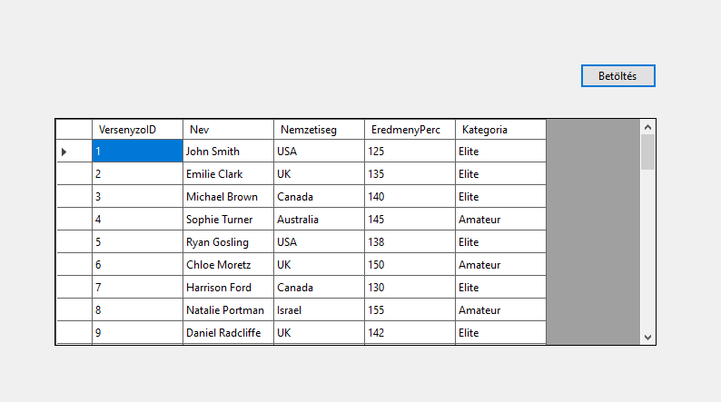
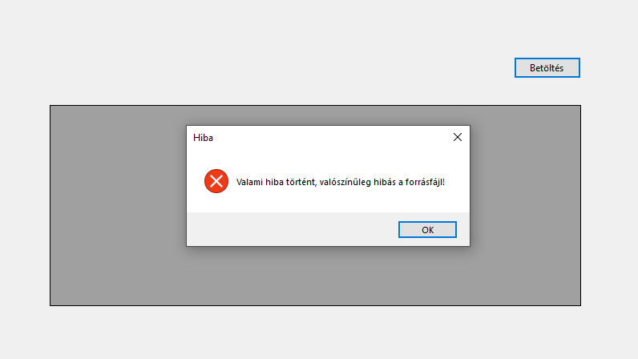
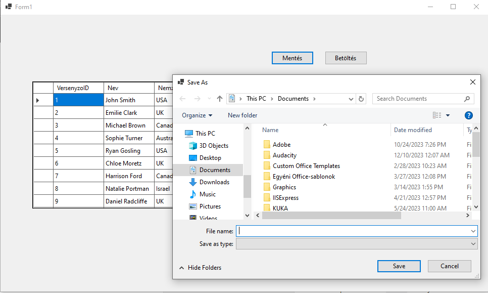
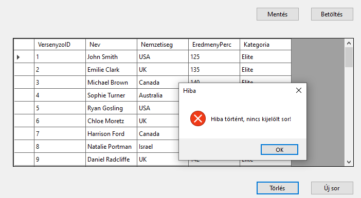
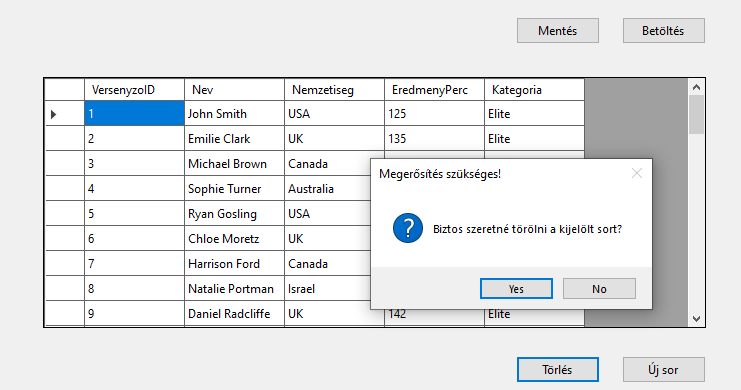
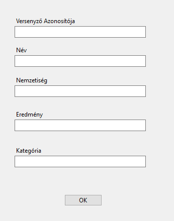
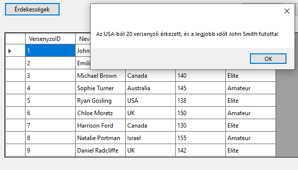

# Minta ZH

A futoversenyzok.txt fájlban található adatok alapján kell egy alkalmazást felépíteni. 

A fájl felépítése:

|                 |                                                         |      |
| --------------- | ------------------------------------------------------- | ---- |
| `VersenyzoID`   | a versenyző azonosítója                                 |      |
| `Nev `          | a versenyző neve, pl: Michael Brown                     |      |
| `Nemzetiseg`    | a versenyző nemzetisége, pl: USA                        |      |
| `EredmenyPerc ` | a versenyző eredménye egy körön, az alacsonyabb a jobb, |      |
| `Kategoria `    | a versenyző kategóriája ahol versenyez, pl: Amateur     |      |

> [!NOTE]
>
> Az alkalmazás felépítésekor célszerű követni a feladat mellé rakott képernyőképeket, melyek segítségül és kiindulási alapként szolgálnak!

Készíts alkalamazást, amely:

(+/-) A csv állományt tedd be a projektbe, és másoltasd a futtatható állomány mellé!

(+/-) Adj a projekthez egy oszályt, amely leképezi az állomány egy sorát!

(+/-) A program legyen képes megnyitni az állományt, és a sorait felolvasni egy `BindingList` típusú, `Form1` osztály szintjén létrehozott listába, majd ezeket megjeleníteni `BindingSource`-on keresztül egy `DataGridView`-ban. A lehetséges hibákat kezeld! A betöltés művelet történjen gombnyomásra!

(+/-) Az alkalamzás legyen képes menteni a `Form1` oszrályban lévő listát. A mentés helye SaveFileDialog-ban legyen kiválasztható

Mentésközben kezeld a hibákat (try-catch)! 

(+/-) Hozz létre egy gombot, melynek segítségével a rácsban az éppen kiválasztott sor törölhető. A törlés csak megerősítő kérdés után történjen meg.
Ellenőrizd, hogy van-e kiválasztott sor!

(+/-) Felugró abalakon keresztül legyen lehetőség új sor rögzítésére!

(+/-) Hozz létre egy gombot, amelyre felugrik egy MessageBox, ami a következő kérdésekre ad nekünk választ:

1) Hány versenyző érkezett az Amerikai Egyesült Államokból (adatok között „USA”)?

2. Ki szaladta a legjobb időt minden kategóriát figyelembe véve?

