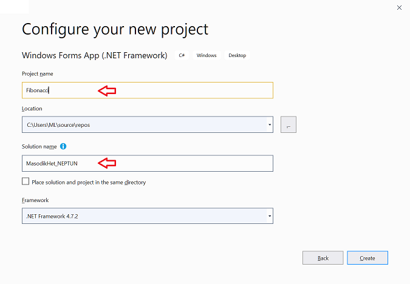
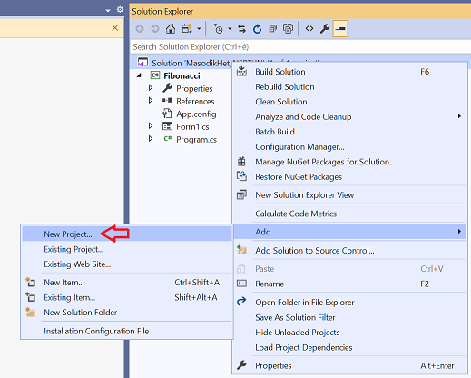
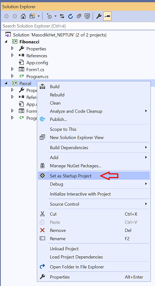

# Függvények és vezérlőszerkezetek

## Videók

[1. videó](S1fgv1-1.m4v)

[2. videó](S1fgv2-2.m4v)

[3. videó](S1fgv3-3.m4v)

[4. videó](S1fgv4-4.m4v)

## 0. feladat: Solution létrehozása

Ezen a gyakorlaton azt kérjük, hogy a két felépítendő feladatot -- Fibonacci sor és Pascal háromszög -- egy közös solution-ön belül hozzátok létre két külön projektként:

(+/-) Hozzatok létre egy új projektet a megszokott módon, de most a solution neve nem az alapértelmezésben felkínált projektnév legyen, hanem `MasodikHet_NEPTUN` fromátumú:



(+/-) Ezután a Solution felett jobb egérgombra megjelenő helyi menüből új projektet lehet adni a Solution-höz. Ennek neve legyen **Pascal**.



(+/-) Ezután a **MasodikHet_NEPTUN** nevű solution tartalmaz egy **Fibonacci** és egy **Pascal** nevű projektet. Az `F5` billentyű lenyomására mindig a félkövér betűvel szedett projekt indul el, ez az alapértelmezett projekt. Ezt is a projekt nevéhez tartozó helyi menüből lehet átállítani:  


(+/-) A végén a teljes solution-t adjátok le betömörítve!

> [!CAUTION]
> A solution és a projekt nevében nem lehet szóköz, tartalmazhat számot, de nem kezdődhet számmal! Ékezetet a ZIP miatt nem érdemes használni, de nem tilos. A pont használatát megengedi, de rossz gyakorlat, mert megzavarja a programot. (A névterek tagolása is ponttal történik)

## 1. feladat: Fibonacci sor kirakása gombokból

(+/-)  Rakjátok ki a  [Fibonacci-sor](https://hu.wikipedia.org/wiki/Fibonacci-sz%C3%A1mok)  első tíz elemét gombokból az űrlapra. 

Segítségül:


A fentiek alapján a Fibonacci sor *n*-edik elemét megadó függvény:

```csharp
int Fibonacci(int n)
{
    if (n == 0) return 0;
    if (n == 1) return 1;
    return Fibonacci(n - 1) + Fibonacci(n - 2);
}
```

> [!NOTE]
> Rekurzív függvényeknek azokat a függvényeket nevezzük, melyek saját magukat meghívják. A fenti függvény jó példa erre. 

A gombok kihelyezése elvégezhető az űrlap konstruktorában, de létrehozhattunk volna eseménykiszolgálót az űrlap `Load` eseményéhez is:

```csharp
public Form1()
{
    InitializeComponent();
    for (int i = 1; i < 10; i++)
    { 
        Button b = new Button();
        b.Top = i * 30;
        b.Text = Fibonacci(i).ToString();
        Controls.Add(b);
    }
}      
```

## 2. feladat: Pascal-háromszög kirakása gombokból

A feladat a  [Pascal-háromszög](https://hu.wikipedia.org/wiki/Pascal-h%C3%A1romsz%C3%B6g)  első néhány sorának kirakása gombokból.

A Pascal háromszögben szereplő binomiális együtthatók kifejezhetők a faktoriálissal:


### 2.1 Faktoriális kiszámolása

A .NET keretrendszer nem tartalmaz kész függvényt a faktoriális kiszámítására, ezért első lépésként nekünk kell megírnunk. Kétféle úton is el lehet indulni, bármelyik megoldást választhatjátok.

#### 1. lehetőség: faktroiális kiszámítása iterációval


A C# függvény a fenti szorzatösszeget képezi:

```csharp
int Faktorialis(int n)
{
    int eredmény = 1;
    for (int i = 1; i <= n; i++) eredmény *= i;
    return eredmény;
}

```

- A `*=` operátor megszorozza a változó értékét az operátor után szereplő értékkel. Hasonlóképpen működnek a `+=`,`-=` és a `/=` operátorok. 
- A `++` operátor növeli a változó értékét 1-el, míg a `--` csökkenti. 

#### 2 lehetőség: faktoriális kiszámítása rekurzióval

Mint korábban írtuk, rekurzív függvényeknek azokat a függvényeket nevezzük, melyek saját magukat meghívják. Ebben a megközelítésben abból indulunk ki, hogy ha $n>0$ akkor $n!=(n-1)!$, ha viszont $n\leq0$, akkor $n=1$. 

C#-ul:

```csharp
int Faktorialis2(int n)
{ 
    if (n == 0) return 1;
    return n * Faktorialis2(n - 1);            
}
```

## 2.2 A háromszög kirakása

(+/-)  Rakjátok ki a binomiális együtthatókat egy 10x10-es négyzetrácsba gomb (`Button`) vezérlőkből az alábbi összefüggés alapján:


A _n_ helyére a sor számát, _k_ helyére az oszlopét helyettesítsd!
 
Először egy négyzetrácsba tesszük az elemeket, majd később csináljuk meg azt, hogy ne jelenjenek meg a főátló felettiek, és később rendezzük őket piramis alakba: 

```csharp
namespace Pascal
{
    public partial class Form1 : Form
    { 
        public Form1()
        {
            InitializeComponent();
            for (int sor = 0; sor < 10; sor++)
            {
                for (int oszlop = 0; oszlop <= 10; oszlop++)
                {
                    Button b = new Button();
                    b.Top = sor * 60;
                    b.Left = oszlop * 60;
                    b.Height = 60;
                    b.Width = 60;
                    this.Controls.Add(b);
                    int p = Faktorialis(sor) / (Faktorialis(oszlop) * (Faktorialis(sor-oszlop)));
                    b.Text = p.ToString();
                }
            }
        }

        int Faktorialis(int n)
        {
            int eredmény = 1;
            for (int i = 1; i <= n; i++) eredmény *=  i; 
                       
            return eredmény;
        }

        int Faktorialis2(int n)
        { 
            if (n == 0) return 1;
            return n * Faktoriális2(n - 1);            
        }
    }
} 
```

(+/-) Oldjátok meg, hogy csak a főátló, és a főátló alatti “kockák” jelennenek meg. 

> Tipp: főátló alatt azok az elemek vannak, amelyeknél az oszlop száma nagyobb, vagy egyenlő, mint a sor száma. A Pascal-háromszög háromszög, és nem négyzet  Egyenlőre most derékszögű háromszögünk lesz.

(+/-) Az elemek jelenjenek meg piramis-szerűen.

> Tipp: minden sorban egy kicsit jobban balra kell tolni az elemeket, mint az előző sorben. Egész pontosan minden sorban az elemeket egy fél elemnyivel balrább kell kell tolni, mint az előző sor elemeit.

> Tipp: a ClientRectangle.Width kifejezés értéke az ablak belső mérete – keretek nélkül – pixelekben. (Ablak esetén a Width és a Height a keretet is magában foglalja, ami függ Windows verziótól és a beállított témától is.) Az első sort az ablak szélességének felével érdemes jobbra tolni, amiből – ha nagyon szőrszálhasokgatunk – ki kell vonni egy fél elemszélességnyit.

## Extra feladat “versenyen kívül”

(+/-) Csináljatok sakktáblát. Azaz csak minden második négyzetet jelenítsétek meg.

> [!Tip]
> A `%` (modulo) operátor az osztási maradékot képzi. Az alábbi kódrészlet eldönti egy számról, hogy páros-e:

``` csharp
if (a % 2 == 0)
{
	//páros
}
else
{
	//páratlan
}
```

## Offtopic

[If the Moon were only 1 pixel](https://joshworth.com/dev/pixelspace/pixelspace_solarsystem.html) - a naprendszer méretarányainak bemutatása hosszú-hosszú görgethető oldalon keresztül

