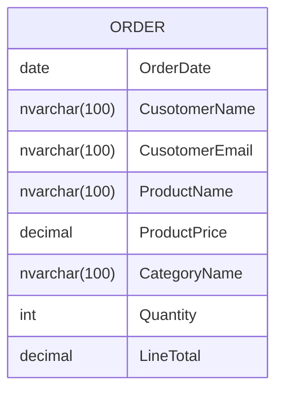
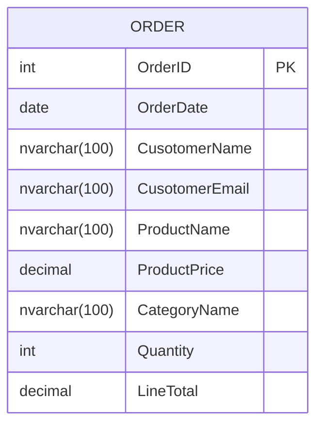
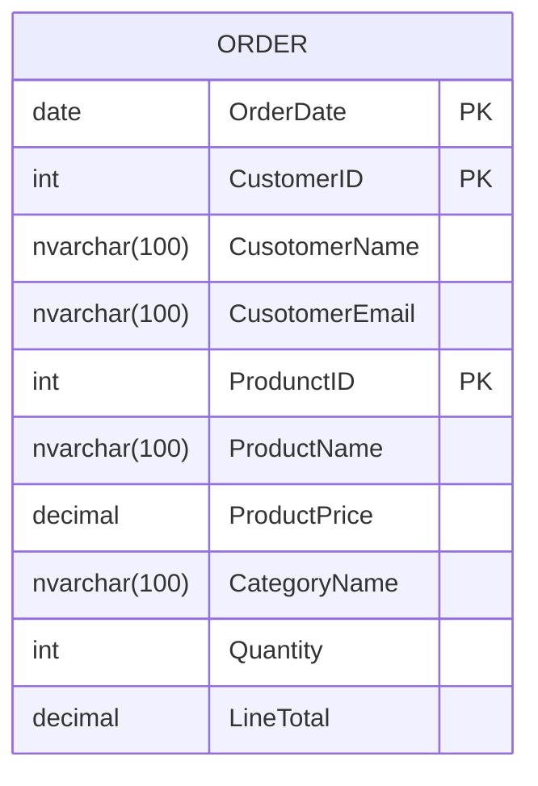
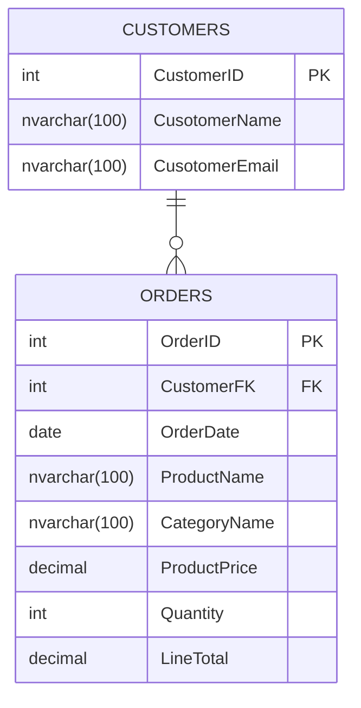
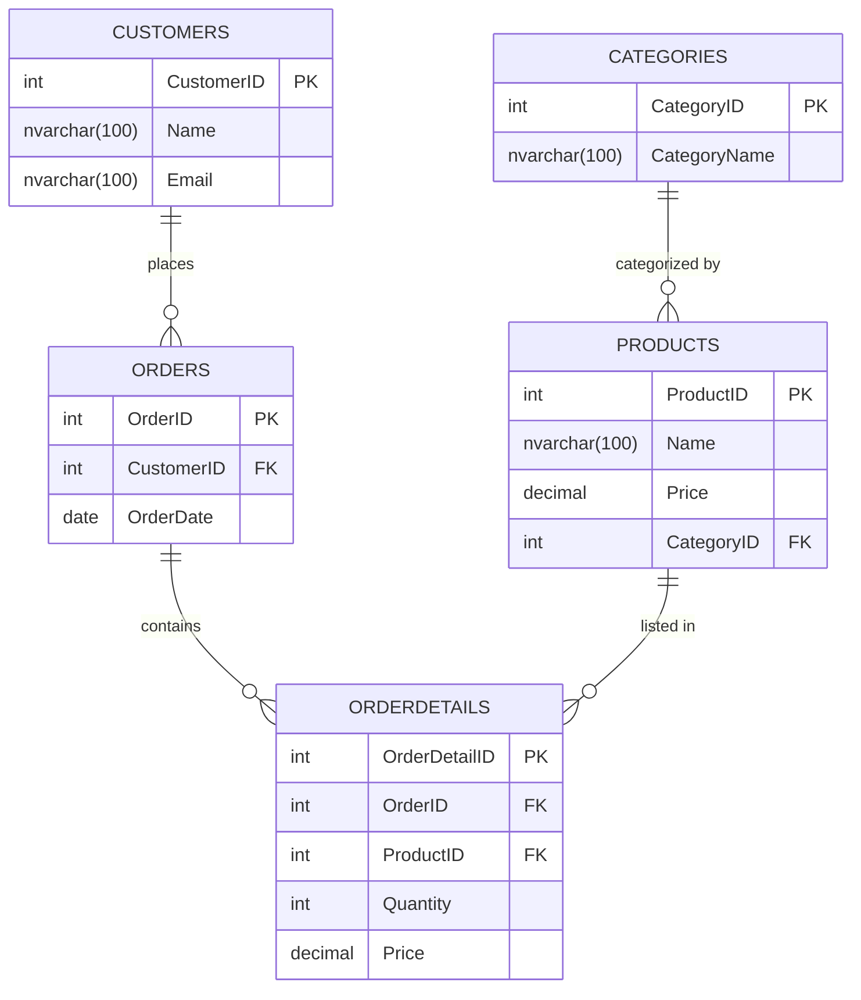
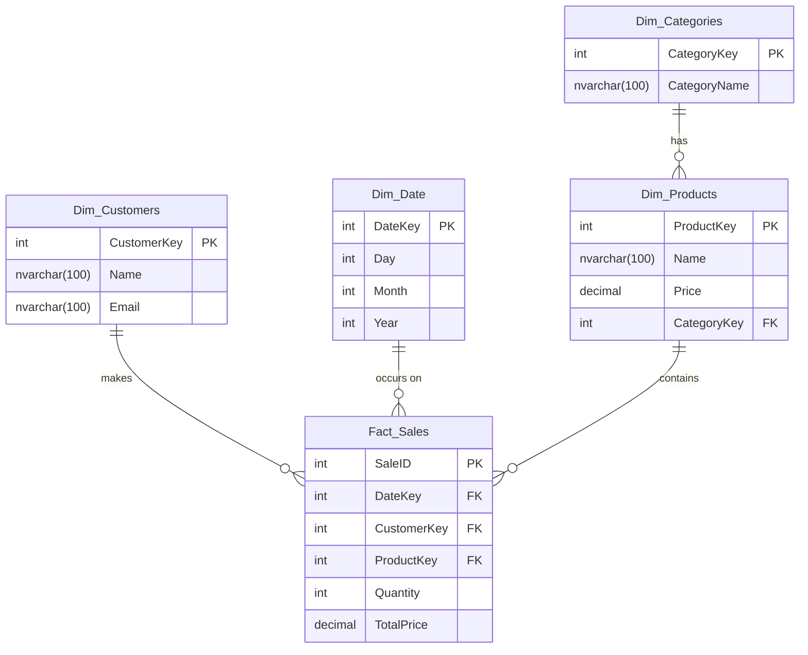

# Normalization

## Initial State - NF0

| OrderDate | CustomerName  | CustomerEmail        | ProductName | ProductPrice | CategoryName | Quantity | LineTotal |
| --------- | ------------- | -------------------- | ----------- | ------------ | ------------ | -------- | --------- |
| 9/1/2021  | John Doe      | johndoe@email.com    | Laptop      | 1200.00      | Electronics  | 1        | 1200.00   |
| 9/2/2021  | Jane Smith    | janesmith@email.com  | T-shirt     | 20.00        | Clothing     | 2        | 40.00     |
| 1/10/2022 | Alice Johnson | alicej@example.com   | Smartphone  | 700.00       | Electronics  | 1        | 70.00     |
| 1/11/2022 | Bob Smith     | bobsmith@example.com | Jeans       | 50.00        | Clothing     | 2        | 500.00    |
| 1/12/2022 | Carol Brian   | carolb@example.com   | Backpack    | 70.00        | Clothing     | 1        | 150.00    |
| 1/13/2022 | John Doe      | johndoe@email.com    | Tablet      | 250.00       | Electronics  | 1        | 60.00     |
| 1/13/2022 | John Doe      | johndoe@email.com    | Laptop      | 1200.00      | Electronics  | 1        | 700.00    |
| 1/14/2022 | Jane Smith    | janesmith@email.com  | Headphones  | 150.00       | Electronics  | 1        | 25.00     |
| 1/15/2022 | David Lee     | davidlee@example.com | Sweater     | 60.00        | Clothing     | 3        | 30.00     |
| 1/16/2022 | Emma Watson   | emmaw@example.com    | Charger     | 25.00        | Electronics  | 1        | 30.00     |
| 1/17/2022 | Frank Miller  | frankm@example.com   | Socks       | 10.00        | Clothing     | 2        | 70.00     |

### Issues with NF0

- **Redundancy**: Customer information is repeated for each order.
- **Update Anomaly**: Updating a customer's email would require updating it in every row where the customer appears.
- **Insertion Anomaly**: Adding a new customer without an order might require entering dummy order data.
- **Deletion Anomaly**: Deleting an order might inadvertently delete customer information.


## Using Mermaid

Mermaid `erDiagram` code [mermaid.live](mermaid.live)

This diagram is referred to as *pyhisical ER* diagram. ER diagrams have many notations, the one used on the previous lecture is the *Chen* notation.

A physical ER (Entity-Relationship) diagram, often referred to as a physical data model (PDM), is a detailed representation of a database's structure. It goes beyond the logical data model by including the physical details needed for the database implementation. Here are the key aspects of a physical ER diagram:

1. **Table Structures**:
   - **Tables**: Represent entities as tables.
   - **Columns**: Show the columns for each table, including data types and constraints (e.g., NOT NULL, UNIQUE).
   - **Primary Keys**: Indicate the primary key for each table.
   - **Foreign Keys**: Define foreign keys that establish relationships between tables.
2. **Data Types**:
   - **SQL Data Types**: Specify the data types for each column (e.g., INT, VARCHAR, DATE).
3. **Relationships**:
   - **One-to-One, One-to-Many, Many-to-Many**: Indicate the type of relationship between tables, enforced through foreign key constraints.

Let's build the diagram in Mermaid:

```
erDiagram
    ORDER {
		date OrderDate
        nvarchar(100) CusotomerName
        nvarchar(100) CusotomerEmail
        nvarchar(100) ProductName
        decimal ProductPrice
        nvarchar(100) CategoryName
        int Quantity
        decimal LineTotal
    }
```





## NF1

### Requirements

A table is in First Normal Form if it meets the following criteria:

1. **Atomicity**: Each column contains only atomic (indivisible) values.
2. **Uniqueness**: Each row must be unique.
3. **No Repeating Groups**: There should be no repeating groups or arrays.


### Solution #1: simple primary key

In other words _single column PK_




### Solution #2: composite primary key 

In other words _multi-column PK_.




## NF2

To normalize the given table to the Second Normal Form (2NF), we need to ensure that it meets the following criteria:

1. The table must be in the First Normal Form (1NF), which means it should have atomic (indivisible) values and each record should be unique. 
2. All non-key attributes must be fully functionally dependent on the entire primary key, meaning no partial dependency of any column on a part of the composite primary key.


### Case 1:  single-column primary key was added

We are good to go! 

>  [!INFORMATION] 
> A 1NF table is automatically a 2NF table only when the primary key contains only a single column. This is because 2NF rule prohibits partial dependencies, which won't happen if the primary key only contains a single column.

### Case 2:  combined primary key was added

To normalize the given table to the Second Normal Form (2NF), we need to ensure that it meets the following criteria:

- [x] The table must be in the First Normal Form (1NF), which means it should have atomic (indivisible) values and each record should be unique. 

- [ ] All non-key attributes must be fully functionally dependent on the entire primary key, meaning no partial dependency of any column on a part of the composite primary key.

**The given table violates 2NF because it has partial dependencies**. Specifically, 

- `CusotomerName` and `CusotomerEmail` depend only on `CustomerID`, and 
- `ProductName`, `ProductPrice`, and `CategoryName` depend only on `ProdunctID`.

Let's break thigs up:




## NF3

### Requirements

To bring the given database structure to Third Normal Form (3NF), we need to ensure that:

1. The database is in Second Normal Form (2NF).
2. All the attributes are functionally dependent on the primary key, and there are no transitive dependencies.

**In the given schema, the `ORDERS` table has transitive dependencies.** Specifically, 

- `ProductName`, `CategoryName`, and `ProductPrice` depend on `ProductID`, which implies they should be moved to a separate `PRODUCTS` table. 
- Additionally, `CategoryName` depends on `CategoryID`, which implies the need for a `CATEGORIES` table.

### Solution  #1: Decomposing the tables to achieve 3NF

1. **Customers Table**: Contains customer-specific information.
2. **Categories Table**: Contains category-specific information.
3. **Products Table**: Contains product-specific information with a foreign key to categories.
4. **Orders Table**: Contains order-specific information with a foreign key to customers.
5. **OrderDetails Table**: Contains order line items with foreign keys to orders and products.


```
erDiagram
    CATEGORIES {
        int CategoryID PK
        nvarchar(100) CategoryName
    }

    CUSTOMERS {
        int CustomerID PK
        nvarchar(100) Name
        nvarchar(100) Email
    }

    ORDERDETAILS {
        int OrderDetailID PK
        int OrderID FK
        int ProductID FK
        int Quantity
        decimal(10,2) Price
    }

    ORDERS {
        int OrderID PK
        int CustomerID FK
        date OrderDate
    }

    PRODUCTS {
        int ProductID PK
        nvarchar(100) Name
        decimal(10,2) Price
        int CategoryID FK
    }

    CUSTOMERS ||--o{ ORDERS : "places"
    ORDERS ||--o{ ORDERDETAILS : "contains"
    PRODUCTS ||--o{ ORDERDETAILS : "listed in"
    CATEGORIES ||--o{ PRODUCTS : "categorized by"

```



### Solution  #2: Snow Flake




## NF1 in practice


### Non atomic values

| ProductKey | Name       | Price   | CategoryKey | HardwareSpecs                                                |
| ---------- | ---------- | ------- | ----------- | ------------------------------------------------------------ |
| 1          | Laptop     | 1200.00 | 1           | `<Hardware><CPU>Intel i7</CPU><RAM>16GB</RAM><Storage>512GB SSD</Storage><Graphics>NVIDIA GTX 1650</Graphics></Hardware>` |
| 2          | Smartphone | 700.00  | 1           | `<Hardware><CPU>Snapdragon 888</CPU><RAM>8GB</RAM><Storage>128GB</Storage><Camera>108MP</Camera></Hardware>` |
| 3          | Tablet     | 250.00  | 1           | `<Hardware><CPU>Apple A14</CPU><RAM>4GB</RAM><Storage>64GB</Storage><Display>10.2 inch</Display></Hardware>` |
| 4          | Headphones | 150.00  | 1           | `<Hardware><Type>Over-Ear</Type><Wireless>Yes</Wireless><BatteryLife>20 hours</BatteryLife><NoiseCancelling>Yes</NoiseCancelling></Hardware>` |

MMSQL can query into XML directly:

```sql
SELECT *
FROM Products
WHERE HardwareSpecs.exist('/Hardware/Wireless[text()="Yes"]') = 1;
```

### Splitting Addresses to atomic values