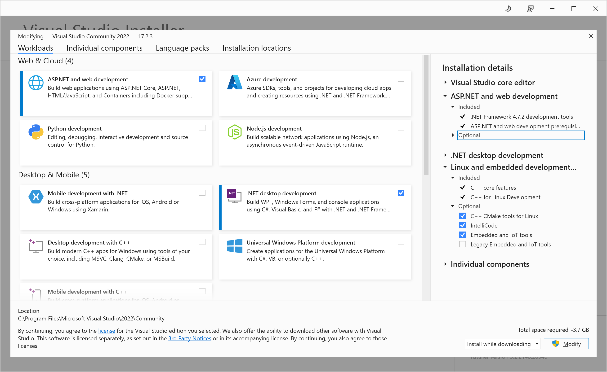

## Visual Studió telepítése

[Visual studio verziók](S1_BEV_01_vs_letoltes.mp4) (Rövid videó)
A telepítőkészlet letölthető  [innen](https://visualstudio.microsoft.com/downloads/)
Az egyetemi géptermekbe az alábbi komponensek kerültek telepítésre:  

A félév során ezek közül a ".NET desktop development" csomag kell csak. 

A **Visual Studio** termékvonal nem összekeverendő a **Visual Studio Code**-dal. Az utóbbi egy nyílt forráskódú szoftver, melynek fejlesztését szintén a Microsoft gondozza. Létezik mac-es és linuxos változata is ellentétben Visual Studio-val. A Visual Studio Code testreszabható kódszerkesztő, melyet elsősorban webfejlesztők használnak szívesen, de létezik hozzá számos nyelvhez és technológiákhoz modul.
