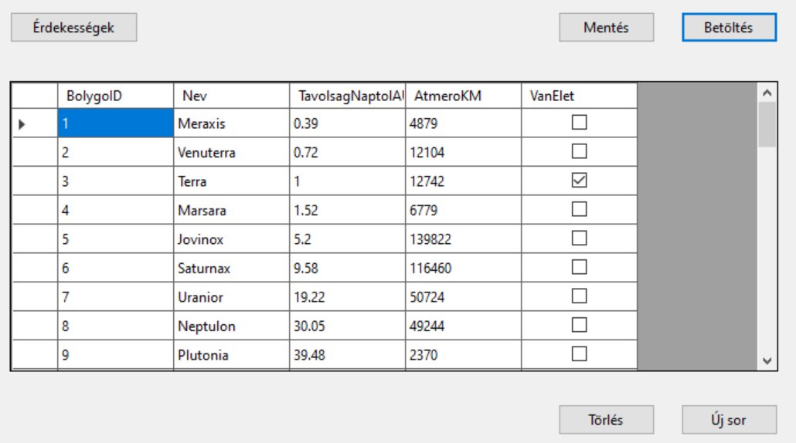
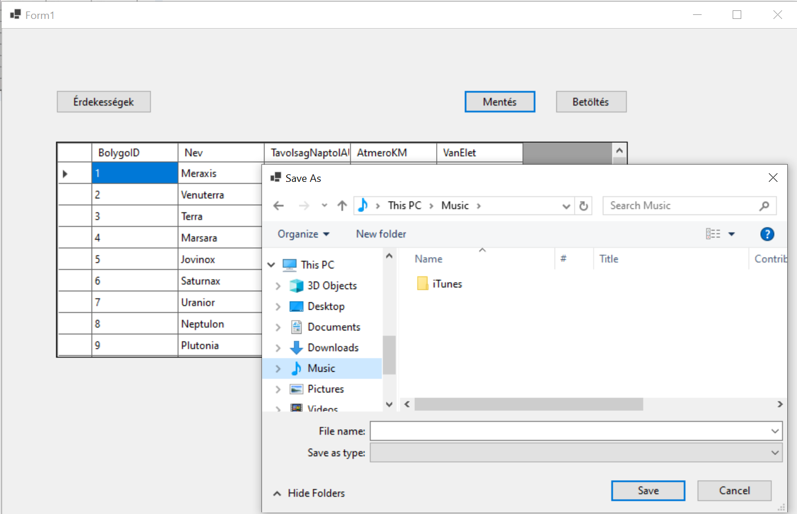
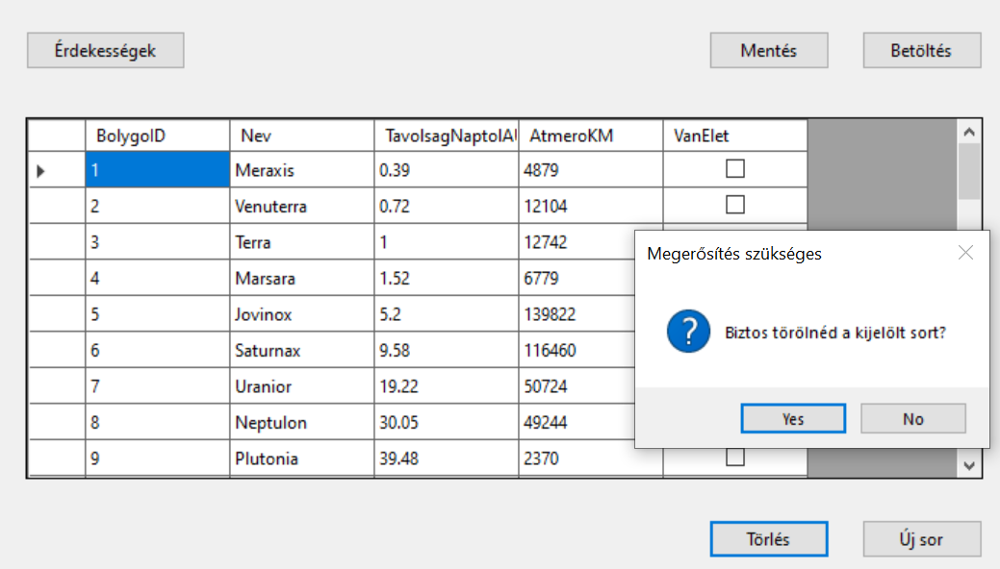
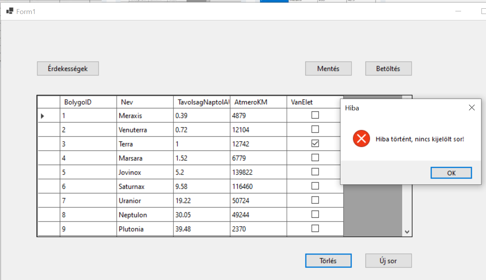
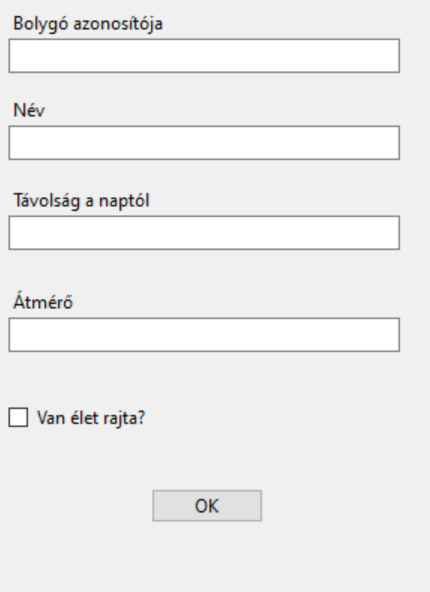
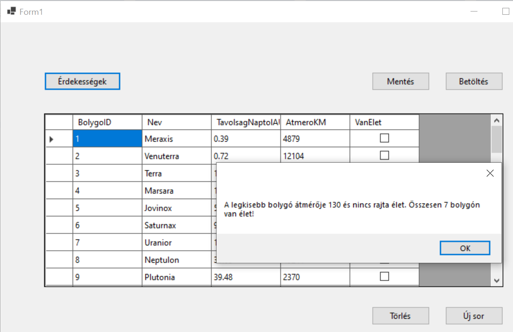

# 2. ZH - bravo

A [bolygo.txt ](bolygo.txt) fájlban található adatok alapján kell egy alkalmazást felépíteni. 

A fájl felépítése:

|                    |                                             |      |
| ------------------ | ------------------------------------------- | ---- |
| `BolygoID`         | a bolygó azonosítója                        |      |
| `Nev `             | a bolygó neve                               |      |
| `TavolsagNaptolAU` | a bolygó távolsága a taptól fényévben mérve |      |
| `AtmeroKM`         | a bolygó átmérője                           |      |
| `VanElet `         | boolean típus, 1-van élet 0-nincs élet      |      |

> [!NOTE]
>
> Az alkalmazás felépítésekor célszerű követni a feladat mellé rakott képernyőképeket, melyek segítségül és kiindulási alapként szolgálnak!

Készíts alkalmazást, amely:

(+/-) A csv állományt tedd be a projektbe, és másoltasd a futtatható állomány mellé!

(+/-) Adj a projekthez egy osztályt, amely leképezi az állomány egy sorát!

(+/-) A program legyen képes megnyitni az állományt, és a sorait felolvasni egy `BindingList` típusú, `Form1` osztály szintjén létrehozott listába, majd ezeket megjeleníteni `BindingSource`-on keresztül egy `DataGridView`-ban. A lehetséges hibákat kezeld! A betöltés művelet történjen gombnyomásra!

(+/-) Az alkalmzás legyen képes menteni a `Form1` osztályban lévő listát. A mentés helye SaveFileDialog-ban legyen kiválasztható

Mentés közben kezeld a hibákat (try-catch)! 

(+/-) Hozz létre egy gombot, melynek segítségével a rácsban az éppen kiválasztott sor törölhető. A törlés csak megerősítő kérdés után történjen meg.
Ellenőrizd, hogy van-e kiválasztott sor!

(+/-) Felugró ablakon keresztül legyen lehetőség új sor rögzítésére!

(+/-) Hozz létre egy gombot, amelyre felugrik egy MessageBox, ami a következő kérdésekre ad nekünk választ:

1) Melyik bolygó átmérője a legkisebb? Van rajta élet?
2) Összesen hány bolygón van élet?

