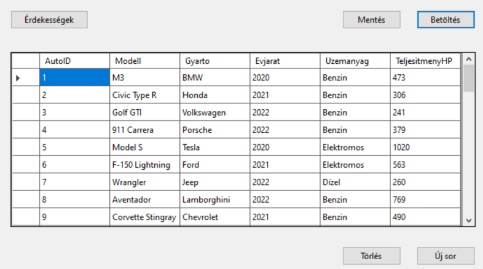
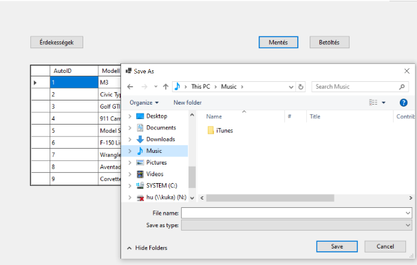
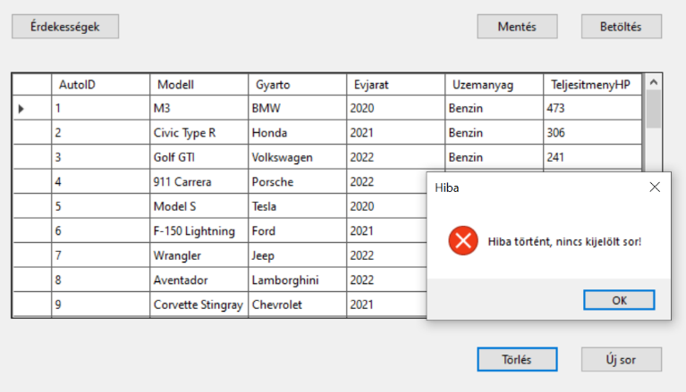
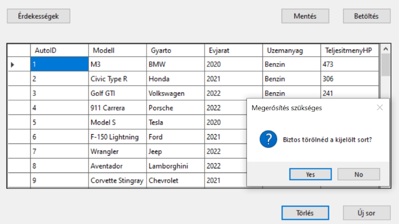

# 2. ZH - alfa

A [autok.txt](autok.txt) fájlban található adatok alapján kell egy alkalmazást felépíteni. 

A fájl felépítése:

|                   |                                        |      |
| ----------------- | -------------------------------------- | ---- |
| `autok.txt`       | az autó azonosítója                    |      |
| `Modell`          | az autó modellje, pl: X7               |      |
| `Gyarto `         | az autót gyártó cég, pl: BMW           |      |
| `Evjarat `        | az autó gyártási éve                   |      |
| `Uzemanyag  `     | milyen típusú üzemanyag való az autóba |      |
| `TeljesitmenyHP ` | az autó teljesítménye lóerőben         |      |

> [!NOTE]
>
> Az alkalmazás felépítésekor célszerű követni a feladat mellé rakott képernyőképeket, melyek segítségül és kiindulási alapként szolgálnak!

Készíts alkalmazást, amely:

(+/-) A csv állományt tedd be a projektbe, és másoltasd a futtatható állomány mellé!

(+/-) Adj a projekthez egy osztályt, amely leképezi az állomány egy sorát!

(+/-) A program legyen képes megnyitni az állományt, és a sorait felolvasni egy `BindingList` típusú, `Form1` osztály szintjén létrehozott listába, majd ezeket megjeleníteni `BindingSource`-on keresztül egy `DataGridView`-ban. A lehetséges hibákat kezeld! A betöltés művelet történjen gombnyomásra!

(+/-) Az alkalmzás legyen képes menteni a `Form1` osztályban lévő listát. A mentés helye SaveFileDialog-ban legyen kiválasztható

Mentés közben kezeld a hibákat (try-catch)! 

(+/-) Hozz létre egy gombot, melynek segítségével a rácsban az éppen kiválasztott sor törölhető. A törlés csak megerősítő kérdés után történjen meg.
Ellenőrizd, hogy van-e kiválasztott sor!

(+/-) Felugró ablakon keresztül legyen lehetőség új sor rögzítésére!

(+/-) Hozz létre egy gombot, amelyre felugrik egy MessageBox, ami a következő kérdésekre ad nekünk választ:

1) A felsorolt autók közül melyik gyártónak van a legerősebb autója lóerők szempontjából, és hány lóerős az adott autó?
2.	A listában több BMW típusú jármű is található. Hány darab van és átlagosan milyen erősek (lóerő) a listában szereplő BMW autók?

