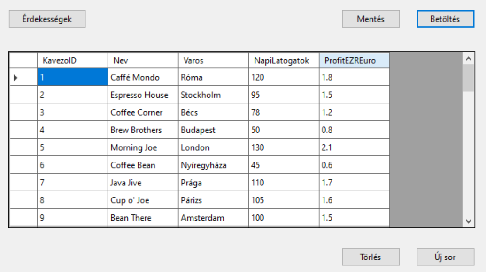
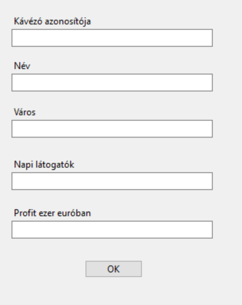
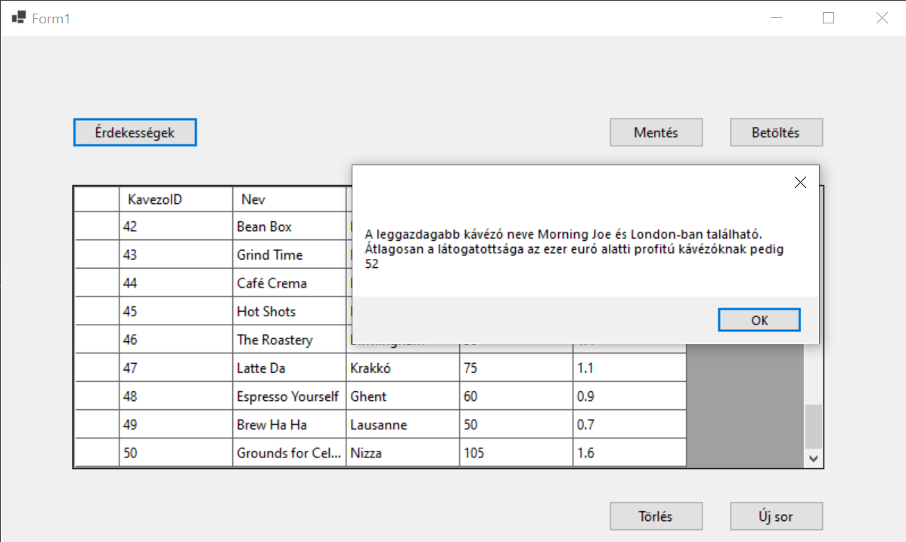

# 2. ZH - echo

> [!NOTE]
>
> A **Solution neve kezdődjön a ZH2E_ karaktersorozattal**, majd folytatódjon a NEPTUN kóddal. A teljes projekt könyvtárat Moodle-rendszeren keresztül kell beadni ZIP állományban. Javasoljuk, hogy a projektet a C:/Temp könyvtárba hozd létre és ne az S: meghajtóra. A leadás egyben a jelenléti ív. Pontot csak olyan kódrészletre lehet kapni, ami megfelelően lefordul és a program futtatása során ellátja a szerepét. **A munkaidő 90 perc**.

## 🅐 UI keret létrehozása 

❶ Hozz létre egy "Windows Forms App" alapú alkalmazást. Az induláskor megjelenő űrlap bal oldalán helyezz el négy gombot, és egy panelt! 

❷ A Panel kerete legyen vékony vonal. 

❸ A Panel az űrlap átméretezésekor kövesse az űrlap méretét! 

❹ Adj négy `UserControl`-t is a projekthez, elnevezésük tetszőleges! A következő feladatblokkokat ezekre a vezérlőkre kell majd megvalósítani. 

❺ A gombok megnyomására töröld a panel tartalmát, és helyezd el a gombhoz tartozó `UserControl`-t úgy, hogy kitöltse a panel teljes területét átméretezéskor is. 

## 🅑 UserControl1 : CSV állomány beolvasása

A [kavezo.txt](kavezo.txt) fájlban található adatokat kell egy `DataGridView`-ben megjeleníteni. 

A fájl felépítése:

|                   |                                                    |      |
| ----------------- | -------------------------------------------------- | ---- |
| `KavezoID  `      | a kávézó azonosítója                               |      |
| `Nev    `         | a kávézó neve                                      |      |
| `Varos `          | a város amiben található a kávézó                  |      |
| `NapiLatogatok `  | az a szám ahányan megfordulnak a kávézóban naponta |      |
| `ProfitEZREuro  ` | a kávézó heti nyeresége ezer euróban               |      |

❶ A csv állományt tedd be a projektbe, és másoltasd a futtatható állomány mellé **-=VAGY=-** a fálj legyen `OpenFileDialog` segítségével kitallózható!

❷ Adj a projekthez egy osztályt, amely leképezi az állomány egy sorát!

❸ A program legyen képes megnyitni az állományt, és a  ❸ sorait felolvasni egy `BindingList` típusú, `UserControl1` osztály szintjén létrehozott listába, majd ❹ ezeket megjeleníteni `BindingSource`-on keresztül egy `DataGridView`-ban. 
❺ A lehetséges hibákat kezeld! 



## 🅒 UserControl1 : új rekord rögzítése

❶ Gombnyomásra felugró ablakon keresztül legyen lehetőség új sor rögzítésére!





## 🅓 UserControl1 : LINQ lekérdezések

Hozz létre egy 'Érekességek' gombot, amelyre felugrik egy MessageBox, ami a következő kérdésekre ad nekünk választ:

- ❶ Melyik kávézónak a legmagasabb a profitja és ❷ melyik városban található ez a kávézó?

- ❸ Átlagosan mennyi a látogatottsága azoknak a kávézóknak amiknek a profitja kevesebb mint ezer euró?



## 🅔 ORM osztályok készítése

❶ Telepítsd a NuGet csomagokat a projektbe: 

```powershell
Install-Package Microsoft.EntityFrameworkCore.SqlServer -Version 7.0.20
Install-Package Microsoft.EntityFrameworkCore.Tools -Version 7.0.20
```

❷ Készítsd el a Scaffold parancs segítségével az adatbázist leképező osztályokat:

``` powershell
Scaffold-DbContext "Data Source=bit.uni-corvinus.hu;Initial Catalog=se_pets;Persist Security Info=True;User ID=hallgato;Password=Password123;TrustServerCertificate=true" Microsoft.EntityFrameworkCore.SqlServer -OutputDir PetsModels
```

Az adatbázis sémája segítségül:


## 🅕 UserControl2 : `ProcedureDone` tábla tartalmának megjelenítése

❶ Jelenítsd meg a(z) **ProcedureDone** tábla tartalmát rácsban a UserControl-on.  Az idegen kulcsok helyén hivatkozott táblából a megfelelő szövegek jelenjenek meg. Jelenjen meg az állat neve és az elvégzett beavatkozás neve is, és az, hogy mikor végezték a beavatkozást! Ne jelenjenek meg a felesleges technikai mezők. 

## 🅖 UserControl3: Állatok fajonként

Helyezz el a UserControl-on egy `ListBox`-ot és egy `DataGridView`-t!

❶ Töltsd be a **Species** tábla tartalmát a ListBox-ba úgy, hogy a **Name** mező tartalma jelenjen meg benne. 

❷ A ListBox felett legyen egy TextBox, amellyel szűrni lehet a ListBox tartalmát. (Ezt a feladatrészt LINQ segítségével old meg!) 

❸ A ListBox mellett legyen egy DataGridView, amiben jelenítsed meg az **Animal** tábla tartalmának azon részét, ami a ListBox-ban éppen kiválasztott elemhez tartozik. 

## 🅔🅧🅣🅡🅐 UserControl4 : CSV Export 

❶ A `UserControl4`-on jelenítsd meg a `Species` tábla tartalmát.

❷ Gombnyomásra felugró `SaveFileDialog`-on keresztül mentsd a `Type` tábla tartalmát CSV állományba tetszőleges módszerrel!
