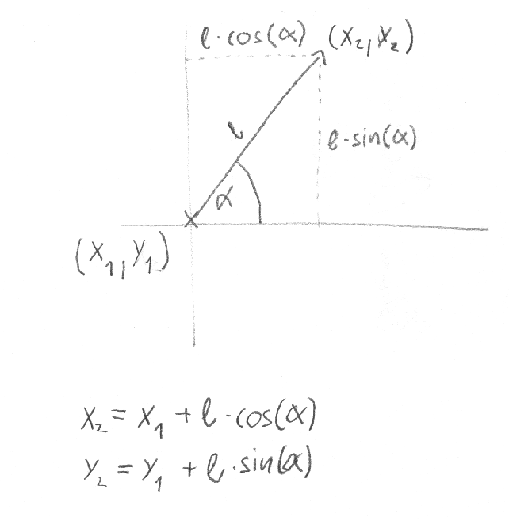

# Koch görbe


Rajzoljatok Koch-görbét a képernyőre! A Koch-görbe vagy Koch-hópehely Helge von Koch, svéd matematikus által 1904-ben leírt fraktál, mely ilyen minőségében az egyik legelső.


Tipp: keressétek meg a [Wikipédián a Koch görbét](https://hu.wikipedia.org/wiki/Koch-g%C3%B6rbe), és nézzétek meg, hogy épül fel!


### A `Teki` osztály

 Ahhoz, hogy fel tudjátok építeni a görbét, érdemes lehet egy Teknőc osztályt létrehozni. 

- A teknőc mindig egy adott koordinátájú ponton tartózkodik a rajzfelületen. A teknőc a saját koordinátáját tudja magáról.

- A teknőcnek a konstruktorában adjuk át, hogy melyik bittérképre rajzoljon. 

- A teknőc orra mindig néz valamerre. A teknő tudja magáról, hogy milyen szögben áll az orra.

- A teknőc három parancsot ért:
  - jobbra(szög)
  - balra(szög)
  - előre(távolság)

 
> [!WARNING]
>
> A teknőc koordinátáit lebegőpontos számok formájában érdemes tárolni, különben a kerekítési hibák a parancsok során összeadódnak. 

 Valahogy így nézhet ki a Teknőc osztály:

```csharp
class Teki
    {
        double xPos, yPos;
        int orrSzög;
        Graphics rajzlap;

        public Teki(Graphics rajzlap)
        {
            this.rajzlap = rajzlap;
		…
        }

        public void MenjElőre(int távolság)
        {
            
        …
        
        }
        public void ForduljJobbra(int szög)
        {
   		…
        }

        public void ForduljBalra(int szög)
        {
		…
        }

    }
}
```

Egy kis segítség matekból:

 


> [!WARNING]
>
> A `Math` osztály szögfüggvényei radiánban várják a szögeket! Tipp:
> `Math.Cos(szog_fokban * Math.PI / 180)`


### Egyszerű alakzatok rajzolása

``` csharp
void Hatszög(Teki teknos)
{
    for (int i = 0; i < 6; i++)
    {
        teknos.MenjElőre(100);
        teknos.ForduljJobbra(60);
    }
}
```

``` csharp
void Ötszög(Teki teknos)
{
    for (int i = 0; i < 5; i++)
    {
        teknos.MenjElőre(200);
        teknos.ForduljJobbra(144);
    }
}
```

``` csharp
void Spirál(Teki teknos)
{
    for (int i = 0; i < 20; i++)
    {
        teknos.MenjElőre(i * 10);
        teknos.ForduljJobbra(60);
    }
}
```

``` csharp
void Napocska(Teki teknos)
{
    for (int i = 0; i < 36; i++)
    {
        teknos.MenjElőre(250);
        teknos.ForduljJobbra(170);
    }
}
```


### Koch görbe rajzolás Tekivel

Az űrlapon létrehozhatunk a Teknőcből egy példányt, és irányítgathatjuk:

```csharp
private void button2_Click(object sender, EventArgs e)
{	
	Teki béla = new Teki(this.CreateGraphics());
  
	béla.MenjElőre(20);
	béla.ForduljBalra(60);
	béla.MenjElőre(20);
	béla.ForduljJobbra(120);
	béla.MenjElőre(20);
	béla.ForduljBalra(60);
	béla.MenjElőre(20);         
}
```

 A fenti példa kirajzolja a Koch-görbe egy darabját. 


Írjunk egy rekurzív függvényt, mely kirajzolja a teljes görbét:

```csharp
private void koch(Teki teki,int méret)
{
	if (méret<5)
	{
	 … rajzoljunk „méret” méretű görbét
	}
	else
	{
	… minden oldal helyére rajzoljunk görbét 1/3 mérettel(rekurzió)
	}
}
```

