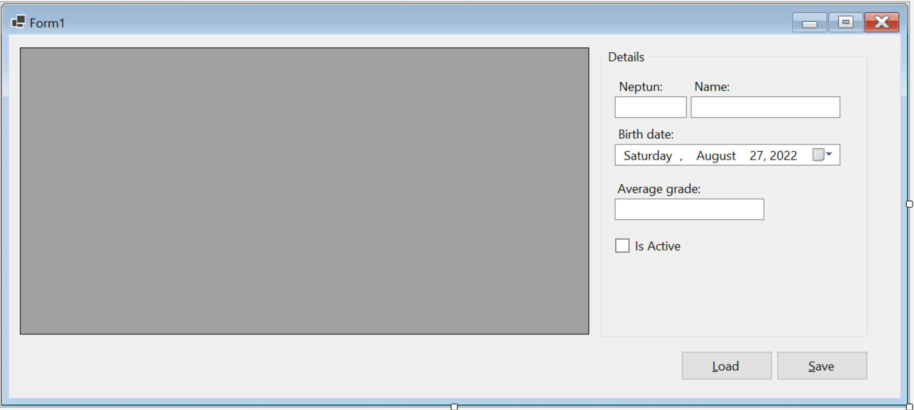
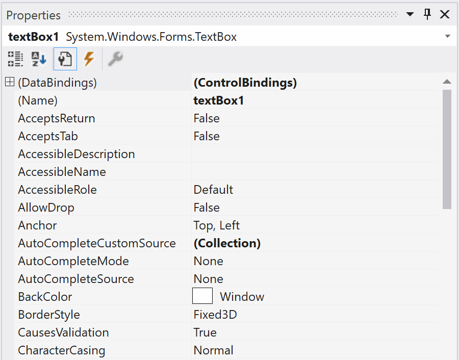

# 1. gyakorlati feladatsor: In memory adatbázis 

## Gyakorlat célja
A _Software Engineering_ tárgy során a korábban megszokotthoz képest szignifikánsan nagyobb adathalmazokkal fogunk dolgozni. Az előző félévben felépítettünk egy kvízjátékot, aminek a tartalmait egy szöveges fájlból olvastuk ki egy-egy `UserControl`-ba. A feladat a memóriában végzett adatkezelés témakörét készítette elő.

A mai gyakorlaton egy standardizáltabb megoldást választunk, és az adatainkat CSV (Comma Seperated Values) formátumú fájlokban fogjuk tárolni. Ebben a fájltípusban az egyes sorokban vesszővel elválasztva szerepelnek az adatok. Néhány nyelv azonban (köztük a magyar is) a számokban tizedesvesszőt használ pont helyett, így nem ideális a vesszővel történő elválasztás. Emiatt a nyelvi beállításoktól függően érdemes meghatározni, hogy vesszőt vagy pontosvesszőt használunk a CSV fájljainkban. Az egyszerűség kedvéért mi minden esetben pontosvesszőt használunk majd.

A szoftverünkben külön osztályt hozunk létre az adataink tárolására, és ezt az osztályt felhasználva jelenítjük majd meg az adatainkat. Ebben a példában fájlból olvasás mellett a fájlba írásra is nézünk példát.


## 1. Hallgató osztály létrehozása

 A `Student` osztályt  minden példánya egy-egy hallgató adatait tartalmazza majd.  Ez az osztály írja le, hogy milyen tulajdonságokkal rendelkezzen egy-egy hallgató. Egy `Student`   típusú elemekből álló lista  gyakorlatilag egy  memóriában tárolt adatbázistáblának feleltethető meg.

(+/-) A _SolutionExplorer_-ben hozz létre egy `Models` nevű mappát! (A mappa neve egyébként tetszőleges.)

(+/-) A `Models` nevű mappában hozz létre egy osztályt `Student` néven egy külön fájlba! Ezt az osztályt kizárólag hallgatói adatok tárolására fogjuk használni. 

A létrejövő kódban érdemes megfigyelni, hogy a névtérbe bekerült a projekt és a mappa neve is! Az osztályra a `Models.Student` néven lehet az `InMemoryDB` névtérből hivatkozni. 

``` csharp
...
namespace InMemoryDB.Models
{
    internal class Student
    {

    }
}
```


(+/-) Hozd létre az alábbi tulajdonságokat a `Student` osztályon belül, és állítsd _access modifier_-t `public`-ra:  

Megnevezés|Adattípus|Leírás
-|-|-
Neptun|string|Neptun-kód
Name|string|teljes név
BirthDate|DateTime?|születési dátum
AverageGrade|decimal?|tanulmányi átlag
IsActive|bool|aktív-e a hallgató az adott félévben


>**Nullable type**
A C# nyelvben a változótípus után tett kérdőjellel jelöljük az úgynevezett nullable type-okat. Az ilyen típusú változók a megszokott értékeken kívül felvehetik a null értéket is. Ezzel lehetőséget adunk a felhasználónak, hogy bizonyos értékeket ne állítson be, a példában tehát a születési dátum és a tanulmányi átlag lehet ismeretlen.

Megoldás:
```csharp
public class Student
{
    public string Neptun { get; set; }
    public string Name { get; set; }
    public DateTime? BirthDate { get; set; }
    public decimal? AverageGrade { get; set; }
    public bool IsActive { get; set; }
}
```
## 2. Űrlap felépítése

(+/-) Hozz létre egy `DataGridView`-t a `Form1` design nézetében, és nevezd át `dgv`-re!

(+/-) Hozz létre egy *Save* és egy *Load* feliratú gombot is a `Form1` design nézetében és nevezd el őket rendre `btnSave`-nek és `btnLoad`-nak!

(+/-) Gondoskodj róla, hogy a gombok mindig a Form jobb felső sarkában legyenek, a `DataGridView` pedig töltse ki a rendelkezésre álló helyet!

> Az **Anchor**, azaz horgony a "szülő" objektum (jelen esetben a `Form`) négy oldalához (Top, Bottom, Left, Right) tudja rögzíteni az érintett vezérlőt. Ha egy Anchor aktív, akkor a vezérlőnek az őt tartalmazó objektum adott oldalától vett távolsága állandó. A jelen példában ez a form átméretezésekor is érvényes. Alapértelmezetten minden vezérlő Top és Left horgonya aktív, ezért van értelme az ennek megfelelő tulajdonságokkal meghatározni egy vezérlő pozícióját a `Form`-on. Ha például a Top és Right horgonyok aktívak, és kihelyezünk egy gombot a jobb felső sarokba, akkor az átméretezéskor is mindig ott fog maradni. Az Anchorok akkor is aktívak maradnak, ha két ellentétes oldalhoz állítjuk be őket. Ebben az esetben a fix távolságot úgy biztosítja a rendszer, hogy a "szülő" objektum átméretezésének megfelelően átméretezi a vezérlőt is. Ha mind a négy Anchort beállítjuk, akkor a vezérlőnk mindig kitölti a rendelkezésre álló helyet, és csak annyi szabad hely marad körülötte, amennyi eredetileg is volt. Az Anchor tulajdonság kódból történő beállítása körülményes, ezért javasolt a tervező nézet használata, de utólag a Designer.cs-ben meg lehet nézni az automatikusan generált mintakódot.
> 
> ![kep1]

## 3. Hallgató lista létrehozása

### 3.1 Adatkötött lista létrehozása

(+/-) Hozz létre egy adatkötött listát (`BindingList`) a hallgatók tárolására a `Form1`-ben, osztály szinten!  

▶ Megoldás:  
```csharp
using System.ComponentModel; //névtér, ahol a BindingList megtalálható

// Adatkötött lista
BindingList<Models.Student> students = new BindingList<Models.Student>();
```
>Megjegyzés:
>Ez a példa projekt "normál" lista használata esetén is működik, érdemes kipróbálni. Az egyetlen különbség, hogy adatkötés hiányában nem fogjuk tudni szerkeszteni a listánkat a felhasználói felületen, de az adatok megjelennek:
>
>```csharp
>// Normál lista
>List<Models.Student> students = new List<Models.Student>();
>```

### 3.2 Adatkötött lista adatforrásának beállítása

>A DataGridView az adatforrásként megadott lista (felsorolás) sorait jeleníti meg. Az oszlopai szerkeszthetők kódból, de alapértelmezetten a lista összes publikus Property-jét jeleníti meg oszloponként az eredeti nevekkel.

(+/-) A Form konstruktorában állítsd be, hogy a `dgv` adatforrása (`DataSource`) a students lista legyen!  

Adatkötött lista esetén a lista elemei szerkeszthetők és a listaelemek automatikusan mentődnek a memóriába, ha átállunk egy másik sorra. A `DataGridView` azonnal figyelmeztet, ha egy oszlopba nem az annak megfelelő értéket próbáljuk beállítani.

![kep2]

▶ Megoldás:
```csharp
// Konstruktor
public Form1()
{
    InitializeComponent();           

    // A hallgató lista összekötése a DataGridView-al
    // Innentől már nem kell foglalkoznunk a dgv kezelésével, a felhasználó ezen keresztül el fogja érni a students listát        
    // A kód oldalról pedig csak magát a students listát fogjuk szerkeszteni
    dgv.DataSource = students;
}
```
## 4. Adatkötött vezérlők használata

### 4.1 Űrlap újratervezése

(+/-) Tervezd át az űrlapot  az alábbi ábrának megfelelően:



>A "details" felirattal rendelkező elem egy `GroupBox`, ami megkönnyítheti a későbbiekben a benne lévő elemek együtt mozgatását

### 4.2 Új adatforrás felvétele


(+/-) A `DataGridView` vezérlő "fülében" kattints a legördülőre, majd a megjelenő panelen választ az *Add Object Data Source* gombot!

(+/-) A párbeszédablakban válaszd ki a `Student` osztályt. Fontos: a `Student` osztály csak akkor jelenik meg a párbeszédablakban, ha a létrehozása után már le lett fordítva (build) az alkalmazás. Innentől az adatforrások között a fában már elérhető a `Students` osztály. (Ha futtatás után sem jelenik meg a párbeszédablakban, próbáld meg a `Form1.cs`-t szerkeszteni és megpróbálni megint.)

(+/-) A `DataGridView` adatforrásaként válaszd ki a `Student` osztályt.

Mi történt?

- Ezzel a lépéssorozattal létrejött egy `studentBindingSource`, mely az űrlap alatt jelenik meg a tervezőben, mivel nincs külön vizuális reprezentációja.
- A `studentBindingSource` adatforrásaként már a tervezőben be van állítva a `Student` osztály. 
- A `DataGridView` adatforrása a `studentBindingSource`, és mivel a `studentBindingSource` "tudja", hogy `Student` típusú elemekből álló listát jelenítünk majd meg, a rácsban is megjelennek a `Student` osztály tulajdonságai.
- A _Solution Explorer_-ben létrejött egy `DataSources` elem, amelyben megtalálható az adatforrásként felvett `Student` osztály. Ha valamit tévedésből vettünk fel, innét lehet törölni. 

### 4.3 Vezérlők adatkötésének megváltoztatása

(+/-) A rácsba az adatokat a `studentBindingSource`-on keresztül töltsd.

Cseréld re ezt a sort:

``` csharp
dgv.DataSource = students;
```

erre a sorra:

``` csharp
studentBindingSource.DataSource = students;
```

### 4.4 További vezérlők bekötése

(+/-)  Állíts be egy adatkötést a Neptun kódhoz tartozó `TextBox` `Text` tulajdonságára  az animáció szerint:




## 5. Mentés funkció megvalósítása

(+/-) Rendelj eseménykezelőt a *Save* gomb `Click` eseményéhez!
	
(+/-) Az eseménykezelőben hozz létre egy példányt a `SaveFileDialog` osztályból!
	
(+/-) Jelenítsd meg ezt a dialógus ablakot (`ShowDialog`), de ha az ablak végül nem az *OK* gombbal zárul be, akkor ne engedd tovább futni a metódust!
	
(+/-) A `StreamWriter` osztály felhasználásával írd ki a `students` lista sorait a dialógus ablakban megadott nevű fájlba!
	
(+/-) Futtasd a programot, tölts ki néhány sort a táblázatból, és mentsd el a listát. Ez hasznos lesz a betöltés funkció tesztelésekor.

▶ Megoldás:
```csharp
using System.Text; //névtér, ami a karakterkódolást tartalmazza

// Save gomb eseménykezelője
private void btnSave_Click(object sender, EventArgs e)
{
    // Példányosít egyet a windows standard mentés ablakából
    SaveFileDialog sfd = new SaveFileDialog();

    // Opcionális rész
    sfd.InitialDirectory = Application.StartupPath; // Alapértelmezetten az exe fájlunk mappája fog megnyílni a dialógus ablakban
    sfd.Filter = "Comma Seperated Values (*.csv)|*.csv"; // A kiválasztható fájlformátumokat adjuk meg ezzel a sorral. Jelen esetben csak a csv-t fogadjuk el
    sfd.DefaultExt = "csv"; // A csv lesz az alapértelmezetten kiválasztott kiterjesztés
    sfd.AddExtension = true; // Ha ez igaz, akkor hozzáírja a megadott fájlnévhez a kiválasztott kiterjesztést, de érzékeli, ha a felhasználó azt is beírta és nem fogja duplán hozzáírni

    // Ez a sor megnyitja a dialógus ablakot és csak akkor engedi tovább futni a kódot, ha az ablakot az OK gombbal zárták be
    if (sfd.ShowDialog() != DialogResult.OK) return;

    // Az előző kódsor az alábbi két sor rövidített írásmódja
    // DialogResult eredmény = sfd.ShowDialog(); // A dialógusablak bezárása után visszakapunk egy DialogResult típusú értéket, mely az ablak bezárásnak körülményeit tárolja
    // if (eredmény != DialogResult.OK) return; // Ha a bezárás nem az OK gomb lenyomására következett be, akkor kilépünk a metódusból és nem hajtjuk végre a mentést

    // Ha a using blokk használatával példányosítunk egy osztályt akkor a példány csak a using blokk végéig létezik, utána törlésre kerül
    // StreamWriter és StreamReader használata esetén ezzel a módszerrel megspórolhatjuk a Close() metódus használatát és az írás / olvasási hibák egy részét is lekezeljük
    // A StreamWriter paraméterei:
    //    1) Fájlnév: mi itt azt a fájlnevet adjuk át, amit a felhasználó az sfd dialógusban megadott
    //    2) Append: ha igaz és már létezik ilyen fájl, akkor a végéhez fűzi a sorokat, ha hamis, akkor felülírja a létező fájlt
    //    3) Karakterkódolás: a magyar nyelvnek is megfelelő legáltalánosabb karakterkódolás az UTF8
    using (StreamWriter sw = new StreamWriter(sfd.FileName, false, Encoding.UTF8))
    {
        // Végigmegyünk a hallgató lista elemein
        foreach (var s in students)
        {
            // Egy ciklus iterációban egy sor tartalmát írjuk a fájlba
            // A StreamWriter Write metódusa a WriteLine-al szemben nem nyit új sort
            // Így darabokból építhetjük fel a csv fájl pontosvesszővel elválasztott sorait
            sw.Write(s.Neptun);
            sw.Write(";");
            sw.Write(s.Name);
            sw.Write(";");
            sw.Write(s.BirthDate.ToString());
            sw.Write(";");
            sw.Write(s.AverageGrade.ToString());
            sw.Write(";");
            sw.Write(s.IsActive.ToString());
            sw.WriteLine(); // Ez a sor az alábbi módon is írható: sr.Write("\n");
        }
    }
}
```
Foreach rövidebben:
```csharp
foreach (var s in students)
        {
            sw.WriteLine($"{s.Neptun};{s.Name};{s.BirthDate};{s.AverageGrade};{s.IsActive}");
        }
```

## 5. Betöltés funkció megvalósítása

(+/-) Rendelj eseménykezelőt a *Load* gomb `Click` eseményéhez!

(+/-) Az eseménykezelőben hozz létre egy példányt az `OpenFileDialog` osztályból!

(+/-) Jelenítsd meg ezt a dialógus ablakot (`ShowDialog`), de ha az ablak végül nem az *OK* gombbal zárul be, akkor ne engedd tovább futni a metódust!

(+/-) A `StreamReader` osztály felhasználásával menj végig a fájl sorain!

(+/-) Minden sorra hozz létre egy új elemet a `students` listában!
	
- Bontsd fel a beolvasott sort a `Split` metódus segítségével!
- Hozz létre egy új `Student` példányt!
- A felbontott szövegdarabokat megfelelően konvertálva töltsd fel értékekkel a létrehozott `Student` objektum tulajdonságait! (Figyelj a potenciális `null` értékekre!)
- Add hozzá a létrehozott `Student` példányt a `students` listához!

▶ Megoldás:
	
```csharp
using System.Text; //névtér, ami a karakterkódolást tartalmazza

// Load gomb eseménykezelője
private void btnLoad_Click(object sender, EventArgs e)
{
    // Példányosít egyet a windows standard fájlmegnyitó ablakából
    OpenFileDialog ofd = new OpenFileDialog();

    // Opcionális rész
    ofd.InitialDirectory = Application.StartupPath; // Alapértelmezetten az exe fájlunk mappája fog megnyílni a dialógus ablakban
    ofd.Filter = "Comma Seperated Values (*.csv)|*.csv"; // A kiválasztható fájlformátumokat adjuk meg ezzel a sorral. Jelen esetben csak a csv-t fogadjuk el
    ofd.DefaultExt = "csv"; // A csv lesz az alapértelmezetten kiválasztott kiterjesztés
    ofd.AddExtension = true; // Ha ez igaz, akkor hozzáírja a megadott fájlnévhez a kiválasztott kiterjesztést, de érzékeli, ha a felhasználó azt is beírta és nem fogja duplán hozzáírni

    // Ez a sor megnyitja a dialógus ablakot és csak akkor engedi tovább futni a kódot, ha az ablakot az OK gombbal zárták be
    if (ofd.ShowDialog() != DialogResult.OK) return;

    // Ha a using blokk használatával példányosítunk egy osztályt akkor a példány csak a using blokk végéig létezik, utána törlésre kerül
    // StreamWriter és StreamReader használata esetén ezzel a módszerre megspórolhatjuk a Close() metódus használatát és az írás / olvasási hibák egy részét is lekezeljük
    // A StreamReader paraméterei:
    //    1) Fájlnév: mi itt azt a fájlnevet adjuk át, amit a felhasználó az ofd dialógusban megadott            
    //    2) Karakterkódolás: megadható fixen, de érdemes inkább a Default opciót megadni, mert ez kiolvassa a fájlból, hogy milyen karakterkódolással lett eredetileg lementve
    using (StreamReader sr = new StreamReader(ofd.FileName, Encoding.Default))
    {
	// Ebben a példában nincs fejléc a csv-ben, de gyakran előfordul, hogy szerepel olyan fejléc, amire a kódban nincs szükségünk
	// Az alábbi kódsor beolvassa ugyan a csv első sorát, de nem tárolja el változóban a tartalmát, hanem egyszerűen eldobja azt
	// sr.ReadLine()
	// Ettől a StreamReader továbblép a következő sorba, és a lenti ciklus a második sortól kezdve fogja felolvasni a sorokat
	
        // Addig ismételjük a ciklust, míg el nem érjük a fájl végét
        while (!sr.EndOfStream)
        {
            // Ez a sor egy sor nevű tömbbe olvassa be a fájl következő sorát úgy, hogy a pontosvesszők mentén feldarabolja azt
            string[] sor = sr.ReadLine().Split(';');

            // Az előző sor részletesebben kifejtve:                    
            // string következőSor = sr.ReadLine(); // Először beolvassuk a következő sort
            //    VIGYÁZAT: Ha a ciklusban egy ReadLine() sem szerepel, akkor a végtelenségig fog futni
            //    Ha egynél több ReadLine() szerepel, akkor egy ciklus lépésre több sort is beolvasunk - Ilyenkor könnyen hibára futhat a program, ha azután próbálunk sort beolvasni, hogy elértük a fájl végét
            // string[] sor = következőSor.Split(';'); // Ezután feldaraboljuk a következő sort a pontosvesszők mentén és a szöveges darabokból létrehozunk egy string típusú tömböt, amit később fel tudunk használni 

            // Példányosítjuk a következő Student-et
            Student s = new Student();

            // A szöveges mezők egyszerűen feltölthetők
            s.Neptun = sor[0];
            s.Name = sor[1];                    

            // A másik három mező nem szöveges ezért  megfelelő módon kell konvertálni őket
            // A nullable mezők problémásak, ugyanis, ha nincs bennük tartalom, akkor a save metódusunk üres értéket fog kiírni a fájlba
            // Ezt a konvertálás nem tudja kezelni ezért biztosan hibát fog eredményezni
            // Az alábbi try-catch blokkok nem a legszebb megoldások, de cserébe nagyon egyszerűek
            // Amennyiben az adott property beolvasása során hiba történik, egyszerűen nem csinálunk semmit és így üres marad az értéke
            // VIGYÁZAT: Üres catch ágat csak rendkívül ellenőrzött körülmények között szabad írni a gyakorlásra szánt programokban
            // Egy éles szoftverben SOHA nem szabad üres catch ágat hagyni, legalább az Exception logolást biztosítani kell!
            try
            {
                s.BirthDate = Convert.ToDateTime(sor[2]);
            }
            catch { }                    
            try
            {
                s.AverageGrade = decimal.Parse(sor[3]);
            }
            catch { }            
            s.IsActive = bool.Parse(sor[4]);

            // Az újonnan létrehozott Student-et hozzáadjuk a students listához
            students.Add(s);
        }
    }
}
```


## Összefoglalás

#### Adatkötött objektumok

Adatkötések (Binding) segítségével elérhető, hogy két különböző változó értéke mindig megegyezzen egymással. Ha például egy `string` típusú változót egy `TextBox` `Text` property-jével kötünk össze, akkor nem kell folyton átírni a változót, ha megváltozik a `TextBox` tartalma.

#### BindingList

Az adatkötött listák (`BindingList`) elsősorban olyan vezérlőkben használhatók fel, melyek alkalmasak több elem megjelenítésére is (pl.: `ListBox`, `DataGridView`). Ilyenkor lehetőség van arra is, hogy a felhasználó egy megfelelő vezérlőn keresztül szerkessze az általunk létrehozott listát. Ehhez mindössze be kell állítani, hogy az adatkötött lista legyen a vezérlő adatforrása (`DataSource`).

#### BindingSource

A `BindingSource` egy speciális adatkötött objektum. Egyszerre több vezérlő adatforrásaként is be lehet állítani, és van saját adatforrása is. Lényegében egy köztes szereplő, melynek segítségével más adatkötött objektumokat több különböző vezérlőhöz is hozzá tudunk rendelni. A `BindingSource` képes kezelni a kiválasztott elemeket is, így ha az egyik vezérlőben kiválasztunk egy elemet egy listából, a másikban is megváltozik a kijelölés.


[kep1]: in-memory-db-1.png
[kep2]: in-memory-db-2.png
