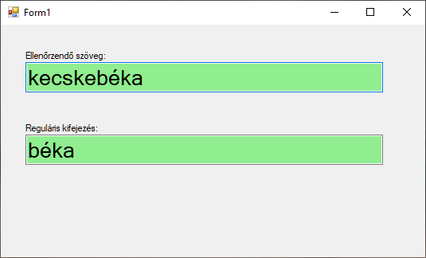

# Reguláris kifejezések
Ez a dokumentum az [itt](http://vbence.web.elte.hu/regex_leiras.html) található cikk kivonatolt változata. A linken további példákat is találsz. 

## Segítség a RegEx használatához

A **RegEx** vagy **RegExp** a **Regular Expression** rövid formája. Magyarul talán a "szabályos kifejezés" lenne a megfelelő fordítás. Ez a leírás azért született, hogy elindítson a technika megismerésében, de korántsem tekinthető teljesnek -- a cikk végén található URL-eken lehet folytatni a barangolást a "szabályos kifejezések" világában.

> "*Mindig babonás félelemmel néztem a RegEx mintáira. Volt dolgom egykét nyelvvel, de ez valami egészen bizarr dolog volt. Nem hinném, hogy létezik olyan tapasztalat aminek birtokában felfedezhető a RegEx sajátos logikája, szintaktikája, viszont az operátorok elolvasása után szinte arcul csap a felismerés: "ennyi az egész?" Legalább is ez lenne a cikk célja :)*"

A RegEx lehetőséget ad szabályok, azaz minták egyszerű leírására. Ezekkel a mintákkal aztán sok hasznos dolgot tehetünk. Kereshetünk rájuk egy stringben, vagy kicserélhetjük őket valamilyen szabály szerint. Használhatjuk adatellenőrzésre vagy szerkezetek (pl. dátum) szétdarabolására, értelmezésére.

Essünk túl a kötelező analógián: a DOS-ból jól ismert joker karakterek is kifejezéseket írnak le, amiknek fájlokat feleltetünk meg, vagy van egyezés, vagy nem. A `ka*.doc` és `ka???.doc` kifejezések közül a `kalap.doc` mindkettőnek, még a `kapa.doc` csak az elsőnek felel meg.

Hogy még egy kicsit rosszabb legyen, mielőtt jobb lesz: DOS-os `ka*.doc` RegEx megfelelője: `ka.*\.doc` a `ka???.doc` pedig nem más, mint `ka.{3}\.doc`

## RegEx operátorok

### Karakter megfeleltetés
| jel|leírás 
|-|-
|**. (pont)**|Bármilyen karakter: A  **b.ka**kifejezésnek megfelel a  **béka**  és  **bika**  szó is
|**[karakterek]**|A kapcsoszárójelek között felsorolt karakterek valamelyikével megegyező karakter: A  **b[éa]ka**  kifejezésnek megfelel a béka és baka szó, a bika viszont nem. A - (minusz) jellel tartományt is megadhatunk. Például  **[0-9]**  megfelel bármely számjegynek vagy  **[a-zA-Z]** bármely kis vagy nagybetűnek.
|**[^karakterek]**| A kapcsoszárójelek között felsorolt karakterek egyikével sem egyező karakter (az előző operátor tagadása): A  **b[^é]ka**  kifejezésnek  **nem**  megoldása a  **béka**. A  **baka**  és  **bika**  viszont igen.

### Többszörözés
| jel|leírás 
|-|-
|**?**|A megelőző minta 0 vagy 1 alkalommal fordul elő: A  **borda.?**  kifejezés igaz a  **borda**  és a  **bordal**  szavakra is.
|**+**|A megelőző minta 1 vagy több alkalommal fordul elő: A  **bo.+ka**  kifejezésnek megfelel a  **boróka**, a  **boka**  viszont  **nem**.
|*|A megelőző minta 0 vagy több alkalommal fordul elő: A  **bo.\*ka**  kifejezésnek már megfelel a  **boka**  és  **boróka**  is.
|**{m,n}**|Segítségével megadható minimum és maximum vagy pontosan megadott számú előfordulás - {*3} pontosan 3 előfordulás; {3,} legalább 3 előfordulás; {2,5} legalább 2 legfeljebb 5 előfordulás; {0,10} legfeljebb 10 előfordulás. A **d.{0,5}ány** igaz minden esetben, ha **legfeljebb** 5 karaktert kell helyettesíteni, például a **dolmány** esetén. A **diszkópatkány** viszont már nem akad fenn rajta.

### Horgonyok

Az előzőekben nem szemléltettem, de a felsorolt kifejezések akkor is igazak ha a vizsgált string belsejében találhatók meg. A b.ka igaz a bikaviadal mintára is.

| jel|leírás 
|-|-
|^|A minta eleje: Ezzel jelezhetjük, hogy a kifejezést a minta elején keressük. A  **^béka**  kifejezésnek megfelel a  **békanyál**  minta, a  **kecskebéka**  viszont  **nem**.
|\$|A minta vége: Az előző horgonyhoz hasonlóan a minta végét testesíti meg. A  **ék$**  mintának megfelel minden erre végződő szó (**kerék**,  **pék**).

Természetesen kombinálhatók is. A  **^p.k$**  kifejezés csak akkor igaz, ha az input pontosan egy hárombetűs szó. A **legpikánsabb** nem megoldása, ahogy a **pikáns** sem. A  **pék**  vagy  **pók**  viszont jó.

### Logika

| jel|leírás 
|-|-
|**\|**|Vagylagos egyezés: Két lehetőség közé téve bármelyikkel való egyezés találatot produkál. Gyakorlati példához picit előre kell ugorjunk, a normál (kerek) zárójelekre, jelen felhasználás viszont nem kíván különösebb magyarázatot:  **ka(lap\|bát)**
|**( )**|Kifejezések csoportosítása: Nem csak a vagylagos egyezés az egyetlen lehetséges felhazsnálás. Egy csoportot létrehozva elláthatjuk paraméterrel például a  **(hókusz)?pók**  segítségével a  **hókuszpók**  és  **pók**  szavak is megtalálhatók. A csoportokra később hivatkozhatunk is, ez cserénél vagy stringek értelmezésénél lesz hasznos.

## Mintaprogram reguláris kifejezések kipróbálására




``` csharp
public partial class Form1 : Form
{
    public Form1()
    {
        InitializeComponent();
    }

    private void textBoxText_TextChanged(object sender, EventArgs e)
    {
        DoCheck();
    }

    private void textBoxRegEx_TextChanged(object sender, EventArgs e)
    {
        DoCheck();
    }

    void DoCheck() {
        try
        {
            Regex regex = new Regex(textBoxRegEx.Text);
            if (regex.IsMatch(textBoxText.Text))
            {
                textBoxText.BackColor = Color.LightGreen;
            }
            else
            {
                textBoxText.BackColor = Color.LightCoral;
            }
        }
        catch (Exception)
        {
            textBoxRegEx.BackColor = Color.LightCoral;
            return;
        }
        textBoxRegEx.BackColor = Color.LightGreen;          
    }
}
```
