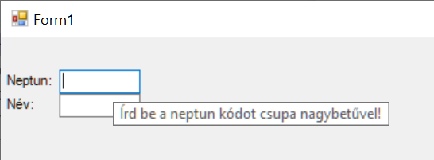
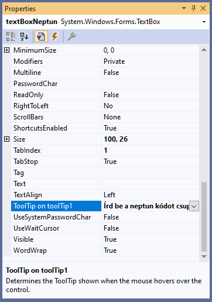

# Adatok validálása űrlapon

**Ez a dokumentum a `Validation` és `Validated` események valamint az `ErrorProvider` magyarázataként szolgál, a megoldást feltölteni nem kell.**

A cél egy olyan felugró űrlap készítése, melyen keresztül a felhasználó adatokat vihet fel, majd az *OK* illetve *Mégse* gomb megnyomásával dönt a sorsukról - azaz rögzíti az adatbázisban, vagy nem. Az űrlap csak akkor lehet bezárható az *OK* gombal, ha minden felvitt adat megfelel a formai követelményeknek.  

##  A "OK" és "Mégse" gombbal bezárt űrlapok közti különbségtétel

### Form1

(+/-) Hozz létre egy `Form`-ot `newUserForm` néven!

(+/-) A `Form1`-en helyezz el egy gombot, majd a gombhoz rendelj eseménykiszolgálót. 

(+/-) Az eseménykiszolgálóban nyisd meg a `NewUserForm`-ot és attól függően, hogy a felhasználó melyik gombbal zárta be a `NewUserForm`-ot, jeleníts meg eltérő szöveget. (A bezáró gombok később készülnek majd.)

``` csharp
private void button1_Click(object sender, EventArgs e)
{
    NewUserForm newUserForm = new NewUserForm();
    if (newUserForm.ShowDialog() == DialogResult.OK)
    {
        MessageBox.Show("OK-al zárult");
    }
    else
    {
        MessageBox.Show("Nem OK-al zárult");
    }          
}
```

### A `newUserForm`
(+/-) Az űrlapon helyezd el a képnek megfelelő vezérlőket!


(+/-) Húzz az űrlapra még egy `ErrorProvider` vezérlőt is - ez jelenít majd meg kis piros X-et a hibásan kitöltött vezérlők (jelenleg csak TextBox) mellett. 

(+/-) Az *Cancel* gomb tulajdonságai között állítsd be az alábbiakat a *Prpoerties* panelen: `DialogResult`:`Cancel`. Innentől fogva, ha a felhasználó ezt a gombot nyomja meg, az űrlap automatikusan bezáródik, és a `Form1`-en a `ShowDialog()` metódus `DialogResult.Cancel` értékkel tér vissza. Próbáld ki!

(+/-) Az *OK* gomb esetén NE állítsd be ugyanezt a tulajdonságot a `Properties`-ben, mert problémákhoz fog vezetni. Helyette a gomb *Click* eseménykezelőjében kódból állítsd be az értéket. A beállítás pillanatában is be fog záródni a Form, és hasonló hatást érsz el, mint a Mégse gomb esetén.

```csharp
this.DialogResult = DialogResult.OK;
```

## Űralapon szereplő adatok ellenőrzése

(+/-) Ezután készítsd el az eseménykiszolgálóat mindkét `TextBox` `Validating` és `Validated` eseményeihez, és ellenőrizd, hogy *OK* gomb `CausesValidation` tulajdonsága az az alapértelmezett értéknek megfelelően `True`-e. 

A `Validating` esemény akkor következik be, ha valamilyen oknál fogva az érintett mezőben szereplő adatok érvényességének ellenőrzése szükségessé válik. Ilyen ok, ha a felhasználó egy olyan vezérlőre kattintott, aminek a `CausesValidation` tulajdonsága `True`.  Ilyen jelen pillanatban az *OK* gomb, de mindkét szövegdoboz is, mert  `CausesValidation` tulajdonságuk alapértelmezetten `True`. 

A *Mégse* gomb `CausesValidation` tulajdonságát viszont állítsd `False`-ra, különben később, amikor megírjuk az ellenőrzésekhez tartozó kódot, nem fogod tudni bezárni az ablakot, ha valamelyik validáció nem sikerül. Ez pedig bosszantó lehet, mert sokszor pont azért akarjuk bezárni az ablakot, mert rájövünk, hogy nincs meg minden adatunk a helyes kitöltéshez. 

A `Validated`  esemény akkor következik be, ha az ellenőrzés sikerrel zárult. Az osztály vélhetően most így néz ki:
``` csharp
public Form2()
    {
        InitializeComponent();
    }

    private void nameTextBox_Validating(object sender, CancelEventArgs e)
    {
    }

    private void nameTextBox_Validated(object sender, EventArgs e)
    {
    }

    private void neptunTextBox_Validating(object sender, CancelEventArgs e)
    {
    }

    private void neptunTextBox_Validated(object sender, EventArgs e)
    {
    }
}
```

(+/-) Próbáld ki, ha valamelyik `Validatig` eseményhez tartozó kiszolgálót az alábbiak szerint módosítod, akkor a TextBox-ba való gépelést követően nem elhagyni a TextBox-ot egészen addig míg helyes értéket nem ír be a felhasználó:

``` csharp
	private void nameTextBox_Validating(object sender, CancelEventArgs e)
	{
	        e.Cancel = true;
	}
```

(+/-) Az ellenőrzés megvalósításához készíts egy-egy függvényt a kétféle érték ellenőrzéséhez:

``` csharp
    private bool CheckName(string név)
    {
        return !string.IsNullOrEmpty(név);
    }

    private bool CheckNeptun(string neptun)
    {
        Regex r = new Regex("^[A-Z0-9]{6}$");
        return r.IsMatch(neptun);
    }
```
(+/-) Majd a `Validating` eseményekhez tartozó kiszolgálókban ellenőrizd az értékeket:

``` csharp
public partial class NewUserForm : Form
{
    public NewUserForm()
    {
        InitializeComponent();
    }

    private bool CheckName(string név)
    {
        return !string.IsNullOrEmpty(név);
    }

    private bool CheckNeptun(string neptun)
    {
        Regex r = new Regex("^[A-Z0-9]{6}$");
        return r.IsMatch(neptun);
    }
    private void nameTextBox_Validating(object sender, CancelEventArgs e)
    {
        if (!CheckName(nameTextBox.Text))
        {
            e.Cancel = true;
            errorProvider1.SetError(nameTextBox, "A név nem lehet üres");
        }
    }

    private void nameTextBox_Validated(object sender, EventArgs e)
    {
        errorProvider1.SetError(nameTextBox, "");
    }


    private void neptunTextBox_Validating(object sender, CancelEventArgs e)
    {
        //Ha kell, megnézzük, érvényes-e a tartalom
        if (!CheckNeptun(neptunTextBox.Text))
        {
            e.Cancel = true;
            errorProvider1.SetError(neptunTextBox, "Érvénytelen Neptun kód");
        }
    }

    private void neptunTextBox_Validated(object sender, EventArgs e)
    {
        errorProvider1.SetError(neptunTextBox, "");
    }

    private void button1_Click(object sender, EventArgs e)
    {
        if (this.ValidateChildren())
        {
            this.DialogResult = DialogResult.OK;
            this.Close();
        }
    }
}
```
A fenti megoldással még van egy kis probléma. Ha ugyanis egyáltalán nem írunk semmi a cellákba, akkor nem indul el a validálási folyamat, így semmi nem akadályozza meg a belőlük való kikattintást. Gond nélkül rá tudunk nyomni az OK gombra, és be tudjuk zárni az ablakot.

Ezért szükség van egy végső ellenőrző lépésre, amivel a bezárás előtt megbizonyosodhatunk arról, hogy valóban minden beviteli mezőben helyes érték szerepel. Ehhez a `Form` összes vezérlőjét egyszerre kell validálnunk. A `this.ValidateChildren()` függvény ezt teszi meg helyettünk, és csak akkor tér vissza igaz értékkel, ha minden validálás rendben megtörtént (nem volt `e.Cancel = true`).

(+/-) Írd meg az ennek megfelelő feltételt az OK gomb Click eseménykezelőjébe.

Érdemes továbbá átállítani az ErrorProvider `BlinkStyle` tulajdonságát `NeverBlink`-re. A vezérlők ugyanis nem teljesen egyező pillanatban kezdenek villogni, és emiatt ilyenkor hibás működés hatását keltik (úgy tűnik, mintha felváltva villognának).

```csharp
private void button1_Click(object sender, EventArgs e)    
{
    // Bezárás előtt minden vezérlőt újra validálunk
    if (this.ValidateChildren())
        this.DialogResult = DialogResult.OK;
}
```

## ToolTip

A `ToolTip` segítségével a felhasználót segítő üzenetet lehet rendelni a vezérlőkhöz.



(+/-) Az űrlapon egyetlen `ToolTip` típusú objektumot érdemes elhelyezni, ez fogja kezelni az összes vezérlőhöz tartozó szöveget. A *Properties* panelben a megjelenés késleltetését, időtartamát, méretét, stb. egységesen a `toolTip1` tulajdonsági között lehet beállítani.  


(+/-) Ha van `ToolTip` az űrlapon, minden vezérlőhöz be lehet állítani a szöveget:



Érdemes a Label-ekre is beállítani a ToolTip-eket, mert a TextBox-ok esetén elég nehéz egérrel eltaláni azt a pontot, amikor feljönnek.

