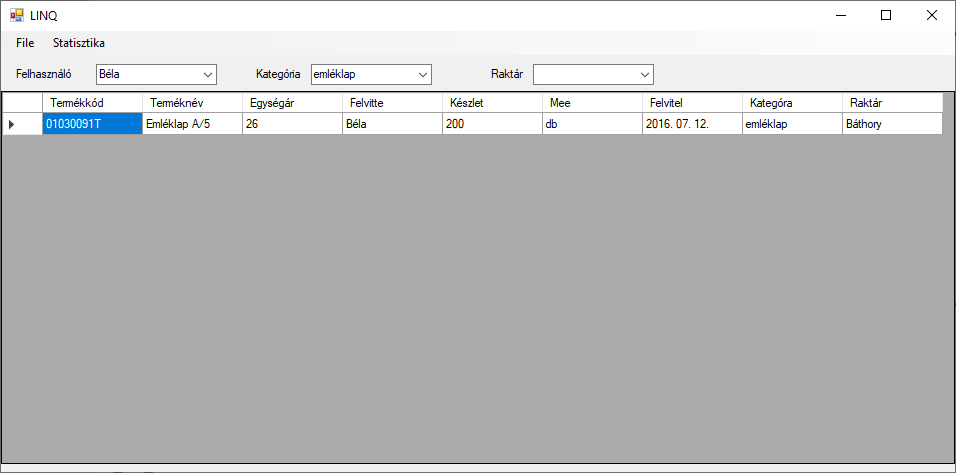

# Gyakorlati feladatsor !!

A feladat egy készen kapott CSV állomány feldolgozása, amely egy webshop termékeit tartalmazza. A CSV állományból ki kell nyerni a különféle típusú adatokat, majd az egyes alkotóelemekből szűrhető llistát alkotni, és a szűrések eredményét fájlba menteni. Szintén lehetővé kell tenni aggregált stasztikák megjelenítését.
A feladatsor többek között megismertet a MenuStrip használatával, a LINQ join és aggregáló műveleteivel.

## Osztályszerkezet létrehozása
(+/-)  Hozz létre egy Windows Forms alkalmazást!

(+/-)  Töltsd le a [termekek.csv](termekek.csv) állományt, nem szükséges a projekthez adni, mivel a felhasználó részére fájlmegnyitó dialógusablakot fogunk felkínálni.

(+/-)  A fájl termékeket tartalmaz redundánsan tárolt adatokkal. Mi ezeket a relációs adatbázis szabályoknak megfelelő formában fogjuk tárolni. Hozz létre három osztályt az adatok tárolásához:
- A `Kategoria` tartalmazza a kategória kódját és megnevezését
- A `Raktar` tartalmazza a raktár kódját, nevét, és címét
- A `Termek` taralmazza a termék kódját, nevét, listaárát, készletét, mennyiségi egységét, a felvivő felhasználó nevét, a felvitel dátumát, a kategória és a raktár kódját. 
- Az eredeti állomány három külön oszlopban tartalmazza a felvitel dátumát, ezt egyetlen Datetime változó reprezentálja!
Az adattípusokat értelemszerűen határozd meg a csv vizsgálatának segítségével.

Példaként álljon itt a `Termek` osztály szerkezete:
```csharp
class Termek
{
    public string Termekkod { get; set; }
    public string Termeknev { get; set; }
    public decimal Listaar { get; set; }
    public decimal Keszlet { get; set; }
    public string Megys { get; set; }
    public string Felvitte { get; set; }
    public DateTime Felvitel { get; set; }
    public int RaktarKod { get; set; }
    public int KategoriaKod { get; set; }
}
```

(+/-)  Hozz létre a Form1-en három osztályszintű listát, egyet-egyet minden osztálytípus számára. Példányosítsd a listákat!
```csharp
public partial class Form1 : Form
{
    List<Termek> termekek = new List<Termek>();
    List<Kategoria> kategoriak = new List<Kategoria>();
    List<Raktar> raktarak = new List<Raktar>();
    
    ...
}
```

## Felhasználói felület létrehozása
(+/-) Helyezz el egy MenuStrip komponenst a Form1-en!

(+/-) A menüben legyen egy Fájl és egy Statisztika főmenüpont. (Design nézetben könnyen felvihetők.)

(+/-) A Fájl menüponton belül hozz létre két menüitemet
- Az első elem neve legyen Megnyitás, ez fog szolgálni a kapott állomány megnyitására
- A második elem neve legyen Bezárás, ez egyszerűen bezárja az applikációt

(+/-)A Statisztika menüponton belül három elem szükséges: Raktáranként, Felhasználónként és Kategóriánként

(+/-) Helyezz ki a Formra három legördülő mezőt (`Combobox`), melléjük egy-egy címkét. A legördülők a felvivő felhasználó (`cbUser`), a raktár (`cbRaktar`) és a kategória (`cbKat`) szerinti szűrések indítására fognak szolgálni. Nevezd el őket értelemszerűenn, adj értéket a címkéknek.

(+/-) Helyezz ki a Fomra egy datagridviewt, amely a szűrések eredményét fogja megjeleníteni.



## Fájl betöltése
(+/-) Rendelj eseménykezelőt a fájl megnyitása menüponthoz! (Ugyanúgy működik, mint egy sima Button.)

(+/-)Az eseménykiszolgálóban szabványos fájlmegnyitó dialógus segítségével nyisd meg a felhasználó által választott fájlt.

(+/-)A beolvasó ciklusban töltsd be az állományt a három korábban létrehozott osztályszintű listába az alábbi módon:
- Haladj végig a sorokon (a fejléc átugrásával), és minden sorhoz példányosíts egy `Termek` példányt. Állítsd be a mezők értékét értelemszerűen. A dátumot az év, a hó és a nap összefűzéséből kapjuk, például egy 2022.05.01 értékű dátum létrehozása a következő módon történik:
```csharp
DateTime myDate = new DateTime(2022,5,1)
```

(+/-)A kategórialistához, illetve a raktárlistához csak akkor adj új elemet, ha az adott sorban kapott értékek nem szerepelnek még bennük.
- Továbbra is a beolvasó ciklus törzsében dolgozva add a Termek példányt a termekek listához.
- LINQ segítségével vizsgáld meg, hogy az aktuális sorbéli kategóriát tartalmazza-e a már a kategóriák lista, ha nem, akkor add hozzá.
- Járj el ugyanígy a raktárakat illetően.

```csharp
OpenFileDialog ofd = new OpenFileDialog();
if (ofd.ShowDialog() != DialogResult.OK)
    return;            

using (StreamReader sr = new StreamReader(ofd.FileName))
{
    while (!sr.EndOfStream)
    {
        // Sor beolvasása
        string[] sor = sr.ReadLine().Split(';');

        // Termék létrehozása
        Termek t = new Termek();
        t.Termekkod = sor[0];
        t.Termeknev = sor[1];
        t.Listaar = decimal.Parse(sor[2]);
        t.Keszlet = decimal.Parse(sor[3]);
        t.Megys = sor[4];
        t.Felvitte = sor[5];
        t.Felvitel = new DateTime(int.Parse(sor[6]), int.Parse(sor[7]), int.Parse(sor[8]));
        t.KategoriaKod = int.Parse(sor[9]);
        t.RaktarKod = int.Parse(sor[11]);
        termekek.Add(t);

        // Kategória létrehozása, ha még nincs ilyen
        var szurtKategoriak = from x in kategoriak 
                                where x.KategoriaKod == t.KategoriaKod 
                                select x;
        if (szurtKategoriak.Count() == 0)
        {
            Kategoria k = new Kategoria();
            k.KategoriaKod = t.KategoriaKod;
            k.KategoriaNev = sor[10];
            kategoriak.Add(k);
        }

        // Raktár létrehozása, ha még nincs ilyen
        var szurtRaktarak = from x in raktarak 
                            where x.RaktarKod == t.RaktarKod 
                            select x;
        if (szurtRaktarak.Count() == 0)
        {
            Raktar r = new Raktar();
            r.RaktarKod = t.RaktarKod;
            r.RaktarNev = sor[12];
            r.RaktarCim = sor[13];
            raktarak.Add(r);
        }
    }
}
```

## Adatkötés
A fájlbetöltés után, továbbra is az eseménykezelőben maradva gondoskodni kell a legördülő mezők feltöltéséről.

(+/-) Érdemes ezen a ponton lekérdezni a `termekek` lista tartalmát, hogy lássuk sikeres volt-e a betöltés. (Ezt a kódsort később töröld, vagy kommenteld, mert nem lesz rá szükség. Csak a teszteléshez kell.)
```csharp
dataGridView1.DataSource = termekek;
```

(+/-) Készíts LINQ lekérdezést, amely lekérdezi a rögzítő felhasználó nevét, kiszűri az ismétlődéseket és beállítja, hogy a felhasználónevek tárolására szolgáló legördülő mező tartalmazza a lehetséges felhasználókat. A megfelelő eljárás az, hogy lekérdezzük a `Felvitte` mezők különféle értékeit, az ismétlődést a Distinct() metódus segítsévéel eltávolítjuk, majd az eredményt listává konvertáljuk.
```csharp
var felhasznalok = (from x in termekek
                    select x.Felvitte)
                    .Distinct()
                    .ToList();
cbUser.DataSource = felhasznalok;
```

(+/-) A kategóriák és a raktárak esetében a feladat eltérő, mert a legördülőknek `Kategoria` illetve `Raktar` példányokat kell megjeleníteniük a kategoriak illetve a raktarak lista alapján. Ehhez a Listbox kontrollhoz hasonlóak be kell állítani a DisplayMember és a Valuemember tulajdonságokat. 
```csharp
cbKat.DataSource = kategoriak;
cbRaktar.DataSource = raktarak;
cbKat.DisplayMember = "KategoriaNev";
cbRaktar.DisplayMember = "RaktarNev";
cbKat.ValueMember = "KategoriaKod";
cbRaktar.ValueMember = "RaktarKod";
```

(+/-) Mivel azt szeretnék, hogy a legördülő mezőkben kezdetben semmi se legyen kiválasztva, állítsuk a három legördülő SelectedIndex tulajdonságát -1-re!
```csharp
cbRaktar.SelectedIndex = -1;
cbKat.SelectedIndex = -1;
cbUser.SelectedIndex = -1;
```

(+/-) Készítsünk egy visszatérési érték nélküli függvényt a Form1-en `TermekListaz` neven. Feladata a termékek lista szűrése és az eredmények felhasználóbarát megjelenítése a gridben. Hívjuk meg ezt a függvényt a betöltés végén!
- Egy-egy változóban tároljuk a választott felhasználót, raktárkódot és kategóriakódot. Ha nincs választott elem, a változók értéke legyen üres karakterlánc a felhasználónév esetében, 0 a kategóriakód és a raktárkód esetében.
- Állítsunk össze egy LINQ lekérdezést, amely a következő oszlopokból álló listát állítja elő: Termékkód, terméknév, egységár, felvitte, készlet, mennyiségi egység, felvitel időpontja, kategória neve és raktár neve. Ebben a lekérdezésben nem állnak rendelkezésre navigációs kulcsok, így a raktár és a készlet nevét a LINQ join műveletével kell megszereznünk a kategóriakód és a raktárkód alapján.

> Jelen példában nem adatbázis táblákkal dolgozunk, és nincsenek az adathalmazaink között megfelelő táblakapcsolatok. Ezért nem működik a LINQ-ban megszokott, táblakapcsolatok mentén történő lekérdezés. Ezért kell az SQL nyelvek INNER JOIN utasításához hasonló megoldást alkalmaznunk.

(+/-) Az előállított listát rendeljük hozzá a Datagridview-hoz.
```csharp
public void Termeklistaz()
{
    // Szűrők beolvasása alapértékekkel
    int katkod = 0;
    if (cbKat.SelectedItem != null) 
        katkod = ((Kategoria)cbKat.SelectedItem).KategoriaKod;

    int raktkod = 0;
    if (cbRaktar.SelectedItem != null)
        raktkod = ((Raktar)cbRaktar.SelectedItem).RaktarKod;
            
    string user = cbUser.Text;

    // Adatok lekérdezése
    var x = (from t in termekek
                join k in kategoriak on t.KategoriaKod equals k.KategoriaKod
                join r in raktarak on t.RaktarKod equals r.RaktarKod
                where ((katkod == 0) || (k.KategoriaKod == katkod)) &&
                    ((raktkod == 0) || (r.RaktarKod == raktkod)) &&
                    ((user == "") || (t.Felvitte == user))
                select new
                {
                    Termékkód = t.Termekkod,
                    Terméknév = t.Termeknev,
                    Egységár = t.Listaar,
                    Felvitte = t.Felvitte,
                    Készlet = t.Keszlet,
                    Mee = t.Megys,
                    Felvitel = t.Felvitel,
                    Kategóra = k.KategoriaNev,
                    Raktár = r.RaktarNev
                })
                .ToList();

    dataGridView1.DataSource = x;
}
```

## Szűrések megvalósítása
(+/-) Rendeljünk közös eseménykezelőt a három legördülő mező `SelectedIndexChanged` eseményéhez, hívjuk meg bennük a `Termeklistaz` eljárást.

(+/-) Problémát jelent, hogy ha már egyszer kiválasztottunk egy elemet, akkor utána már nincs lehetőségünk törölni azt a szűrésből. Ennek megoldására több módszer is kínálkozik. Az egyik, hogy kihasználjuk a mező szerkeszthetőségét, és a szöveg törlési eseményhez kötjük a szűrőfeltétel ürítését. Ehhez rendeljünk közös eseménykezelőt a TextChanged eseményhez,  és ha az adott mező értéke üres,  állítsuk a SelectedIndex értéket ismét -1-re, és hívjuk meg a TermekListaz eljárást!

```csharp
private void FilterIndexChanged(object sender, EventArgs e)
{
    Termeklistaz();
}

private void FilterCleared_TextChanged(object sender, EventArgs e)
{
    var szuro = (ComboBox)sender;
    if (szuro.Text == "")
    {
        szuro.SelectedIndex = -1;
        // Az index kódból történő megváltoztatása sajnos nem váltja ki az IndexChanged eseményt
        // Ezért itt is újra kell listáznunk a termékeket
        Termeklistaz();
    }
}
```

## Bezárás
A korábban létrehozott bezárás gombhoz készítsünk eseménykezelőt és benne kérdezzünk vissza a felhasználó bezárási szándékával kapcsolatban.

(+/-) Hozz létre eseménykezelőt a `Bezárás` menüpontra kattintáshoz

(+/-) Jeleníts meg egy `MessageBox` segítségével egy visszakérdezést a bezárással kapcsolatban. A `MessageBox` egyik paraméterezése:
   
- Megjelenített üzenet
- Felugró ablak fejléce
- Felugró ablak bezáró gombjainak típusa

Az utóbbinak megfelelően olyan gombok jeleníthetőek meg a `MessageBox`-on, melyek bezárják azt, és visszaadják a megfelelő `DialogResult` típusú eredményt. Ezzel a `Form` kezeléshez hasonlóan ellenőrizhető a felhasználó válasza.

(+/-) Ellenőrizd a felhasználó válaszát és csak akkor zárd be az alkalmazást (`Application.Exit()`), ha "Igen"-el válaszolt a kérdésre.

```csharp
var messageBoxResult = MessageBox.Show(
    "Biztosan be akarod zárni az alkalmazást?",
    "Bezárás",
    MessageBoxButtons.YesNo);

if (messageBoxResult != DialogResult.Yes)
    return;

Application.Exit();
```

## Aggregált statisztikák

### Statisztika megjelenítésére szolgáló form létrehozása
(+/-) Hozz létre egy új formot `StatisztikaForm` néven!

(+/-) A `StatisztikaForm` helyezz el egy datagridview komponenst úgy, hogy teljesen kitöltse a rendelkezésre álló területet.

(+/-) Állítsd a datagridview modifiers tulajdonságát public-ra, hogy a Form1-ből legyen lehetőséged beállítani a DataSource tulajdonságát.

### Statisztikák betöltése
A Form1-en korábban létrehozott Statisztika főmenű egyes elemeinek feladata az alábbi:
- Raktáranként: Jelenítse meg raktárkódonként a készletmennyiséget
- Kategóriánként: jelenítse meg kategóriánként a darabszámot és az átlagos listaárat
- Felhasználónként: Jelenítse meg  felhasználónként a felvitt tételek számát

(+/-) A Form1-en korábban létrehozott Statisztika főmenű egyes menüpontjaihoz rendelj eseménykezelőket.

(+/-) A menüpontok eseménykezelőiben:

- Példányosíts egy `StatisztikaForm`-ot
- Készítsd el a megfelelő LINQ lekérdezést
- Rendeld a lekérdezés eredményét a StatisztikaForm gridjéhez
- Jelenítsd meg a statisztikaformot úgy, hogy ne lehessen mögékattintani

Ehhez a feladathoz szükséged lesz az SQL nyelvből már ismert GROUP BY alkalmazására. Az alábbi példában látható ennek a szintaktikája. Ebben az egyszerű példában először meg kell adni, hogy melyik mezőt szeretnénk majd a csoportosításban aggregálni. Utána pedig a csoportosítás alapját kell kijelölni. A `g` egy tetszőleges megnevezése a csoportosításból létrejött rekordoknak.

A `select` részben innentől nem érjük el az `x` rekordokat, csak a `g`-ket. A `g` egy mini lekérdezés, ami a csoporthoz tartozó elemek listáját tartalmazza. Ezeket az elemeket aggregálhatjuk a megszokott függvényekkel (pl.: Count, Sum), továbbá a `Key` utasítással lekérdezhetjük az aktuális csoportosítás alapjául szolgáló értéket (jelen esetben a raktárkódot).

> A példában a `group` után az `x.Keszlet` megadása miatt a `g` csak egy oszlopot tartalmaz, ezért tudjuk lekérdezni később a `select`-ben a szummáját. Ha a `group` után csak `x`-et írnánk, akkor `g` tartalmazná a termékek összes mezőjét, és a szumma kiszámításához egy újabb rész LINQ lekérdezést kéne írnunk a sorba a megfelelő oszlop összegények meghatározásához.

Példaként álljon itt a raktárankénti statisztika menüpont kódja:

```csharp
StatisztikaForm sf = new StatisztikaForm();

var raktarKeszletek = from x in termekek                                  
                        group x.Keszlet by x.RaktarKod into g
                        select new
                        {
                            Raktárkód = g.Key,
                            Készlet = g.Sum()
                        };
sf.dataGridView1.DataSource = raktarKeszletek.ToList();
sf.ShowDialog();
```


### Bónusz feladat
(+/-) A `Raktár` és `Kategória` statisztikákban a megfelelő elemek kódja jelenik meg, hiszen a termékek listában csak ez érhető el. Próbáld meg `join` felhasználásával úgy bővíteni a lekérdezést, hogy a név jelenjen meg mindkettő esetében a kód helyett.


