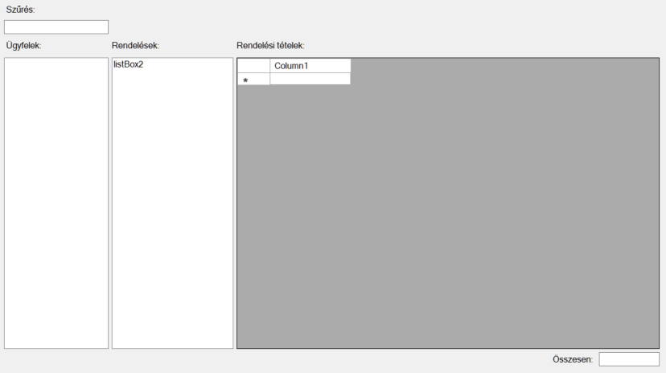

# Webshop számlái - gyakorlati feladatsor

Adott egy adatbázis, melyben egy webshop a vásárlásokat tartja nyilván. Az `Ugyfel` táblában tárolt ügyfelek rendeléseit a `Rendeles` tábla tartalmazza. Minden rendelés több rendelési tételből állhat. A rendelés gyakorlatilag egy számlának felel meg, a számlához pedig tételek tartoznak. A rendelés és a termék tábla között *több a több* kapcsolat áll fenn: egy rendelés során több terméket is megrendelhet az ügyfél, míg ugyanaz a termék több megrendelésben is szerepelhet. A `Termek` és `Rendeles` táblák között a több a többes kapcsolat a `Rendeles_tetel` táblán keresztül valósul meg. Érdekesség, hogy a `Rendeles_tetel` táblában is szerepel egy egységár mező, és emellet a termék táblában is van egy listaár mező. Ez első ránézésre sérti az *"az igazság egy helyen van"* (*"Single point of truth"*) elvet, ami azt jelenti, hogy egy adatbázisban minden adatot csak egy helyen rögzítünk. Az adatbázist azonban azért tervezték ilyenre, mert a termék listaára változhat, a megrendeléshez tartozó rendelési tételben viszont azt a pillanatnyi árat rögzítjük, amelyen a termék értékesítésre került (ez pedig például egy ideiglenes akció miatt eltérhet a listaártól).


## A megoldás menete videókon -- előadás


[1. videó](WS1.mkv)
		   
[2. videó](WS2.mkv)
		   
[3. videó](WS3.mkv)
		   
[4. videó](WS4.mkv)
		   
[5. videó](WS5.mkv)
		   
[6. videó](WS6.mkv)
		  
[7. videó](WS7.mkv)
		   
[8. videó](WS8.mkv)

[9. videó](WS9.mkv)

## Adatbázis felépítése
A [webshop.sql](webshop.sql) script alapján építs fel egy lokális *Service based database*-t a projektedben! A script közel 200 000 sorból áll, így a futtatás időbe telhet. 

## A felhasználói felület felépítése



(+/-) Hozzátok létre az ábrán látható vezérlőket egy űrlapon!

- A baloldali `ListBox`-ba kerülnek majd az ügyfelek nevei.
- Miután a felhasználó kiválasztott egy ügyfelet, a második `ListBox`-ba kerülnek majd a`Rendeles` táblából az adott ügyfélhez tartozó megrendelések dátumai.
- Ha felhasználó a megrendelés dátumra kattintva kiválasztott egy megrendelést, rácsban megjelennek a rendeléshez tartozó rendelési tételek.

## Ügyfelek neveinek kereshető megjelenítése

(+/-) Első lépésben hozz létre `ÜgyfélSzűrés` néven egy `void` típusú függvényt, mely a `textBox1`-be írt szöveg alapján LINQ lekérdezéssel leszűri az `Ugyfel` táblát, majd az eredményt megjeleníti a `listBox1`-ben! Ne felejtsétek beállítani a `listBox1` `DisplayMember` tulajdonságát!

> Tipp: `DisplayMember` és a `ValueMember` tulajdonságokat azelőtt szoktuk beállítani, mielőtt a `ListBox` `DataSourece` tulajdonságához hozzárendeltük az adatforrást.

(+/-) `textBox1` `TextChanged` eseményhez rendelj eseménykiszolgáló függvényt, melyben meghívod az `ÜgyfélSzűrés()`-t.  

(+/-) Annak érdekében, hogy az alkalmazás indítása után rögtön legyenek adatok a listában, `ÜgyfélSzűrés()` metódust érdemes a konstruktorból az `InitializeComponent();` után is meghívni.

## A kiválasztott ügyfél rendeléseinek listázása 

(+/-) Rendelj eseménykiszolgálót a `listBox1` `SelectedIndexChanged` eseményhez. Az eseménykiszolgálóban állapítsd meg a listában kiválasztott elemhez tartozó kulcs értékét!

> Tipp: a `listBox1` adat forrása `Ugyfel` típusú elemeket tartalmaz. Innentől fogva biztosak lehetünk abban, hogy a `listBox1.SelectedItem` tulajdonságból kiolvasott érték is `Ugyfel` típusú, vagy `null` is lehet, ha éppen nincs kiválasztott elem a listában.

Ebből következik, hogy a `listBox1.SelectedItem` tulajdonsága `Ugyfel` típusúvá castolható:
``` csharp
(Ugyfel)listBox1.SelectedItem
```
Ezután már könnyen megállapítható kiválasztott elemhez tartozó keresett kulcs értéke:
``` csharp
var LOGIN = ((Ugyfel)listBox1.SelectedItem).LOGIN;
```
Az hogy melyik a kulcs mező, az adatmodell alapján könnyedén megállapítható. A kulcs mező adattípusát, úgy lehet a legkönnyebben megállapítani, hogy fölé visszük az egeret. Ha nincs kedvünk bajlódni a típus megállapításával, használható a `var` kulcsszó kulcsszó, hiszen a fordító számára a kifejezés jobb oldalából egyértelműen következik, milyen típust kell használni.

(+/-) A listában kiválasztott elemhez tartozó kulcs ismeretében már szűrhető a rendelési tételek tábla.

``` csharp
private void ListBox1_SelectedIndexChanged(object sender, EventArgs e)
{
	var LOGIN = ((Ugyfel)listBox1.SelectedItem).LOGIN;
	var rendelések = from x in context.Rendeles where x.LOGIN == LOGIN select x;
	listBox2.DisplayMember = "REND_DATUM";
	listBox2.DataSource = rendelések.ToList();
}
```
## Rendelési tételek megjelenítése a rendelés kiválasztása után

  (+/-) Rendelj eseménykiszolgálót a `listBox2` `SelectedIndexChanged` eseményhez. Az eseménykiszolgálóban állapítsd meg a listában kiválasztott elemhez tartozó kulcs értékét.

> A megoldás hasonló mint az előbb -- annyi különbséggel, hogy a `listBox2` adatforrása `Rendeles` típusú elemeket tartalmaz, és biztosak lehetünk abban`listBox1.SelectedItem` `Rendeles` típusúra castolható. Az adatmodellből megállapítható, hogy a kulcs a  `Rendeles` táblában a `SORSZAM`.

Első megközelítésben jelenítjük meg a `Rendeles_tetel` tábla összes oszlopát a rácsban.
``` csharp
private void ListBox2_SelectedIndexChanged(object sender, EventArgs e)
{
	var SORSZAM = ((Rendeles)listBox2.SelectedItem).SORSZAM;
	var rendelésiTételek = from x in context.Rendeles_tetel
	where x.SORSZAM == SORSZAM
	select x;
	dataGridView4.DataSource = rendelésiTételek.ToList();
}
```


Futtatás után látható, hogy a rácsban több idegen kulcs található, megyek feloldása nélkül a felhasználó számára nem értelmezhető az eredmény. Alakítsuk át a LINQ lekérdezést úgy, hogy értelmezhető legyen a rács tartalma:
``` csharp
private void ListBox2_SelectedIndexChanged(object sender, EventArgs e)
{
	var SORSZAM = ((Rendele)listBox2.SelectedItem).SORSZAM;
	var rendelésiTételek = from x in context.Rendeles_tetel
	where x.SORSZAM == SORSZAM
	select new {
		Teméknév = x.Termek.MEGNEVEZES,
		Kategória = x.Termek.Termekkategoria.KAT_NEV,
		Egységár = x.EGYSEGAR,
		Megység = x.Termek.MEGYS,
		Mennyiség = x.MENNYISEG
	};
	dataGridView4.DataSource = rendelésiTételek.ToList();
}
```

A fenti lekérdezést úgy érdemes összeállítani, hogy közben nézzük az adatmodellt. Az idegen kulcsok irányába el lehet " lépkedni" a lekérdezésben. A példában a `Rendeles_tetel` táblából kérdezünk. A `Rendeles_tetel` táblában `TERMEKKOD` egy idegen kulcs, mely a `Termek` táblában lévő `TERMEKKOD` nevű kulccsal kapcsolatban. Az anonim típusban az egyenlőségjel bal oldalán szereplő tulajdonságnév tetszőleges lehet, arra kell odafigyelni, hogy két egyforma ne legyen.

(+/-) Egészítsd ki a fenti feladatban lévő lekérdezést úgy, hogy egy *Ár* nevű oszlopban jelenjen meg az egységár is rendelt mennyiség szorzata.

(+/-) Készíts LINQ lekérdezést, mely kiszámolja rendelésben szereplő rendelési tételek összértékét! Az eredményt jelentsd meg egy címkében!

``` csharp
var összesen = (from x in rendelésiTételek select x.Ár).Sum();
```
