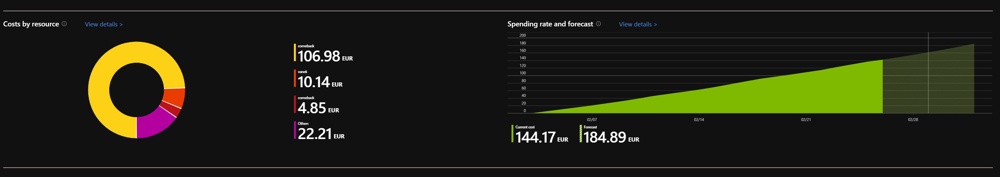
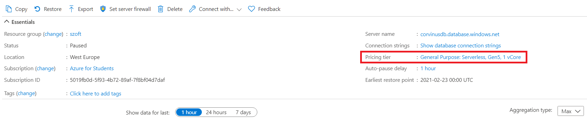
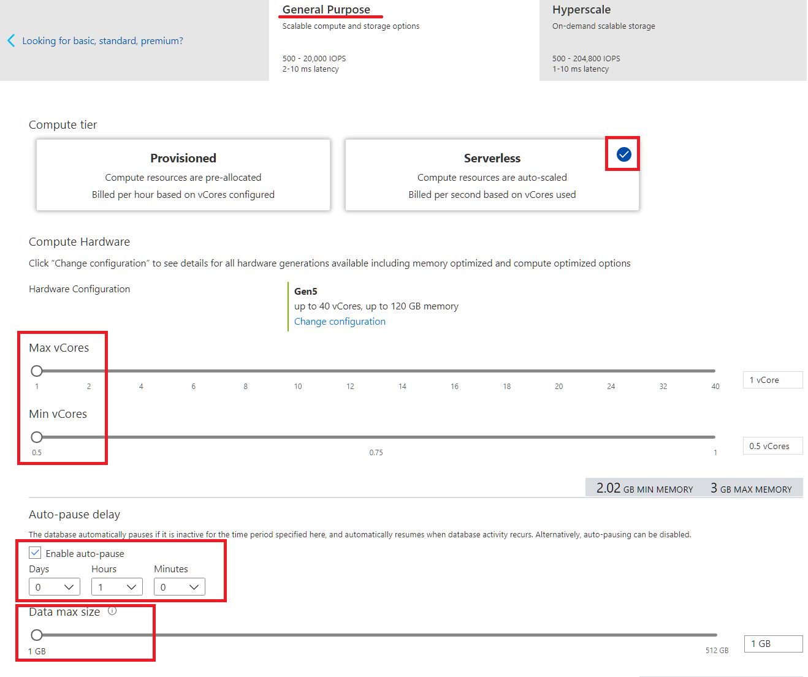
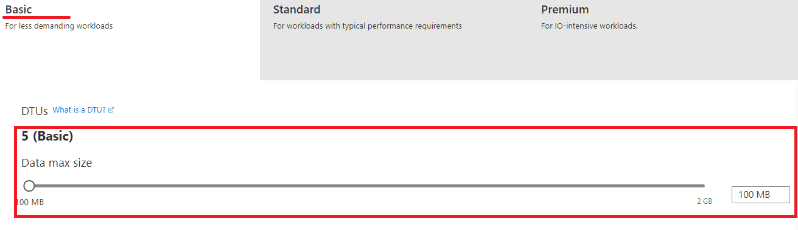

# Azure költségek követése

Gyakran előfordul, hogy vészesen fogy az Azure kreditet – vagy már el is fogyott.

Igyekeztünk utánajárni, hogy mit lehet tenni, ha vészesen fogy az *Azure for Students* kredit. Elöljáróban annyit fontos megjegyezni, hogy a ’Pay-as-you-go’ előfizetés esetén meg lehet nézni, hogy napról napra hogyan növekedett a költség, és a tendenciát meghosszabbítva mekkora számlára számíthatunk a hónap végére. A költségeket aztán tovább lehet bontani. Sajnos ez a funkció hiányzik a „szopnzorált” előfizetésből, az *Azure for Students* előfizetéshez csak a `Subscribtions` alatt elérhető, [https://www.microsoftazuresponsorships.com/](https://www.microsoftazuresponsorships.com/) oldalról letölthető `Usage Details` táblázat érthető el.

Így néz ki a ’Pay-as-you-go’ előfizetés  költségelemzője:

A költségszámításhoz használható az [Azure Picing Calculator](https://azure.microsoft.com/hu-hu/pricing/calculator/) oldal, de ez pont SQL szerver esetén nem sokat segít...

## Típushibák, melyek magas költségekhez vezetnek

- Leállított virtuális gépek esetén is kell fizeni a háttértár fenntartásának költségeit. Érdemes ezeket törölni, ha nem kellenek. 

- A WebApp-ból van free, ha jól van beállítva

- Az SQL adatbázisomként kell fizetni, nem a szerverek után. Érdemes egy adatbázisban dolgozni, ha a táblanevek nem ütköznek. A nem használt adatbázisokat érdemes törölni, ezeket nem nem lehet leállítani. 

- A kurzusokhoz elég a lehető legkisebb SQL adatbázis. Érdemes ellenőrizni a linkre kattintva:

Az adatbázis költségeinek alacsonyan tartására két opciónk van:
1) General Purpose / Serverless visszavett vCore és adatbázismérettel, automatikus leállítással:

2) Basic, 100MB-re visszahúzott adatbázissal

Ha a Serverless beállítással a vCore-okra számlázott tétel rejtélyesen nő, érdemes lehet állítani átállni "Basic"-re, aminek becsült költsége 4.21 EUR havonta, ami a félévből hátralevő időre kalkulálható.  

## Elfogyott kredit

Ha elfogyott a kredit, a fiók letiltásra kerül. Ebben az esetben át lehet állítani a fiókot ’Pay-as-you-go’ előfizetésre, vagy regisztrálni egy másik, ’Azure free account’-ot. Ehhez utóbbihoz is jár 200 USD, de ennek felhasználására már csak egy hónap áll rendelkezésre. A ’Pay-as-you-go’-hoz meg kell adni hitelkártya adatokat – akkor is ha csak ingyenes szolgáltatásokat akarunk igénybe venni. A kártya hitelességének ellenőrzéséhez egy minimális összeggel meg is terheli a kártyát, melyet, ha jól tudom, vissza is utal. 

**Akkor is lehet teljesíteni a tárgyakat**, ha elfogyott a kredit. SQL szervernek tudjátok telepíteni az SQL Server Express kiadását. Hálózatokból a Git repository alapján követjük a gyakorlatokon végzett munkát, a WebApp hiánya nem jelent hátrányt.

## Előfizetés megújítása

Ha még mindig hallgató vagy, évente 100 USD Azure kreditet kaphatsz. Legfeljebb 30 nappal a **regisztráció évfordulója** előtt az MS e-mailt küld, melyen keresztül újra aktiválhatod az Azure fiókot. [forrás](https://azure.microsoft.com/en-gb/resources/knowledge-center/can-i-get-azure-for-students-again-next-year/)
