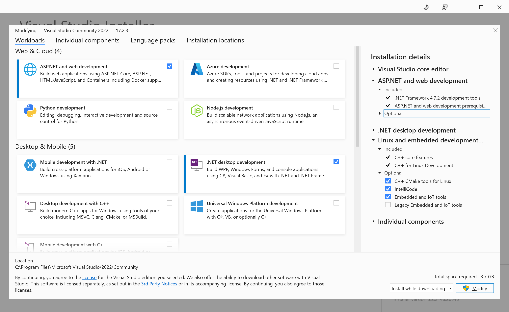

## Visual Studió telepítése

A kurzus során a Visual Studio 2022-es változatát és a vele együtt települő .NET 6 keretrendszert fogjuk használni.  Az esetleg korábban telepített  VS 2019  sajnos nem elég, nem tartalmazza azokat a modulokat amikre szükségünk lesz.

(!Vid) Videó: Visual Studio verziók összehasonlítása

> [!Video https://storage.altinum.hu/szoft1/S1_BEV_01_vs_letoltes.mp4]

A telepítőkészlet letölthető  [innen](https://visualstudio.microsoft.com/downloads/)
Az egyetemi géptermekbe az alábbi komponensek kerültek telepítésre, a kurzushoz ezek közül a ".NET desktop development" csomag kell csak:

Ha már van telepített VS példány, a **Start menü**/**Visual Studio Installer** megnyitása után konfigurálható a telepített rendszerelemek listája. Az Installer csak akkor hajlandó futni, ha a legfrissebb változat van fent, de a frissítés elvégzését felajánlja. 

A [Community](https://visualstudio.microsoft.com/vs/community) változat ingyenes magánszemélyeknek és kisvállalkozásoknak.  Egy hónap használat után azt fogja kérni, hogy  jelentkezzünk be egy Microsoft fiókkal,  de ezt követően továbbra is ingyenesen használható. 

**Mac felhasználóknak:** A  Microsoft Visual Studio for Mac  néven kínálja  fejlesztőkörnyezet MacOS  alatt futó változatát. A Visual Studio for Mac  fejlesztésekor a felhasználói felületet teljesen újra írták az Apple alkalmazástervezési elvei mentén.  Sajnos a Mac-es változatban  nem szerepel a Winforms  tervező,  így a fél év első felének  feladatait nem lehet vele megoldani. Ha a MacOS-el  dolgozó kollégáknak nem a rendelkezésére a Parallels (https://www.parallels.com/eu/),  a  géptermi gépeken tudnak gyakorolni.  Lehetőség van még  Azure for Students előfizetés keretére  virtuális gépet  telepíteni,  odafigyelve arra hogy a  nem használt VM le legyen állítva,  különben gyorsan elégeti  a keretet.

> [!WARNING]
>
> A **Visual Studio** termékvonal nem összekeverendő a **Visual Studio Code**-dal. Az utóbbi egy nyílt forráskódú szoftver, melynek fejlesztését szintén a Microsoft gondozza. Létezik mac-es és linuxos változata is ellentétben Visual Studio-val. A Visual Studio Code testreszabható kódszerkesztő, melyet elsősorban webfejlesztők használnak szívesen, de létezik hozzá számos nyelvhez és technológiákhoz modul.
