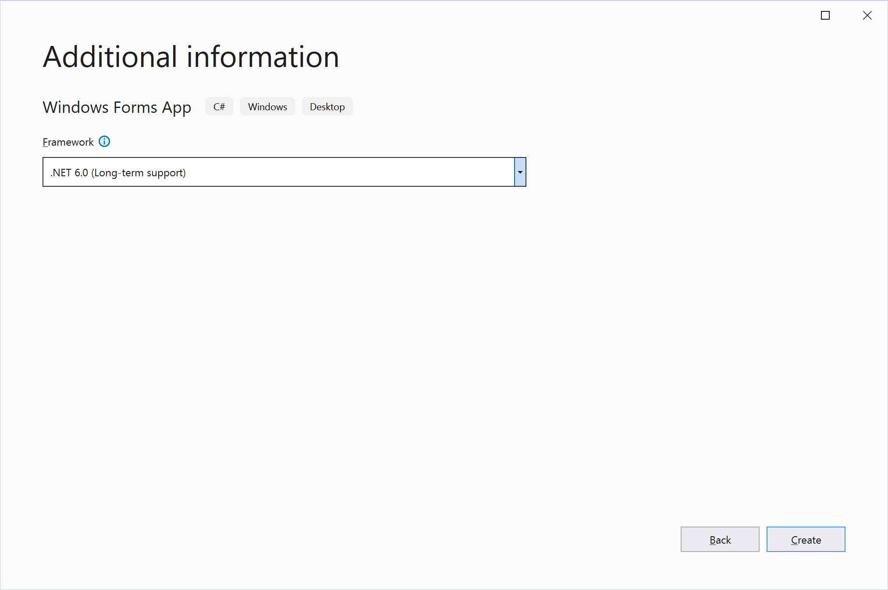
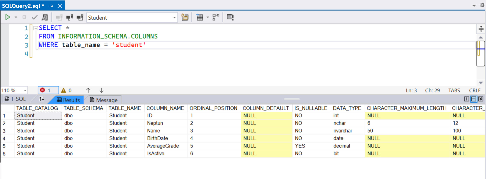

# Távoli adatbázis elérése C# alkalmazásból

## A gyakorlat célja

Ezen a gyakorlaton  olyan alkalmazást építsünk, amely képes 

- egy távoli SQL szerveren tárolt adatbázishoz csatlakozni,
-  onnét egy tábla adatait letölteni, majd
-  egy űrlapon elhelyezett rácsban megjeleníteni.

A félév során az itt bemutatott módon történik majd a kliens és az SQL server közötti adatmozgatás. Ez a félév legösszetettebb feladata! 

### Követelmények

A gyakorlat teljesítéséhez a Visual Studio 2022-es változata és a .NET 6 SDK szükséges. 

### SQL adatbázis adatai

|                |                     |
| -------------- | ------------------- |
| Szerver        | bit.uni-corvinus.hu |
| Felhasználónév | hallgato            |
| Jelszó         | Password123         |
| Adatbázis      | Student             |

> [!IMPORTANT]
>
> A bit.uni-corvinus.hu domain alatt futó SQL szerver csak VPN alól érhető el!!!

## Videók

Az alábbi videókat érdemes lehet a feladatmegoldás előtt megnézni. 

(!Vid) 1. rész

> [!Video https://storage.altinum.hu/softeng_lev/remote_db_1.m4v]

(!Vid) 2. rész

> [!Video https://storage.altinum.hu/softeng_lev/remote_db_2.m4v]

(!Vid) 3. rész

> [!Video https://storage.altinum.hu/softeng_lev/remote_db_3.m4v]

(!Vid) 4. rész

> [!Video https://storage.altinum.hu/softeng_lev/remote_db_4.m4v]


## A megoldás lépései

### 1. Windows Forms App létrehozása .NET 6 alatt

(+/-) Hozz létre egy `Windows Forms App` típusú alkalmazást Visual Studio-ban. A Solution és a Project neve tetszőleges, a példában a `RemotelDbTest` nevet használjuk. 


> [!WARNING] 
>
> `Windows Forms App (.NET Framework)` template a régi .NET Framework 4.7 vagy 4.8 keretrendszert használja, nem a .NET 6.0-át! **Ne keverd össze!** A .NET 6-ban  teljesen újra írták a Windows Forms  kódját és a szerkesztőt is.  Gyakori hiba hogy C# projekt helyett Visual Basic projekt készül. 

Ha jól csináltad ez látszik:




### 2. Adatbázis kezelése a Server Explorer panelben

#### 2.1 Csatlakozás Server Explorer-ben az adatbázishoz

> [!WARNING]
>
> A  _Server Explorer_-nek semmi köze nincs az épp megnyitott projekthez. A Visual Studio egy integrált fejlesztőkörnyezet,  és mint ilyen rendelkezik beépített funkcióval alapvető adatbázis műveletek elvégzésére.  A fejlesztőnek így nem kell elhagyni a VS-t, és más  alkalmazást telepíteni, ha egyszerű adatbázis műveleteket szeretne végrehajtani.  A Server Explorer ablakban  akkor is csatlakozhatunk adatbázishoz, ha a Visual Studio-ban éppen nincsen  projekt megnyitva. 

(+/-) A _Server Explorer_-ben vegyél fel egy kapcsolatot a bevezetésben megadott adatbázishoz!

- Ha nincs meg a Server Explorer panel, a Ctrl+Alt+S vagy a `view` / `Server Explorer`  menüpont segítségével lehet bekapcsolni.

- A _Server Explorer_ `Connect To Databese` ikonjával lehet felvenni az új adatbáziskapcsoaltot.


- A szerver neve  magáért beszél. 

-  A `Windows Authentication`  azt jelenti,  hogy a kliens a Windows-ba történő bejelentkezéshez használt credential-ökkel próbálja azonosítani magát a kliens az SQL szerver felé.  Ez azért jó,  mert az SQL Server képes az Active Directory-t használni a jogosultságok ellenőrzéséhez anélkül, hogy felhasználói jelszavakat kellene felvinni.  Lehetne jogosultságot adni egyszerre az összes diáknak. De nálunk nem ez a helyzet.
-  Mi az `SQL Server Authentication` használjuk,  ahol az SQL szerveren tárolt felhasználónév / jelszó párosokkal  történik az azonosítás. 
- A `Save password`  pipát fejlesztéskor érdemes lehet betenni.
- Az adatbázis nevét is érdemes kitölteni,  legördülő dobozból nem mindig választható ki.  Az SQL Server-en  engedélyezhető vagy tiltható az adatbázisok listázása -- ez a beállítás általában attól függ hogy mennyire paranoid az adatbázisgazda :)
- Ha a `Test Connection` nem megy,  érdemes ellenőrizni a VPN kapcsolatot.


#### 2.2 Connection String kinyerése

Mint ahogy arról már korábban esett szó, a _Server Explorer_-nek semmi köze nincs az éppen megnyitott projekthez.  Ahhoz hogy olyan C# programot tudjunk írni,  ami csatlakozik a távoli adatbázishoz, később szükségünk lesz az úgynevezett _connection string_-re. (Nem most, de úgy tűnik logikusnak, hogy itt tegyünk említést róla.)

A _connection string_-ben mező--érték párokat találunk, ez az információ szükséges egy adatbázisba bejelentkezéshez, és egy meghatározott adatbázis eléréséhez. A következő lépésben erre a _connection string_-re  lesz szükségünk ahhoz,  hogy legeneráljuk az adatbázis eléréséhez szükséges C# osztályokat.

Ha a _Server Explorer_-ben  az adatbázisra kattintasz, a _Properties_  ablakban (jobb lent) megjelenik a _connection string_:

```
Data Source=bit.uni-corvinus.hu;Initial Catalog=Student;Persist Security Info=True;User ID=hallgato;Password=***********
```

(+/-)  Jegyezd meg, hogy hol találod a _connection string_-et később kelleni fog!


### 3. "Reverse engineering" 

 A Microsoft-os terminológiában _Revrese Engineering_-nek  hívjuk azt a folyamatot,  ami egy meglévő adatbázis séma alapján legenerálja azokat az osztályokat,  amelyek leképezik az adatbázist táblákat, a köztük lévő kapcsolatokat, illetve lehetőséget biztosítanak  adatok mozgatására  a kliens és a szerver között.

Emlékeztetőül az előadáshoz:  két megközelítés létezik. A  **database first**  megközelítésben egy már létező, SQL szerveren felépített adatbázis séma alapján generáljuk le azokat az osztályokat,  melyek az adatbázis eléréséhez szükségesek.  A **code first** megközelítésben először az osztályokat írjuk meg mondjuk C#-ban,  majd ez alapján generálunk SQL adatbázis sémát.  A kurzus során végig a database first megközelítést használjuk. 


#### 3.1 NuGet csomagok hozzáadása a projekthez

(+/-) Nyisdmeg a NuGet csomagkezelőt,  és add az alábbi csomagokat  a projekthez:


 

A `Microsoft.EntityFrameworkCore.Tools` és a `Microsoft.EntityFrameworkCore.SqlServer` a NuGet konzolán keresztül ezzel a két paranccsal is hozzáadható a projekthez:
``` powershell
Install-Package Microsoft.EntityFrameworkCore.SqlServer
Install-Package Microsoft.EntityFrameworkCore.Tools
```

#### 3.2 Osztályok generálása

Sajnos .NET Core alatt (még) nem áll rendelkezésre Visual Studio-ba épített grafikus eszköz és varázsló az adatbázis sémája alapját leképező C# osztályok előállítására. (3rd party modul létezik.) Ezt is a *Package Manager Console*-ból kell megoldani parancssorból, de nem olyan veszélyes, mint első hallásra tűnik. (`Tools`/`NuGet Package Manager`) 

A `Scaffold-DbContext` parancs használata egyszerű, meg kell neki adni a _Connection String_-et, és a projekten belül azt a mappát, ahova dolgozhat. A mappa neve tipikusan a `Models`, ha csak egy adatbázisunk van. 

``` powershell
Scaffold-DbContext "[Connection String]" Microsoft.EntityFrameworkCore.SqlServer -OutputDir [Mappa]
```

A mi esetünkben, miután a kicsillagozott jelszót újra megadtuk:
``` powershell
Scaffold-DbContext "Data Source=bit.uni-corvinus.hu;Initial Catalog=Student;Persist Security Info=True;User ID=hallgato;Password=Password123" Microsoft.EntityFrameworkCore.SqlServer -OutputDir Models
```

> [!IMPORTANT] 
>
> Ha a projektet nem lehet lefordítani, amikor kiadjuk a `Scaffold-DbContext` parancsot, csak egy mérsékelten beszédes "Bulid Failed." üzenetet kapunk. Ha nem ez a baj, használható a parancs végére a `-Verbose` kapcsoló.

> [!NOTE]
>
> Ha a `Scaffold-DbContext` lejárt tanusítványra panaszkodik, bővítsük a connection stringet a  `TrustServerCertificate=True` beállítással!

(+/-) Állítsd össze a `Scaffold-DbContext`  parancsot saját _connection string_-ed alapján,  majd futtasd  a *Package Manager Console*-ban.   

Ezután meglelenik a SolutionExplorer-ben egy `Models` mappa benne a fájlokkal:


#### A `Students` osztály

 Érdemes megnézni a `Student.cs`-t -- az SQL szerveren lévő `Student` tábla leképezését tartalmazza:

``` csharp
using System;
using System.Collections.Generic;

namespace RemoteDBTest.Models
{
    public partial class Student
    {
        public int Id { get; set; }
        public string Neptun { get; set; } = null!;
        public string Name { get; set; } = null!;
        public DateTime BirthDate { get; set; }
        public decimal? AverageGrade { get; set; }
        public bool IsActive { get; set; }
    }
}
```

Összehasonlításul:




> [!NOTE]
>
> A `StudentContext` osztály Az osztály neve alapértelmezetten a `[Adatbázis neve]Context` formájú. 

A `StudentContext` osztályon keresztül lesz lehetőségünk adatokat mozgatni az SQL szerver és a saját alkalmazásunk között.

### 4. Forms alapú felhasználói felület készítése 

#### 4.1  DataGridView létrehozása

(+/-) Hozz létre egy `DataGridView`-t a `Form1`-en, a neve maradjon `dataGridView1`
(+/-) Allítsd be a megfelelő `anchor`-okat, hogy az ablak átméretezésével a `DataGridView` is átméreteződjön

#### 4.2 Adatok olvasása az SQL szerverről

(+/-) A `Form1`  osztály szintjén példányosítsd `studentContext`  néven a  `StudentContext` osztályt.  

(Emlékezz vissza:  az elnevezési konvenció szerint az osztály neveket nagy betűvel az osztályból létrehozott példány nevét pedig kisbetűvel szokás kezdeni.)

A példányosítás azért az osztály szintjén végezzük el,  mert az osztályon belül több mert metódusból is el szeretnénk érni a `context`-et.  (A `context`  név  szerepel az összes microsoftos dokumentációban és példaprogramban ezért mi is ehhez tartjuk magunkat --  lehetne bármi.)

``` csharp	
namespace RemoteDBTest
{
    public partial class Form1 : Form
    {
        // Ezen a objektumon keresztül lehet majd elérni a távoli adatbázis elemeit
        Models.StudentContext studentContext =  new Models.StudentContext();
        public Form1()
        {
            InitializeComponent();
        }
    }
}
```


``` csharp
namespace RemoteDBTest
{
    public partial class Form1 : Form
    {
        Models.StudentContext studentContext =  new Models.StudentContext();
        public Form1()
        {
            InitializeComponent();
            dataGridView1.DataSource = studentContext.Students.ToList();
        }
    }
}
```

Az  SQL ben elterjedt  adatbázis objektum elnevezési konvenció szerint  a táblák neve  mindig a tábla alapjául szolgáló entitás egyes számú alakja.  Jelen esetben _Student_ és nem _Students_. A érdemes megfigyelni, hogy a reverse engineering  során generált `StudentContext` osztály `Students`  tulajdonságán keresztül érhető el a `Student` tábla.  Azaz a táblanév  automatikusan többesszámba került  az angol nyelvtan szabályai szerint. A `Scaffold-DbContext`  [dokumentációjában](https://docs.microsoft.com/en-us/ef/core/cli/powershell#scaffold-dbcontext) szereplő `-NoPluralize`  kapcsolóval a többesszámba  tétel kikapcsolható,  magyar táblaneveknél elég zavaró tud lenni.

#### 4.3 Adatkötött vezérlők használata

(+/-) A `dataGridView1` vezérlő "fülében" kattints a legördülőre, majd a megjelenő panelen választ az *Add Object Data Source* gombot!

(+/-) A párbeszédablakban válaszd ki a `Student` osztályt. Ez az osztály írja le a `Student` tábla egy entitását -- magyarul egy-egy `Student` típusú objektum jön majd létre az adatbázistábla összes memóriába olvasott sorához. Fontos: a `Student` osztály csak akkor jelenik meg az alábbi ablakban, ha az `Scaffold-DbContext` után már le lett fordítva (build) az alkalmazás. Innentől az adatforrások között a fában már elérhető a `Students` osztály. 

(+/-) A `dataGridView1` adatforrásaként válaszd ki a `Student` osztályt.


Mi történt?

- Ezzel a lépéssorozattal létrejött egy `BindingSource` `studentBindingSource` néven, mely az űrlap alatt jelenik meg a tervezőben, mivel nincs külön vizuális reprezentációja.
- A `studentBindingSource` adatforrásaként már a tervezőben be van állítva a `Student` osztály. 
- A `DataGridView` adatforrása a `studentBindingSource`, és mivel a `studentBindingSource` "tudja", hogy `Student` típusú elemekből álló listát jelenítünk majd meg, a rácsban is megjelennek a `Student` osztály tulajdonságai.
- A _Solution Explorer_-ben létrejött egy `DataSources` elem, amelyben megtalálható az adatforrásként felvett `Students` osztály. Ha valamit tévedésből vettünk fel, innét lehet törölni. 


(+/-) A rácsba az adatokat a `studentBindingSource`-on keresztül töltsd.

Cseréld re ezt a sort:

``` csharp
dataGridView1.DataSource = studentContext.Students.ToList();
```

erre a sorra:

``` csharp
studentBindingSource.DataSource = studentContext.Students.ToList();
```

#### 4.4 Változások mentése az adatbátzisba

(+/-)  Helyezz el az űrlapon egy _Mentés_ feliratú gombot `saveButton` néven, majd rendelj hozzá eseménykiszolgálót.

(+/-) Az eseménykiszolgálóban mentsd a változásokat:

``` csharp
private void saveButton_Click(object sender, EventArgs e)
{
    studentContext.SaveChanges();
}
```

#### 4.7 Kivételek kezelése

Mivel az Entity Framework [optimista konkurenciát](concurrency.md) használ, a futásidejű kivételek kezelésére fel kell készülni. 

``` csharp
private void saveButton_Click(object sender, EventArgs e)
{
    try
    {
        studentContext.SaveChanges();
    }
    catch (Exception kivétel)
    {
        MessageBox.Show(kivétel.InnerException.Message);
    }            
}
```

így ha pl. hétjegyű neptunkódot próbálunk megadni a `studentContext.SaveChanges();` hívásakor keletkező hibaüzenetről tájékoztatást kap a felhasználó:


