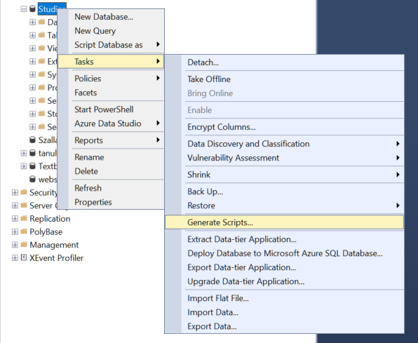
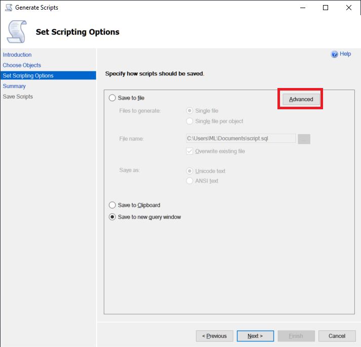
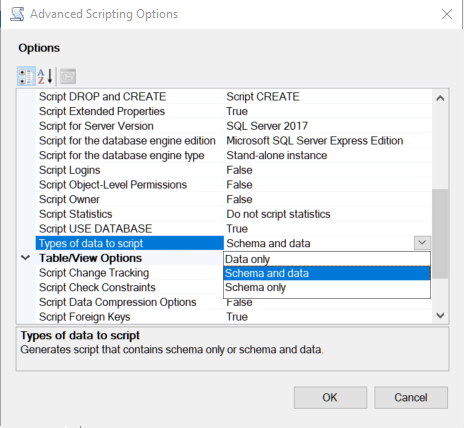

# Adatbázist létrehozázó SQL generálása SSMS segítségével
Többen kérdeztétek, hogy hogyan lehet olyan SQL-t generálni SQL Server Management Studio segítségével, ami nem csak az adatbázis struktúráját építi fel `CREATE TABLE` parancsok segítségével, hanem `INSERT` parancsokkal az adatokat is feltölti. 

(+/-) Első lépéjben jobb egér a kiválasztott adatbázison:

A megjelenő varázslóban minden egyértelmű, de ahhoz, hogy az `INSERT`-ek is elkészüljenek, az `ADVANCED` beállítások közt ezt külön be kell kapcsolni:

