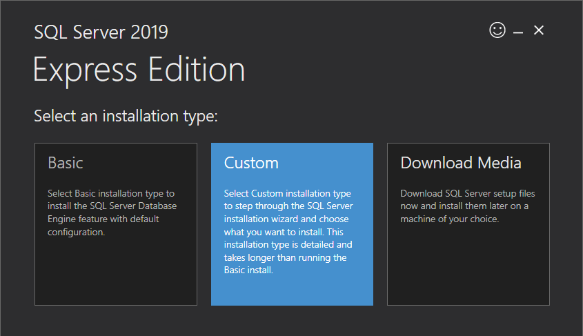
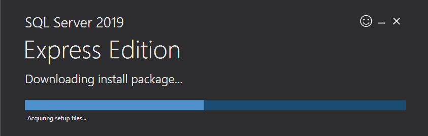
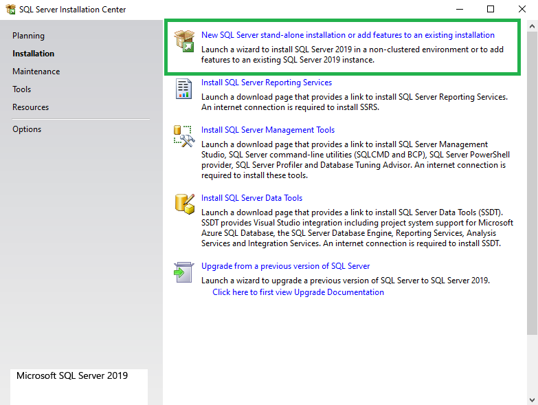
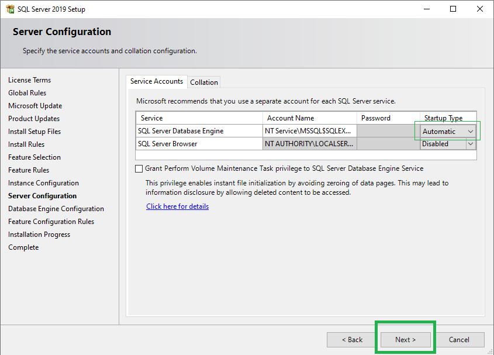
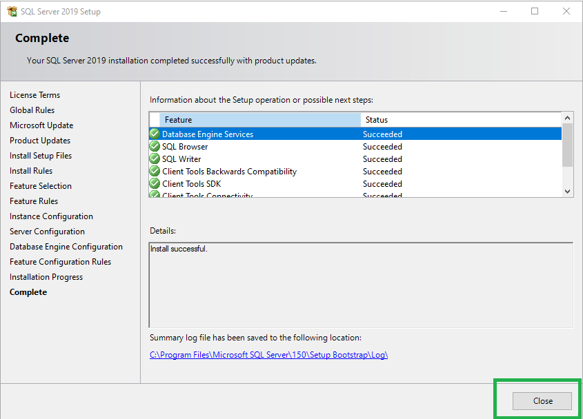
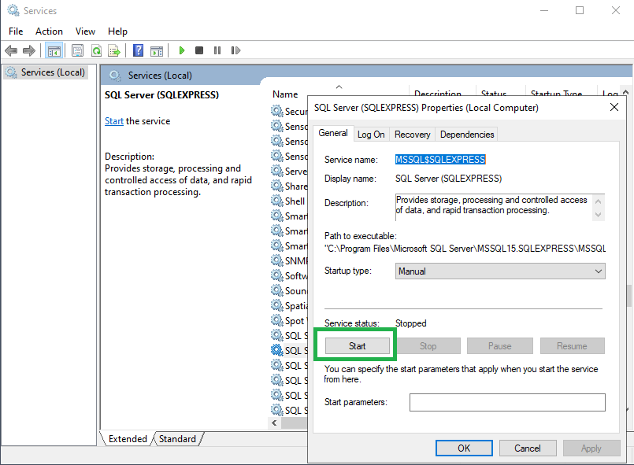
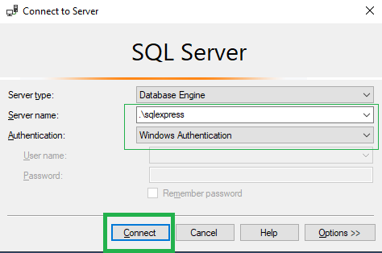

# SQL Express telepítése

## 1. Telepítőkészletek letöltése // Downloading installation media

- Az SQL Szerver különböző változatai letölthetők [innét](https://www.microsoft.com/en-us/sql-server/sql-server-downloads)
- Ha valaki még nem telepítette volna az *SQL Server Management Studio*-t, [innét](https://docs.microsoft.com/en-us/sql/ssms) letöltheti.

## 2. SQL Express telepítése // Installing SQL Express
### 2.1 Telepítési mód // Installation type

 

### 2.2 Letöltések helye // Download location
 

### 2.3 Fájlok letöltése folyamatban // Downloading install package

 

### 2.4 A telepítő elindult // Installation Center is launched
 

### 2.5 Licenszfeltételek // License terms	

 
### 2.6 Frissítések // Updates

Megjegyzés: eleve a legfrissebb telepítőkészletet töltöttük le. // Note: an already up-to-date installation package was downloaded.

### 2.7 Telepítési szabályok ellenőrzése // Install rules

 
### 2.8 Telepítendő komponensek // Feature selection

 

A komponensekről bővebben lásd: // Feature details:
https://docs.microsoft.com/en-us/sql/sql-server/install/feature-selection?view=sql-server-2014&viewFallbackFrom=sql-server-ver15

### 2.9 Azonosító // Instance ID
 

Megjegyzés: a képen látható telepítési környezetben már van más SQL Server kiadás telepítve, emiatt itt egyedi azonosítót használtunk. Más esetben az alapértelmezett azonosító is választható. // Note: the screenshot was taken with another SQL Server instance already installed, therefore a named instance was chosen. Otherwise using a default instance is acceptable.

### 2.10 Automatikus indítás // Automatic startup

Megjegyzés: a szolgáltatás indítása kézi üzemmódra is állítható, és ez a beállítás később igény szerint megváltoztatható. // Note: the service startup type may be set to manual and changed later as needed.

### 2.11 Azonosítás // Authentication

 
### 2.12 A telepítés befejeződött // Installation completed successfully
 

### 2.13 Kézi indítás // Manual startup
 
Megjegyzés: lásd a 2.10-es pont beállításait. // Note: see settings at section 2.10.
 
### 3. SQL Server Management Studio

A lokális gépen futó SQL szerver az *Server Management Studio* segítségével adminisztrálható. 

Kezdődhet az adatbázisok létrehozása és a táblák felépítése!

